# Introduction {#intro}

The movement of freight is a key foundation to the functioning of our society and economy.

This section covers the following topics:

* [Applicable Federal Agencies](#intro-agencies)
* [Freight Movement Statistics](#intro-statistics)
* [Freight Transportation](#intro-Freight)
* [Freight Transportation Service Index](#intro-Freight_Index)
* [Freight Transportation and the Economy](#intro-Freight_economy)
* [Growing Freight Movement](#intro-Freight_movement)
* [Freight Mobility and Statistics](#intro-Freight_mobility)
* [Goods Volume/Value Coming Into/Out of Various Sea Ports](#intro-Goods_Volume)


## Applicable Federal Agencies {#intro-agencies}

* BTS - Bureau of Transportation Statistics (https://www.bts.gov/)
* FHWA - Federal Highway Administration (https://www.fhwa.dot.gov/)
* FMCSA - Federal Motor Carrier Safety Administration (https://www.fmcsa.dot.gov/)
* NHTSA - National Highway Traffic Safety Administration (https://www.nhtsa.gov/)
* USDOT - United States Department of Transportation (https://www.transportation.gov/)


## Freight Movement Statistics {#intro-statistics}

1. Mobility refers to the ease that a passenger or a freight unit can move across a transportation system. High mobility requires limited efforts, while low mobility is related to complexity and high costs.
2. For freight,mobility is cargo-dependent, with some commodities having limited storage requirements but heavy to carry.

**Weight of shipments by transportation mode**

```{r FreightByWeightImage, echo=FALSE, fig.cap='Weight of shipments by transportation mode', out.width='90%', fig.align='center'}
knitr::include_graphics("./Images/Intro/FreightShipments_Weight.jpg")
```

**Value of shipments by transportation mode**

```{r FreightByValueImage, echo=FALSE, fig.cap='Value of shipments by transportation mode', out.width='90%', fig.align='center'}
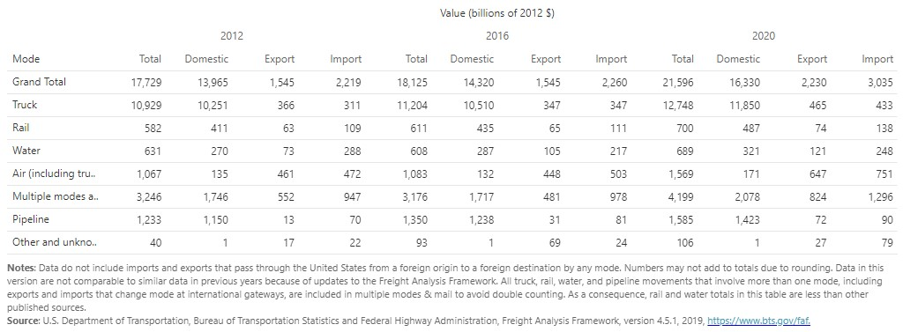
```

::: {#Note .ThreshValue .message style="color: orange;"}
Reference BTS
:::


## Freight Transportation {#intro-Freight}

1. Figure \@ref(fig:FigureTonMiles) shows the Ton-Miles of Freight transported by different transportation modes.
2. Truck remains the premiere mode of freight transportation through the past two decades.
3. Further growth in the future with advancements in electric vehicles and automation. 
4. Other modes are meanwhile holding relatively stable throughout the years.
5. Freight transportation movements are expected to increase over the next few decades as global populations grow and consumer spending power increases. 
6. The freight transportation system in the United States includes an extensive network of highways, railroads, waterways, pipelines, and airways: 958,000 miles of Federal-aid highways, 141,000 miles of railroads, 11,000 miles of inland waterways, and 1.6 million miles of pipelines. 
7. Figure \@ref(fig:FigureModeShareTonMiles) shows historical and forecasted mode share in ton-miles from 1990–2040.
8. The data reveal that most freight transportation modes are expected to experience increased volumes, although the amount of expected growth will vary by mode, with pipelines projected to have negative growth to year 2040.


```{r FigureTonMiles, echo=FALSE, fig.cap='U.S. Ton-Miles of Freight', out.width='75%', fig.align='center'}
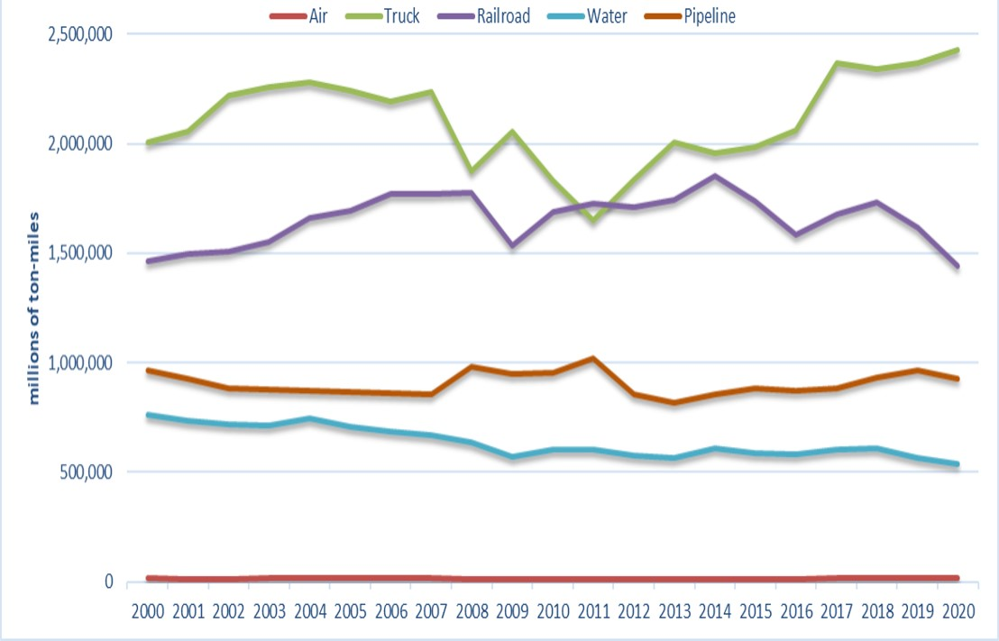
```
Source: https://www.bts.gov/content/us-ton-miles-freight


```{r FigureModeShareTonMiles, echo=FALSE, fig.cap='Historical and Forecasted Mode Share of Ton-miles, 1990–2040', out.width='90%', fig.align='center'}
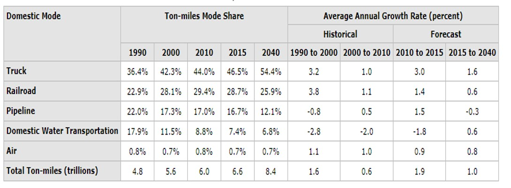
```
Source: 2016 Freight Quick Facts Report, DOT, Draft National Freight Strategic Plan, BTS Special Tabulation


## Freight Transportation Service Index {#intro-Freight_Index}

1. The Freight Transportation Services Index, an indicator of monthly changes in freight carried by for-hire transportation companies.
2. Not exactly paralleled the demand for consumer goods since August 2019.
3. The volume of freight moved declined moderately from August 2019 through February 2020, then collapsed with the arrival of COVID-19 in March but quickly rebounded by summer.


```{r FigureTransportationServices, echo=FALSE, fig.cap='Freight Transportation Services Index 2016–2021', out.width='75%', fig.align='center'}
knitr::include_graphics("./Images/Intro/Freight Transportation Services Index 2016–2021.jpg")
```

## Freight Transportation and the Economy {#intro-Freight_economy}
 
1. The benefits of freight transportation to the economy are enormous.
2. Freight transportation increases the value of goods by moving them to locations where they are worth more and encourages competition and production.
3. Freight transportation also stimulates demand for goods and services and employs millions of people.
4. Freight transportation infrastructure is a significant component of our nation's wealth and productive capacity.
5. From a macroeconomic perspective, transportation accounts for a significant share of the U.S. GDP. In 2000, purchases of transportation-related goods and services accounted for approximately 11 percent of GDP (USDOT BTS 2002).
6. Only housing, health care, and food accounted for a greater share. For-hire transportation services, which include warehousing, contributed about 3.3 percent ($303 billion) to GDP.
7. Many industries and businesses depend on their own transportation operations (primarily trucking) to move goods. These "in-house" transportation services contributed an additional $142 billion to the economy (USDOT BTS 2001b).
8. Freight transportation also contributes to the economy by providing jobs to millions of people—an important indicator of economic growth.
9. In 2000, more than 10 million people were employed in transportation-related industries, including for-hire services, vehicle manufacturing, and parts suppliers.
10. For-hire transportation (including warehousing) employed more than 4.4 million workers, a majority of whom worked in freight-related jobs.
11. Another 5.5 million people worked in transportation occupations in non transportation industries, such as truck drivers for grocery stores (USDOT BTS 2001b).
12. Truck drivers, alone, accounted for nearly 70 percent of the total number of transportation occupational workers (USDOT BTS 2002b).
13. Improvements in freight productivity help the United States maintain its competitive position in the world economy.
14. The Bureau of Labor Statistics reports that productivity for the intercity trucking, railroad, air transport, and petroleum pipeline industries has improved over the last 20 years.


## Growing Freight Movement {#intro-Freight_movement}
 
1. Improvements in railroad productivity resulted primarily from deregulation, divestiture of uneconomic lines, reductions in the labor force, and changes in technology and logistics. Productivity improvements in trucking resulted primarily from public investments in a high-quality national road network and deregulation.
2. The volume of freight moved by the U.S. transportation system has grown dramatically in recent decades and is projected to increase nearly 70 percent by 2020.
3. The liberalization of trade policies, such as the North American Free Trade Agreement (NAFTA), internationalization of supply chains, and changes in transportation and information technologies have contributed to this increase in freight movement.
4. As a share of the gross domestic product (GDP), U.S. exports and imports grew from 9 percent in 1960 to 23 percent in 2002. U.S. international trade is forecast to reach 37 percent of GDP by 2025.
5. Trucks carried about 71 percent of all tonnage and 80 percent of the value of U.S. shipments in 1998.
6. Even with growth in airfreight, maritime, and rail services, the percentage of urban interstates carrying more than 10,000 trucks daily is expected to increase from 27 percent in 1998 to 69 percent in 2020.
7. In recent years, trade growth has increased the number of commercial vehicles on U.S. roadways and, indirectly, the potential demand for more productive and larger commercial trucks. Trucks move a majority of freight tonnage.
8. In 2002, 7.9 million large trucks (trucks with six or more tires) were on the road, compared with 6.2 million in 1990, and trucks contributed to 7.5 percent of all vehicle miles traveled in 2002.
9. Trucks transported the vast majority of freight by both weight and value in 2018 (68% and 73%, respectively). While pipelines and rail together accounted for over 25% of freight tonnage, they accounted for just over 12% of freight value. Domestic freight movement in 2018 totaled 16.5 billion tons with a total value of $14.8 billion.


```{r FigureFreightMode, echo=FALSE, fig.cap='Freight by Mode, 2018', out.width='90%', fig.align='center'}
knitr::include_graphics("./Images/Intro/Freight by Mode, 2018.jpg")
```
Source: U.S. Department of Transportation, Freight Analysis Framework, Version 4.5.1, December 2019. Data Tabulation Tool queried July 2, 2020.

## Freight Mobility and Statistics {#intro-Freight_mobility}


```{r FigureFreightWeight, echo=FALSE, fig.cap='Weight and Value Freight Shipments by Domestic Mode-2017', out.width='75%', fig.align='center'}
knitr::include_graphics("./Images/Intro/Weight and Value Freight Shipments by Domestic Mode-2017.jpg")
```


```{r FigureFreightValue, echo=FALSE, fig.cap='Value of Freight Shipments by State-2017', out.width='80%', fig.align='center'}
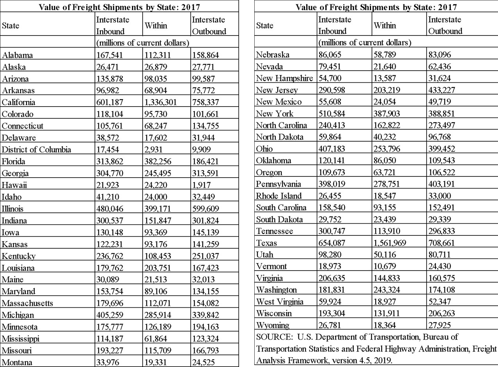
```


## Freight Mobility and Statistics {#intro-Mode_Share}

The modal distribution for ton-miles is similar to that for tons, with the exception of long-distance water moves. Rail moved nearly two-thirds of total ton-miles while pipelines accounted for 70 percent of ton-miles over distances more than 1,000 miles.


```{r FigureFreightDistance, echo=FALSE, fig.cap='Mode Share of Freight Ton-Miles by Distance Band-2007', out.width='80%', fig.align='center'}
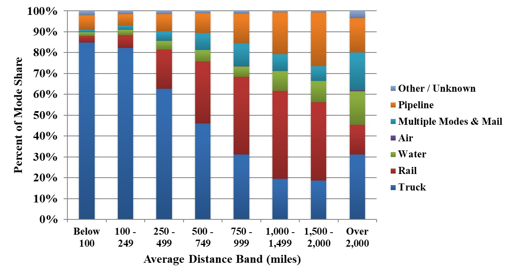
```


```{r FigureFreightDistanceData, echo=FALSE, fig.cap='Data for Mode Share of Freight Ton-Miles by Distance Band-2007', out.width='80%', fig.align='center'}
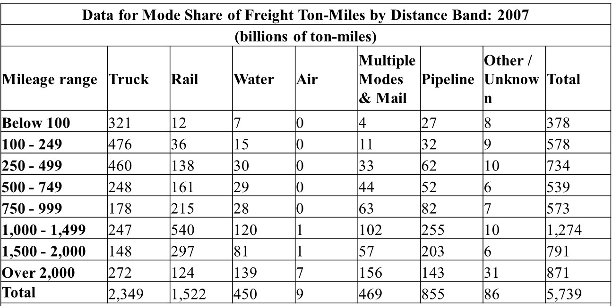
```

Source:  U.S. Department of Transportation, Federal Highway Administration, Office of Freight Management and Operations, Freight Analysis Framework, version 3.4, 2012.


## Goods Volume/Value Coming Into/Out of Various Sea Ports {#intro-Goods_Volume}

::: {#Note .ThreshValue .message style="color: orange;"}
Should these sections be at level 3 (###) rather than level 2 (##)?
:::

Outline: 

1. Sea Port Function 
2. Top 25 Tonnage Ports in 2020
3. The busiest container ports in the United States
4. Sea port goods movement
5. Container Sea Ports
6. Container Terminal Structure
7. Goods movement in Seaport
8. Sea-port Logistic

## Sea Port Function {#intro-Sea_Port_Function}

1. Ports can serve a range of vessels including recreational watercraft, barges, ferries, and ocean-going cargo and passenger ships. The United States has over 150 deep-draft ports, which serve ocean-going ships.
2. Seaports are maritime facilities that can comprise one or more wharves where ships can dock to load and discharge cargo and passengers.
3. Since the dawn of commerce, people have been using boxes, sacks, barrels and containers of varying sizes to transport goods over long distances.
4. Now, an estimated 90% of the world’s goods are transported by sea.
5. The average size of a container ship has doubled in the past 20 years alone, with the largest ships sailing today capable of hauling 24,000 containers.


```{r FigureSeaport, echo=FALSE, fig.cap='Sea Port', out.width='70%', fig.align='center'}
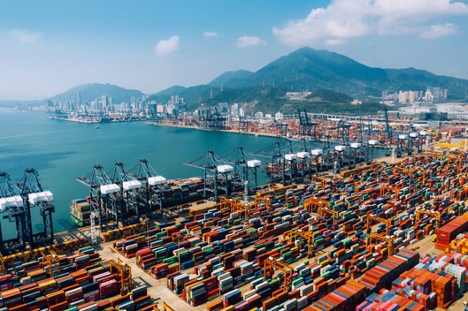
```
Source: https://www.porttechnology.org/news/what-are-sea-ports

6. The main functions of seaports are: To ensure safety for seagoing vessels entering, operation in and leaving the seaport. To provide facilities and equipment necessary for seagoing vessels to anchor, load and unload cargo, and embark and disembark passengers.
7. Ports are land facilities constructed to transfer goods between water and land. They consist of major features such as:
   a. Docks or berths where vessels moor;
   b. Equipment and personnel to load and unload vessels;
   c. Connections to land transportation (such as highways, railways, and pipelines); and
   d. Cargo storage areas.

## Top 25 Tonnage Ports in 2020 {#intro-Tonnage_Port}

1. According to USDOT, Bureau of Transportation Statistics-The top 25 tonnage ports handled a total of 1,744 million tons of cargo about 71.3 percent of the tonnage handled by the top 100 ranked ports. The top 100 ports account for 95.5 percent of total tonnage handled by U.S. ports.
2. The highest tonnage figures are associated with ports that handle large quantities of both liquid bulk cargo (e.g., petroleum or chemicals) and dry bulk cargo (e.g., coal or grain), such as the ports of Houston, South Louisiana, and Corpus Christi.
3. The 2020 top tonnage port was the port of Houston.


## The busiest container ports in the United States {#intro-busiest_Port}

1. Some of the largest and most crucial container gateways of the world are in the United States. The following list of the busiest container ports in the US includes important box hubs, which contribute significantly to the country's economy, while they also allow container movement across the oceans, supporting and facilitating global trade.
   a. Port of Los Angeles, California - More than 9.2 million TEU in 2020
   b. Port of Long Beach, California - More than 8.1 million TEU in 2020
   c. Port of New York and New Jersey, New York - More than 7.5 million TEU in 2020
   d. Port of Savannah, Georgia - More than 4.6 million TEU in 2020
   e. The Northwest Seaport Alliance (Seattle and Tacoma), Washington - More than 3.3 million TEU in 2020
   f. Port Houston, Texas - More than 2.9 million TEU in 2020
   g. Port of Virginia, Virginia - More than 2.8 million TEU in 2020
   h. Port of Oakland, California - More than 2.4 million TEU in 2020
   i. South Carolina Ports, South Carolina - More than 2.3 million TEU in 2020
   j. Port Miami, Florida - More than 1 million TEU in 2020

Source: https://container-news.com/top-10-the-busiest-container-ports-in-the-united-states/


## Sea port goods movement {#intro-Seaport_goods}

1. The Nation’s ports handle the vast majority of U.S. international trade and transportation.
2. Following Figure shows the monthly U.S. international freight value transported by vessel. Between January 2021 and October 2021, the monthly U.S. international freight value transported by vessel increased by about $31 billion (22.6 percent) from $139 billion in January 2021 to $170 billion in October 2021 billion in October 2021.


```{r FigureFreightValue 2.12, echo=FALSE, fig.cap='Monthly U.S. international freight value', out.width='80%', fig.align='center'}
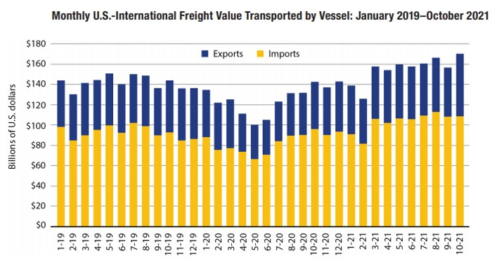
```

Source: U.S. Department of Transportation, Bureau of Transportation Statistics analysis, based upon U.S. Department of Commerce, Census Bureau, USA Trade Online, available at https://usatrade.census.gov/ as of December 2021.


## Container Sea Ports {#intro-container_port}

The operations of container seaport include four steps:

1. Ship-to-shore: stage when cargo is discharged
2. Transfer: cargo is unloaded to a temporal area
3. Storage: stage where containers are hold for a longer period of time
4. Delivery and receipt is the movement of delivery (clearance) of the cargo or receiving into the terminal

 
```{r FigureContainerOps, echo=FALSE, fig.cap='Operations of container seaport', out.width='80%', fig.align='center'}
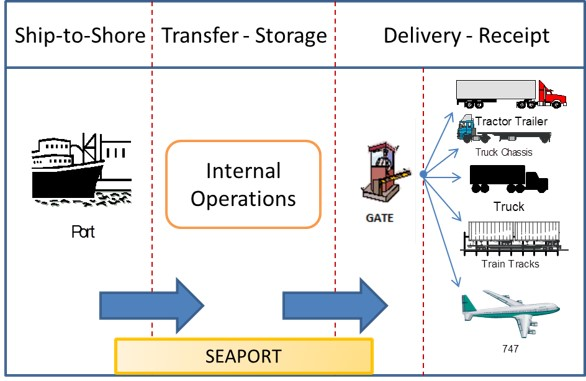
```

## Container Terminal Structure {#intro-container_terminal_structure}

A sea container terminal consists of at least three operational areas:

1. The operational area between the quay wall and container yard (area just behind the berth front).
2. The container yard (terminal storage, which is the stacking area): the area where the containers are stocked and where the loading and unloading activities of these units are carried out.
3. The terminal area of landside operations, which includes the gate, parking, office buildings, customs facilities, container freight station with an area for stuffing and stripping, empty container storage, a container maintenance and repair area, and so on.


```{r FigureContainersScheme, echo=FALSE, fig.cap='Scheme of a port terminal of containers showing the three main zones', out.width='80%', fig.align='center'}
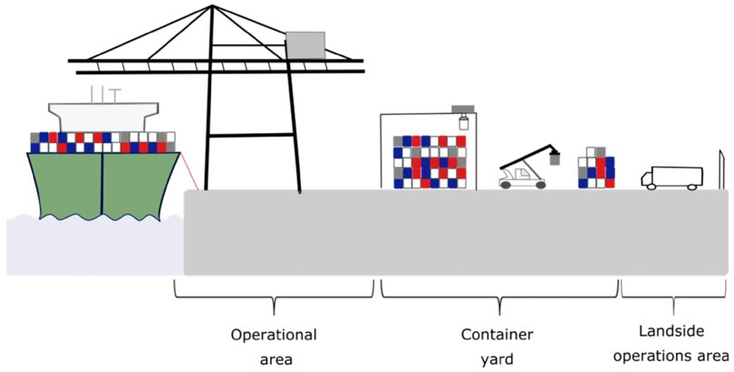
```


## Goods movement in Seaport {#intro-Goods_movement}

1. Let us assume a renowned Denim brand from the US wants to outsource its jeans consignment from China. Once the consignment is ready, the exporter will first select a particular shipping company whose container will come to its factory for cargo loading.
2. After loading the containers, the containers are sealed and an identical no. or a particular id is given to the exporter so that they can track their goods.
3. Now the Freight forwarder will arrange for the intermodal transport i.e. transporting the container from the exporter warehouse or factory to the designated shipping port for loading into the ships.

Shipping:

1. In the port, the container weights are measured, and the entries are made according to that. The container is stacked in the port in such a manner that they can be taken out easily as per the schedule of their assigned vessel. Now the container is ready to be loaded on the ship.
2. Once the ship arrives, the container is brought from the port storage facility, near to the ship by container port trucks
3. The container can be stored on the ship’s cargo hold, where container guides are provided to draw and place the container inside the hold.
4. Once the ship reaches the destined port, the container will be unloaded by the port cranes, and it is transported to the port bay or warehouse using the port container trucks.
5. Once the custody of the shipment is acquired by the Importer’s representative or by the freight forwarder, the cargo will be transported using intermodal transport to the importer’s warehouse where the container is unloaded.
6. The empty container is now returned to the shipping line designated container yard, where it will wait for the next booking and onward journey.
7. The world is now connected by thousands of containers making it feasible for businesses and people to trade across the globe.


```{r FigureExampleGoodsMovement, echo=FALSE, fig.cap='Example of Goods Movement from Port of Entry to Customer', out.width='80%', fig.align='center'}
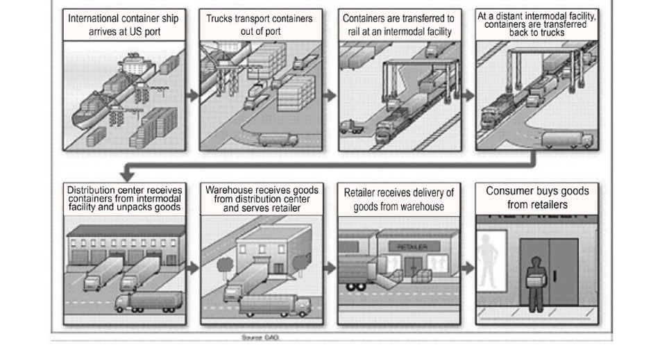
```


## Sea-port Logistics {#intro-port_Logistic}

For accessibility reasons, port-centric activities tend to cluster in areas close to or adjacent to port terminals. A better organization of first and second-tier activities is commonly leading to the setting of port-centric logistics zones. These zones have several advantages, including a better utilization level of transportation and container assets.


```{r FigureSeaportLogistics, echo=FALSE, fig.cap='Sea-port Logistics', out.width='80%', fig.align='center'}
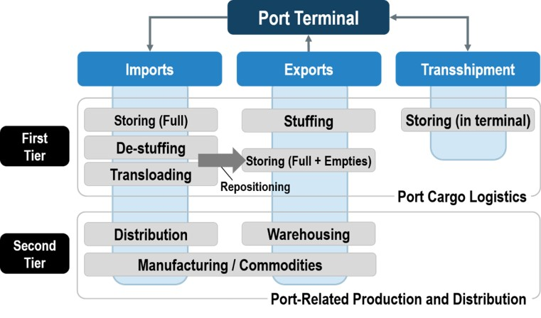
```


```{r FigureWarehouseServices, echo=FALSE, fig.cap='Warehousing Services', out.width='80%', fig.align='center'}
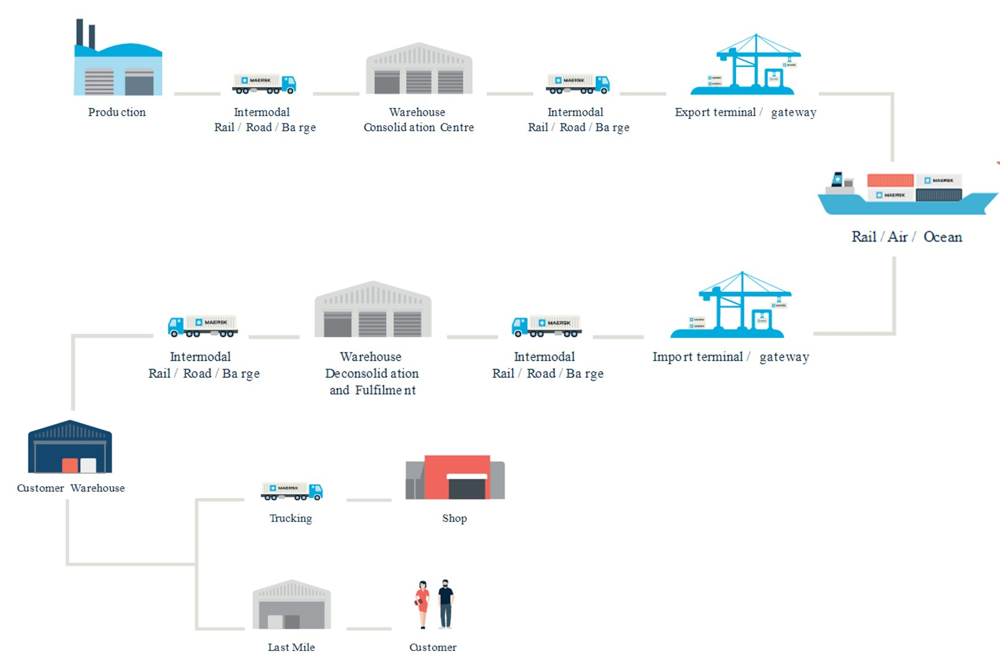
```


