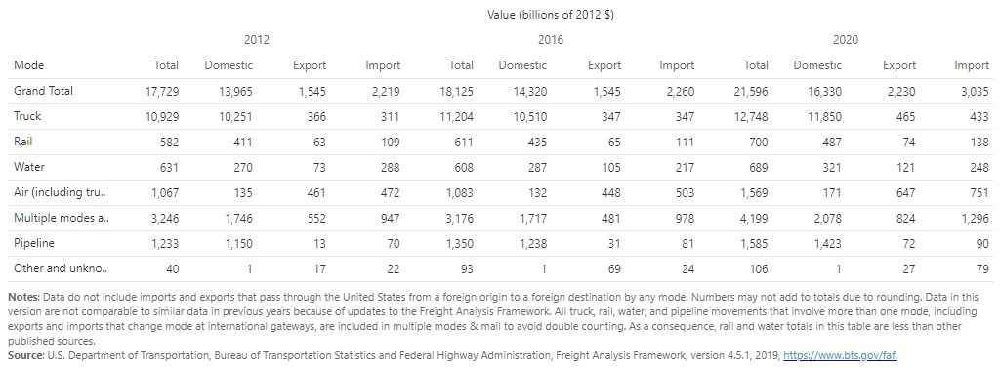

# Introduction {#intro}

The movement of freight is a key foundation to the functioning of our society and economy...

A sample math equation $a^2 + b^2 = c^2$

## Applicable Federal Agencies {#intro-agencies}

* BTS - Bureau of Transportation Statistics (https://www.bts.gov/)
* FHWA - Federal Highway Administration (https://www.fhwa.dot.gov/)
* FMCSA - Federal Motor Carrier Safety Administration (https://www.fmcsa.dot.gov/)
* NHTSA - National Highway Traffic Safety Administration (https://www.nhtsa.gov/)
* USDOT - United States Department of Transportation (https://www.transportation.gov/)


## Freight movement statistics {#intro-statistics}

1) Mobility refers to the ease that a passenger or a freight unit can move across a transportation system. High mobility requires limited efforts, while low mobility is related to complexity and high costs.
...

2) For freight, mobility is cargo-dependent, with some commodities having limited storage requirements but heavy to carry

**Weight of shipments by transportation mode**

```{r FreightByWeightImage, echo=FALSE, fig.cap='Weight of shipments by transportation mode', fig.width=6, fig.align='center'}
knitr::include_graphics("./Images/FreightShipments_Weight.jpg")
```

**Value of shipments by transportation mode**

```{r FreightByValueImage, echo=FALSE, fig.cap='Value of shipments by transportation mode', fig.width=6, fig.align='center'}

```

Reference BTS

## Freight Transportation {#intro-Freight}

1) The figure 2.3 shows the Ton-Miles of Freight transported by different transportation modes.

2) Truck remains the premiere mode of freight transportation through the past two decades.

3) Further growth in the future with advancements in electric vehicles and automation. 

4) Other modes are meanwhile holding relatively stable throughout the years.

5) Freight transportation movements are expected to increase over the next few decades as global populations grow and consumer spending power increases. 

6) The freight transportation system in the United States includes an extensive network of highways, railroads, waterways, pipelines, and airways: 958,000 miles of Federal-aid highways, 141,000 miles of railroads, 11,000 miles of inland waterways, and 1.6 million miles of pipelines. 

7) Figure 2.4 shows historical and forecasted mode share in ton-miles from 1990–2040.

8) The data reveal that most freight transportation modes are expected to experience increased volumes, although the amount of expected growth will vary by mode, with pipelines projected to have negative growth to year 2040.


```{r Figure 2.3, echo=FALSE, fig.cap='U.S. Ton-Miles of Freight', fig.width=6, fig.align='center'}
knitr::include_graphics("./Images/jayisha/U.S. Ton-Miles of Freight.jpg")
```
Source: https://www.bts.gov/content/us-ton-miles-freight


```{r Figure 2.4, echo=FALSE, fig.cap='Historical and Forecasted Mode Share of Ton-miles, 1990–2040', fig.width=4, fig.align='center'}
knitr::include_graphics("./Images/jayisha/Historical and Forecasted Mode Share of Ton-miles, 1990–2040.jpg")
```
Source: 2016 Freight Quick Facts Report, DOT, Draft National Freight Strategic Plan, BTS Special Tabulation


## Freight Transportation Service Index {#ntro-Freight_Index}

1) The Freight Transportation Services Index, an indicator of monthly changes in freight carried by for-hire transportation companies.

2) Not exactly paralleled the demand for consumer goods since August 2019.

3) The volume of freight moved declined moderately from August 2019 through February 2020, then collapsed with the arrival of COVID-19 in March but quickly rebounded by summer (Figure 3.1).

```{r Figure 2.5, echo=FALSE, fig.cap='Freight Transportation Services Index 2016–2021', fig.width=4, fig.align='center'}
knitr::include_graphics("./Images/jayisha/Freight Transportation Services Index 2016–2021.jpg")
```

## Freight Transportation and the Economy {#intro-Freight_economy}
 
1) The benefits of freight transportation to the economy are enormous.

2) Freight transportation increases the value of goods by moving them to locations where they are worth more and encourages competition and production.

3) Freight transportation also stimulates demand for goods and services and employs millions of people.

4) Freight transportation infrastructure is a significant component of our nation's wealth and productive capacity.

5) From a macroeconomic perspective, transportation accounts for a significant share of the U.S. GDP. In 2000, purchases of transportation-related goods and services accounted for approximately 11 percent of GDP (USDOT BTS 2002).

6) Only housing, health care, and food accounted for a greater share. For-hire transportation services, which include warehousing, contributed about 3.3 percent ($303 billion) to GDP.

7) Many industries and businesses depend on their own transportation operations (primarily trucking) to move goods. These "in-house" transportation services contributed an additional $142 billion to the economy (USDOT BTS 2001b).

8) Freight transportation also contributes to the economy by providing jobs to millions of people—an important indicator of economic growth.

9) In 2000, more than 10 million people were employed in transportation-related industries, including for-hire services, vehicle manufacturing, and parts suppliers.

10) For-hire transportation (including warehousing) employed more than 4.4 million workers, a majority of whom worked in freight-related jobs.

11) Another 5.5 million people worked in transportation occupations in non transportation industries, such as truck drivers for grocery stores (USDOT BTS 2001b).

12) Truck drivers, alone, accounted for nearly 70 percent of the total number of transportation occupational workers (USDOT BTS 2002b).

13) Improvements in freight productivity help the United States maintain its competitive position in the world economy.

14) The Bureau of Labor Statistics reports that productivity for the intercity trucking, railroad, air transport, and petroleum pipeline industries has improved over the last 20 years.


## Growing Freight Movement {#intro-Freight_movement}
 
1) Improvements in railroad productivity resulted primarily from deregulation, divestiture of uneconomic lines, reductions in the labor force, and changes in technology and logistics. Productivity improvements in trucking resulted primarily from public investments in a high-quality national road network and deregulation.


2) The volume of freight moved by the U.S. transportation system has grown dramatically in recent decades and is projected to increase nearly 70 percent by 2020.

3) The liberalization of trade policies, such as the North American Free Trade Agreement (NAFTA), internationalization of supply chains, and changes in transportation and information technologies have contributed to this increase in freight movement.

4) As a share of the gross domestic product (GDP), U.S. exports and imports grew from 9 percent in 1960 to 23 percent in 2002. U.S. international trade is forecast to reach 37 percent of GDP by 2025.

5) Trucks carried about 71 percent of all tonnage and 80 percent of the value of U.S. shipments in 1998.

6) Even with growth in airfreight, maritime, and rail services, the percentage of urban interstates carrying more than 10,000 trucks daily is expected to increase from 27 percent in 1998 to 69 percent in 2020.

7) In recent years, trade growth has increased the number of commercial vehicles on U.S. roadways and, indirectly, the potential demand for more productive and larger commercial trucks. Trucks move a majority of freight tonnage.

8) In 2002, 7.9 million large trucks (trucks with six or more tires) were on the road, compared with 6.2 million in 1990, and trucks contributed to 7.5 percent of all vehicle miles traveled in 2002.

9) Trucks transported the vast majority of freight by both weight and value in 2018 (68% and 73%, respectively). While pipelines and rail together accounted for over 25% of freight tonnage, they accounted for just over 12% of freight value. Domestic freight movement in 2018 totaled 16.5 billion tons with a total value of $14.8 billion.

```{r Figure 2.6, echo=FALSE, fig.cap='Freight by Mode, 2018', fig.width=4, fig.align='center'}
knitr::include_graphics("./Images/jayisha/Freight by Mode, 2018.jpg")
```


## Freight Mobility and Statistics {#intro-Freight_mobility}


```{r Figure 2.7, echo=FALSE, fig.cap='Freight by Mode, 2018', fig.width=4, fig.align='center'}
knitr::include_graphics("./Images/jayisha/Freight by Mode, 2018.jpg")
```

Source:U.S. Department of Transportation,Freight Analysis Framework, Version 4.5.1, December 2019. Data Tabulation Tool queried July 2, 2020.


```{r Figure 2.8, echo=FALSE, fig.cap='Weight and Value Freight Shipments by Domestic Mode- 2017', fig.width=4, fig.align='center'}
knitr::include_graphics("./Images/jayisha/Weight and Value Freight Shipments by Domestic Mode- 2017.jpg")
```


```{r Figure 2.9, echo=FALSE, fig.cap='Value of Freight Shipments by State- 2017', fig.width=4, fig.align='center'}
knitr::include_graphics("./Images/jayisha/Value of Freight Shipments by State- 2017.jpg")
```


