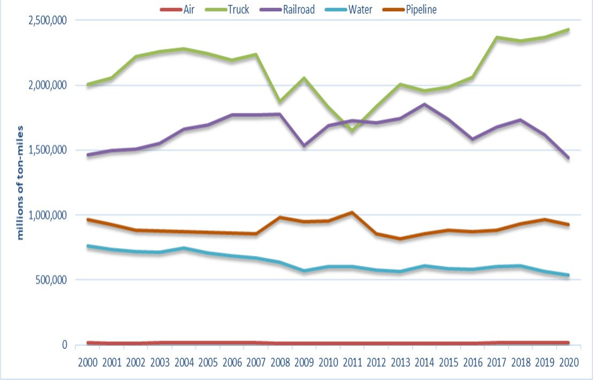

# Introduction {#intro}

The movement of freight is a key foundation to the functioning of our society and economy...

A sample math equation $a^2 + b^2 = c^2$

## Applicable Federal Agencies {#intro-agencies}

* BTS - Bureau of Transportation Statistics (https://www.bts.gov/)
* FHWA - Federal Highway Administration (https://www.fhwa.dot.gov/)
* FMCSA - Federal Motor Carrier Safety Administration (https://www.fmcsa.dot.gov/)
* NHTSA - National Highway Traffic Safety Administration (https://www.nhtsa.gov/)
* USDOT - United States Department of Transportation (https://www.transportation.gov/)


## Freight movement statistics {#intro-statistics}

1) Mobility refers to the ease that a passenger or a freight unit can move across a transportation system. High mobility requires limited efforts, while low mobility is related to complexity and high costs.
...

2) For freight, mobility is cargo-dependent, with some commodities having limited storage requirements but heavy to carry

**Weight of shipments by transportation mode**

```{r FreightByWeightImage, echo=FALSE, fig.cap='Weight of shipments by transportation mode', fig.width=6, fig.align='center'}
knitr::include_graphics("./Images/FreightShipments_Weight.jpg")
```

**Value of shipments by transportation mode**

```{r FreightByValueImage, echo=FALSE, fig.cap='Value of shipments by transportation mode', fig.width=6, fig.align='center'}
knitr::include_graphics("./Images/FreightShipments_Value.jpg")
```

Reference BTS

## Freight Transportation {#intro-Freight}

1) The figure shows the Ton-Miles of Freight transported by different transportation modes.

2) Truck remains the premiere mode of freight transportation through the past two decades.

3) Further growth in the future with advancements in electric vehicles and automation. 

4) Other modes are meanwhile holding relatively stable throughout the years.

```{r Figure 2.3, echo=FALSE, fig.cap='U.S. Ton-Miles of Freight', fig.width=6, fig.align='center'}

```
