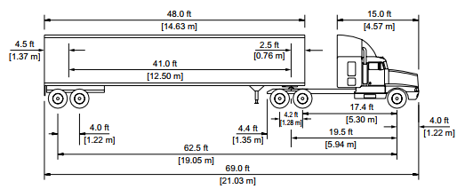
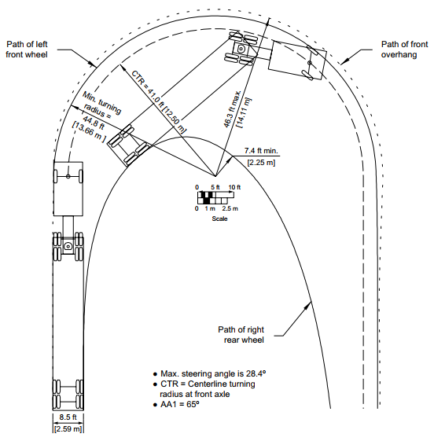

# Freight Vehicle Physical Characteristics {#VehPhysicalChars}

This chapter discusses the physical characteristics of commercial trucks used for the transportation of goods over medium- and long-haul distances. Additionally, it discusses how these physical characteristics should be considered in the context of geometric design issues.


## Vehicle Classifications {#VehChars-Classes}


Figure \@ref(fig:FHWAvehicleClassifications) shows the vehicle classification scheme according to the Federal Highway Administration (FHWA).


```{r FHWAvehicleClassifications, echo=FALSE, fig.cap='FHWA Vehicle Classifications', out.width="60%", fig.align='center'}
knitr::include_graphics("./Images/VehicleChars/VehClassesFHWA.jpg")
```

Source: FHWA (2019). Traffic Monitoring Guide, Appendix C. Vehicle Types. USDOT. Washington, DC. URL: https://www.fhwa.dot.gov/policyinformation/tmguide/tmg_2013/vehicle-types.cfm.


Parcel delivery vehicles (e.g., UPS, FedEx) are usually of type class 5 or 6. Vehicles in classes 6 and 7 are largely comprised of construction vehicles (e.g., dump trucks, concrete mixers). Vehicles in classes 5-7 are often referred to as single unit trucks (SUTs). This course focuses on vehicles in classifications 8-12, vehicle types most commonly used for the transportation of freight over medium- and long-haul distances. Such vehicles consist of a tractor + semi-trailer configuration. These vehicles are often informally referred to as a 'Semi-Truck' or 'Tractor-Trailer'.


## Tractor Truck

The tractor provides the motive force to pull the attached semi-trailer. The near universal design of truck tractors used in North America consist of an engine and hood over the front axle in front of the cab. Figure \@ref(fig:TractorNoSleeper) shows an example of this design. The tractor shown in this figure is often referred to as a 'Day Cab' style.


```{r TractorNoSleeper, echo=FALSE, fig.cap='Tractor without sleeper cab', out.width="60%", fig.align='center'}
knitr::include_graphics("./Images/VehicleChars/TractorNoSleeper.png")
```

Source: https://www.macktrucks.com/

Figure \@ref(fig:TractorWithSleeper) shows an example of a 'Sleeper Cab' tractor design. This tractor includes a compartment that can be used for sleeping by the driver during overnight stops on long-haul trips.

```{r TractorWithSleeper, echo=FALSE, fig.cap='Tractor without sleeper cab', out.width="60%", fig.align='center'}
knitr::include_graphics("./Images/VehicleChars/TractorWithSleeperCab.png")
```

Source: https://www.macktrucks.com/


Manufacturers of popular truck models in the United States include:  

- Freightliner: https://www.freightliner.com/
- Kenworth: https://www.kenworth.com/
- Mack: https://www.macktrucks.com/
- Peterbilt: https://www.peterbilt.com/
- Volvo: https://www.volvotrucks.us/
- Western Star: https://www.westernstartrucks.com/


## Semi-Trailer

A semi-trailer does not include a front axle. Commonly used trailer types include the following:


**Box Trailer (Dry Van Trailer)**  
- Fully enclosed  
- Typical cargo: non-perishable goods, construction-related products, and cargo that does not require temperature control  
- Typical length: 53 ft  

```{r TrailerDryVan, echo=FALSE, fig.cap='Dry Van Trailer', out.width="70%", fig.align='center'}

```
Photo Source: Scott S. Washburn

**Intermodal Trailer (Container Chassis)**  
- Used to transport intermodal shipping containers to and from container depots, seaports, rail yards, and other shipping facilities  
- Typical length: 20 or 40 ft cargo container  

**Flatbed Trailer**  
- A flat deck with no containment, doors, or roof to enclose loads. Thus, provide considerable flexibility for un/loading and laying out loads.  
- Primarily used for shipping construction materials and various equipment. Essentially, any load that does not require protection from weather and other elements can be transported using flatbed trailers.  
- Typical length: 48 ft, 53 ft

```{r TrailerFlatbed, echo=FALSE, fig.cap='Flatbed Trailer', out.width="70%", fig.align='center'}

```
Photo Source: Scott S. Washburn

**Side Curtain Trailer**  
- Combines the loading benefits of a flatbed trailer with a ceiling, front wall, and rear doors for cargo containment and protection, but allows for side loading.  
- Used to transport consumer goods, lumber, etc.  
- Typical length: 40 ft

**Refrigerator Trailer (Reefer Trailer)**  
- Equipped with a built-in temperature control system and insulation to protect temperature-sensitive shipments  
- Typical cargo: Food (meat, fish, dairy, etc.), Pharmaceuticals, and similar  
- Typical length: 48 ft, 53 ft

**Tanker Trailer**  
- Cylindrical design and used to carry liquids  
- Typical cargo: Petrochemicals, dry food, beverages, asphalt  
- Typical length: 53 ft

```{r TrailerTanker, echo=FALSE, fig.cap='Tanker Trailer', out.width="50%", fig.align='center'}

```
Photo Source: Scott S. Washburn

**Dry Bulk Trailers (pneumatic tankers)**  
- used to transport dry goods, such as flour, maize, cement, sand, and similar commodities. These tankers are fully enclosed and vacuum-sealed to prevent any type of leakage. 
- Typical length: 20 ft, 40 ft

```{r TrailerDryBulk, echo=FALSE, fig.cap='Tanker Trailer', out.width="50%", fig.align='center'}

```
Photo Source: Scott S. Washburn

**Lowboy Trailer**  
- Features a very low deck. The primary purpose of this trailer type is to transport tall equipment or cargo without the need to obtain height permits.  
- Typical cargo: Large equipment and machinery, Lowboys are generally used to transport oversized materials from mining sites, bulldozers, heavy machinery, large vehicles, and excavators.  

```{r TrailerLowboy, echo=FALSE, fig.cap='Flatbed Trailer', out.width="80%", fig.align='center'}
knitr::include_graphics("./Images/VehicleChars/TrailerLowboy.png")
```
Photo Source: Scott S. Washburn

**Car Carrier Trailer (Car Hauler Trailer)**  
- Typical cargo: Automobiles (Sedans, SUVs, pickup trucks, etc.)

```{r TrailerCarHauler, echo=FALSE,out.width="45%", fig.show="hold"}
knitr::include_graphics("./Images/VehicleChars/TrailerCarHaulerEmpty.png")

```
<p></p>
Photos Source: Scott S. Washburn

## Physical Dimensions and Weights

AASHTO's "A Policy on Geometric Design of Highways and Streets" (@GreenBook7), commonly referred to as the "Green Book" includes guidelines for design vehicle dimensions. Table \@ref(tab:DesignVehDimensions) lists those values for the commercial truck classifications.

Table: (\#tab:DesignVehDimensions) Design Vehicle Dimensions (units of feet)

**Design Vehicle Type**|**Symbol**|**Overall Height**|**Overall Width**|**Overall Length**|**Overhang-Front**|**Overhang-Rear**|
|-----|:-----:|:-----:|:-----:|:-----:|:-----:|:-----:
Single Unit Truck|SU|11-13.5|8.0|30.0|4.0|6.0
Intermediate Semitrailer|WB-40|13.5|8.0|45.5|3.0|4.5#
Interstate Semitrailer|WB-62*|13.5|8.5|69.0|4.0|4.5#
Interstate Semitrailer|WB-67**|13.5|8.5|73.5|4.0|4.5#
"Double Bottom" Semitrailer / Trailer|WB-67D|13.5|8.5|72.3|2.3|3.0
Rocky Mountain Double-Semitrailer / Trailer|WB-92D|13.5|8.5|97.3|2.3|3.0
Triple-Semitrailer / Trailer|WB-100T|13.5|8.5|104.8|2.3|3.0
Turnpike Double Semitrailer / Trailer|WB-109D|13.5|8.5|114.0|2.3|4.5#

\* Design vehicle with 48.0-ft trailer as adopted in 1982 STAA (Surface Transportation Assistance Act)  
** Design vehicle with 53.0-ft trailer as grandfathered in 1982 STAA  
# Length of the overhang from the back axle of the tandem axle assembly.

Source: @GreenBook7, (Table 2-4a. Design Vehicle Dimensions (U.S. Customary Units))


```{r DimensionsIllustration1, echo=FALSE, fig.cap='Illustration of length and height dimensions for WB-62 design vehicle', out.width="75%", fig.align='center'}

```

```{r DimensionsIllustration2, echo=FALSE, fig.cap='Illustration of length and height dimensions for WB-67 design vehicle', out.width="75%", fig.align='center'}
knitr::include_graphics("./Images/VehicleChars/TractorWith53ftTrailer.png")
```


### Regulatory Limits

Per the Federal Highway Administration (https://ops.fhwa.dot.gov/freight/sw/overview/index.htm), the following weight and dimension regulations are specified.

On the National Network of highways (the interstate highway system and highways, formerly classified as Primary System routes, capable of safely handling larger commercial motor vehicles, the following dimension limits apply:

* overall vehicle length: 
  * No federal limit is imposed on most truck tractor-semitrailers operation on the National Network.
  * Exception: Combination vehicles (truck tractor plus semitrailer or trailer) designed and used specifically to carry automobiles or boats in specially designed racks may not exceed a maximum overall vehicle length of 65 feet, or 75 feet, depending on the type of connection between the tractor and trailer.
* trailer length: 
  * Federal law provides that no state may impose a length limitation of less than 48 feet (or longer if provided for by grandfather rights) on a semitrailer operating in any truck tractor-semitrailer combination on the National Network.
  * Federal law also provides that no state may impose a length limitation of less than 28 feet on a semitrailer or trailer operating in a truck tractor-semitrailer-trailer (twin-trailer) combination on the National Network.
* vehicle width: On the National Network, no state may impose a width limitation of more or less than 102 inches. Safety devices (e.g., mirrors, handholds) necessary for the safe and efficient operation of motor vehicles may not be included in the calculation of width.
* vehicle height: No federal limit. State limits range from 13.6 feet to 14.6 feet.

Additional information about federal size and weight limits can be found at [Compilation of Existing State Truck Size and Weight Limit Laws](https://ops.fhwa.dot.gov/freight/policy/rpt_congress/truck_sw_laws/index.htm).


## Geometric Design Considerations

Because of their larger size relative to passenger vehicles, commercial trucks require special consideration for roadway design.

Figures \@ref(fig:TurningRadiiWB62) and \@ref(fig:TurningRadiiWB67) illustrate the minimum required turning paths for the WB-62 and WB-67 design vehicles.

```{r TurningRadiiWB62, echo=FALSE, fig.cap='Minimum Turning Path for Interstate Semitrailer (WB-62) Design Vehicle', out.width="55%", fig.align='center'}

```

Source: @GreenBook7, Figure 2-23

```{r TurningRadiiWB67, echo=FALSE, fig.cap='Minimum Turning Path for Interstate Semitrailer (WB-67) Design Vehicle', out.width="55%", fig.align='center'}
knitr::include_graphics("./Images/VehicleChars/WB67TurningTemplate.png")
```

Source: @GreenBook7, Figure 2-24

The clearance distance (height) between a roadway and an overpass is generally based on the maximum allowable height of a tractor-trailer. For an overpass that crosses above a sag vertical curve, a tractor-trailer is typically used as the design vehicle because the sight distance is more constrained for truck drivers sitting higher above the ground than for drivers of passenger vehicles.
