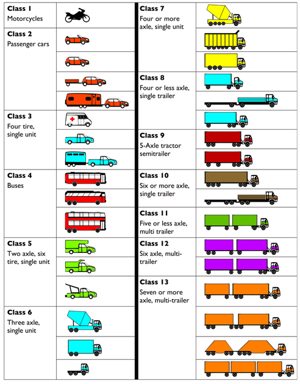

# Freight Vehicle Characteristics {#VehChars}

## FHWA truck classifications {#VehChars-Classes}


```{r Figure 3.1, echo=FALSE, fig.cap='FHWA truck Classifications', fig.width=6, fig.align='center'}

```

Source: FHWA (2019). Traffic Monitoring Guide, Appendix C. Vehicle Types. USDOT. Washington, DC. URL: https://www.fhwa.dot.gov/policyinformation/tmguide/tmg_2013/vehicle-types.cfm.

## Types of trailers

1. Flatbed Trailer
2. Dry Vans
3. Refrigerated Trailer
4. Lowboy Trailers
5. Step Deck Trailers
6. Etc.

https://truckfreighter.com/tractor-types-trucks-trailers

An example table is shown in Table \@ref(tab:Example)


Table: (\#tab:Example) A sample table

|Variable | Value (%) |  
|:-------:|:---------:|
| X       | 25 |
| Y       | 50 |
| Z       | 75 |


## Performance characteristics (accel, decel, speed governing, etc.)

## Unloaded weights

## Geometric design considerations (turning radius, sight distance, etc.)
