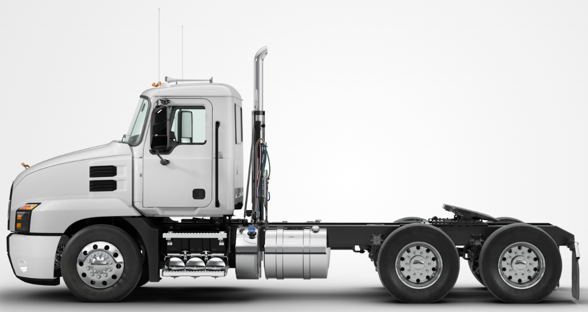
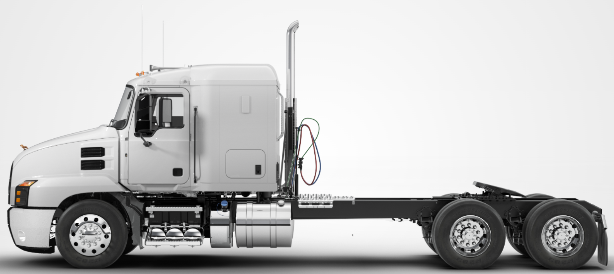
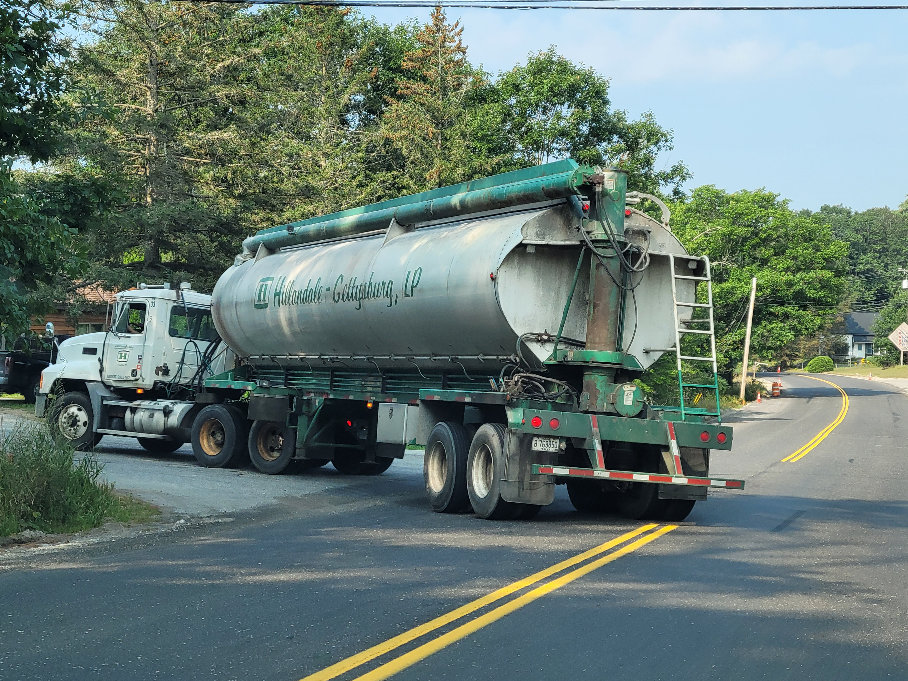
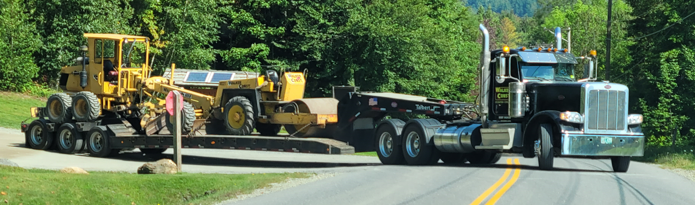
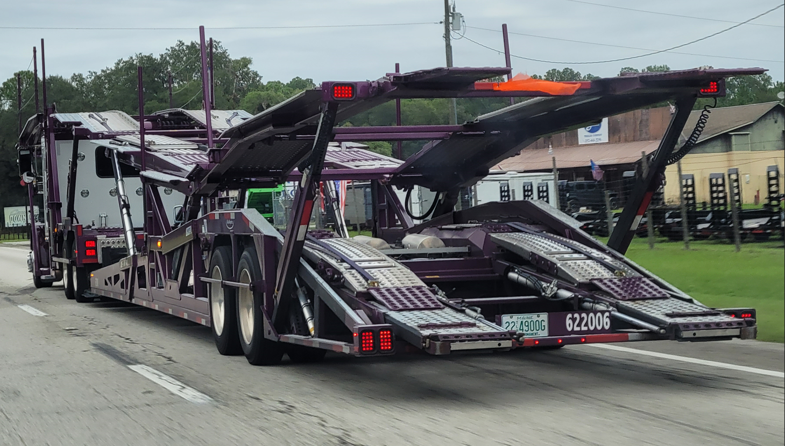
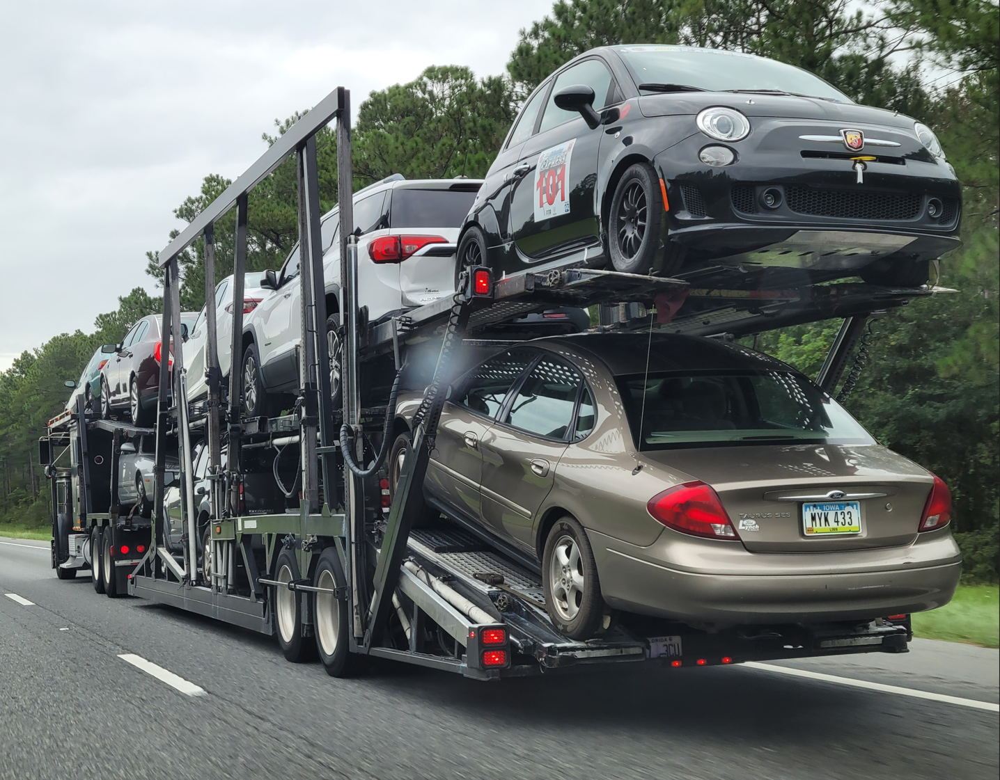
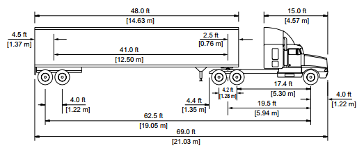
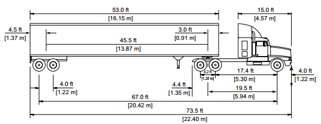
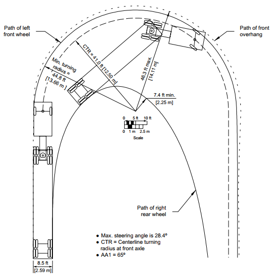
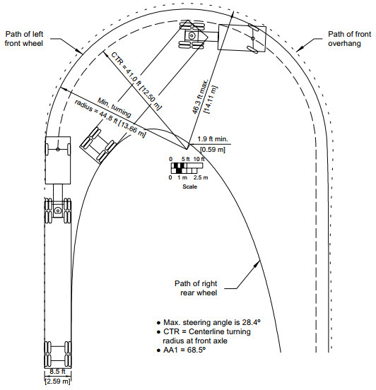

# Freight Vehicle Characteristics {#VehChars}

This chapter discusses the characteristics of commercial trucks used for the transportation of goods over medium- and long-haul distances. Specifically, it describes the physical design features, performance characteristics, and considerations for traffic operations and geometric design as a result of the vehicle physical design and performance characteristics.

Also regulations about carried weights...


## Vehicle Classifications {#VehChars-Classes}


Figure \@ref(fig:FHWAvehicleClassifications) shows the vehicle classification scheme according to the Federal Highway Administration (FHWA).


```{r FHWAvehicleClassifications, echo=FALSE, fig.cap='FHWA Vehicle Classifications', out.width="75%", fig.align='center'}
knitr::include_graphics("./Images/VehClassesFHWA.jpg")
```

Source: FHWA (2019). Traffic Monitoring Guide, Appendix C. Vehicle Types. USDOT. Washington, DC. URL: https://www.fhwa.dot.gov/policyinformation/tmguide/tmg_2013/vehicle-types.cfm.


Parcel delivery vehicles (e.g., UPS, FedEx) are usually of type class 5 or 6. Vehicles in classes 6 and 7 are largely comprised of construction vehicles (e.g., dump trucks, concrete mixers). Vehicles in classes 5-7 are often referred to as single unit trucks (SUTs). This course focuses on vehicles in classifications 8-12, vehicle types most commonly used for the transportation of freight over medium- and long-haul distances. Such vehicles consist of a tractor + semi-trailer configuration. These vehicles are often informally referred to as a 'Semi-Truck' or 'Tractor-Trailer'.


## Tractor Truck

The tractor provides the motive force to pull the attached semi-trailer. The near universal design of truck tractors used in North America consist of an engine and hood over the front axle in front of the cab. Figure \@ref(fig:TractorNoSleeper) shows an example of this design. The tractor shown in this figure is often referred to as a 'Day Cab' style.


```{r TractorNoSleeper, echo=FALSE, fig.cap='Tractor without sleeper cab', out.width="75%", fig.align='center'}

```

Source: https://www.macktrucks.com/

Figure \@ref(fig:TractorWithSleeper) shows an example of a 'Sleeper Cab' tractor design. This tractor includes a compartment that can be used for sleeping by the driver during overnight stops on long-haul trips.

```{r TractorWithSleeper, echo=FALSE, fig.cap='Tractor without sleeper cab', out.width="75%", fig.align='center'}

```

Source: https://www.macktrucks.com/


Manufacturers of popular truck models in the United States include:  

- Freightliner: https://www.freightliner.com/
- Kenworth: https://www.kenworth.com/
- Mack: https://www.macktrucks.com/
- Peterbilt: https://www.peterbilt.com/
- Volvo: https://www.volvotrucks.us/
- Western Star: https://www.westernstartrucks.com/


## Semi-Trailer

A semi-trailer does not include a front axle.

Commonly used trailer types include the following (not an exhaustive list):

Add a photo of each trailer type

**Box Trailer (Dry Van Trailer)**  
- Fully enclosed  
- Typical cargo: non-perishable goods, construction-related products, and cargo that does not require temperature control  
- Typical length: 53 ft  

**Intermodal Trailer (Container Chassis)**  
- Used to transport intermodal shipping containers to and from container depots, seaports, rail yards, and other shipping facilities  
- Typical length: 20 or 40 ft cargo container  

**Flatbed Trailer**  
- A flat deck with no containment, doors, or roof to enclose loads. Thus, provide considerable flexibility for un/loading and laying out loads.
- Primarily used for shipping construction materials and various equipment. Essentially, any load that does not require protection from weather and other elements can be transported using flatbed trailers.
- Typical length: 48 ft, 53 ft

**Side Curtain Trailer**  
- Combines the loading benefits of a flatbed trailer with a ceiling, front wall, and rear doors for cargo containment and protection, but allows for side loading.
- Used to transport consumer goods, lumber, etc.
- Typical length: 40 ft

**Refrigerator Trailer (Reefer Trailer)**  
- equipped with a built-in temperature control system and insulation to protect temperature-sensitive shipments
- Typical cargo: Food (meat, fish, dairy, etc.), Pharmaceuticals, and similar
- Typical length: 48 ft, 53 ft

**Tanker Trailer**  
- Cylindrical design and used to carry liquids
- Typical cargo: Petrochemicals, dry food, beverages, asphalt
- Typical length: 53 ft

```{r TrailerTanker, echo=FALSE, fig.cap='Tanker Trailer', out.width="70%", fig.align='center'}

```

**Dry Bulk Trailers (pneumatic tankers)**  
- used to transport dry goods, such as flour, maize, cement, sand, and similar commodities. These tankers are fully enclosed and vacuum-sealed to prevent any type of leakage. 
- Typical length: 20 ft, 40 ft

**Lowboy Trailer**  
- Features a very low deck. The primary purpose of this trailer type is to transport tall equipment or cargo without the need to obtain height permits.
- Typical cargo: Large equipment and machinery, Lowboys are generally used to transport oversized materials from mining sites, bulldozers, heavy machinery, large vehicles, and excavators. 

```{r TrailerFlatbed, echo=FALSE, fig.cap='Flatbed Trailer', out.width="90%", fig.align='center'}

```

**Car Carrier Trailer (Car Hauler Trailer)**  
- Typical cargo: Vehicles (Sedans, SUVs, trucks, etc.)

```{r TrailerCarHauler, echo=FALSE,out.width="50%", fig.show="hold"}


```

## Physical Dimensions

AASHTO's "A Policy on Geometric Design of Highways and Streets" (@GreenBook7), commonly referred to as the "Green Book" includes guidelines for design vehicle dimensions. Table \@ref(tab:DesignVehDimensions) lists those values for the commercial truck classifications.

Table: (\#tab:DesignVehDimensions) Design Vehicle Dimensions (units of feet)

**Design Vehicle Type**|**Symbol**|**Overall Height**|**Overall Width**|**Overall Length**|**Overhang-Front**|**Overhang-Rear**|
|-----|:-----:|:-----:|:-----:|:-----:|:-----:|:-----:
Single Unit Truck|SU|11-13.5|8.0|30.0|4.0|6.0
Intermediate Semitrailer|WB-40|13.5|8.0|45.5|3.0|4.5#
Interstate Semitrailer|WB-62*|13.5|8.5|69.0|4.0|4.5#
Interstate Semitrailer|WB-67**|13.5|8.5|73.5|4.0|4.5#
"Double Bottom" Semitrailer / Trailer|WB-67D|13.5|8.5|72.3|2.3|3.0
Rocky Mountain Double-Semitrailer / Trailer|WB-92D|13.5|8.5|97.3|2.3|3.0
Triple-Semitrailer / Trailer|WB-100T|13.5|8.5|104.8|2.3|3.0
Turnpike Double Semitrailer / Trailer|WB-109D|13.5|8.5|114.0|2.3|4.5#

\* Design vehicle with 48.0-ft trailer as adopted in 1982 STAA (Surface Transportation Assistance Act)  
** Design vehicle with 53.0-ft trailer as grandfathered in 1982 STAA  
# Length of the overhang from the back axle of the tandem axle assembly.

Source: @GreenBook7, (Table 2-4a. Design Vehicle Dimensions (U.S. Customary Units))


```{r DimensionsIllustration1, echo=FALSE, fig.cap='Illustration of length and height dimensions for WB-62 design vehicle', out.width="75%", fig.align='center'}

```

```{r DimensionsIllustration2, echo=FALSE, fig.cap='Illustration of length and height dimensions for WB-67 design vehicle', out.width="75%", fig.align='center'}

```


## Unloaded and Loaded Weight Characteristics

https://www.macktrucks.com/trucks/anthem/specs/


## Performance characteristics (accel, decel, speed governing, etc.)


**Acceleration**

Vehicle acceleration is a function of tractive effort (the force used to propel the vehicle forward) and resistance forces (the forces that resist/impede the forward motion of a vehicle). The available tractive effort is a function of the powertrain (engine and transmission). The total tractive effort that can be utilized is also limited by the forces between the tire-pavement interface; however, this aspect is rarely the limiting factor given the large weights of commercial vehicles. 


*Engine*

Insert image of PACCAR engine

*Transmission*

Insert image of Detroit DT12 Transmission
12 speeds

*Primary Resistance Forces*

Aerodynamic  
- air density, frontal area, coefficient of drag
Grade  
- weight, roadway incline
Rolling  
- weight, coefficient of rolling resistance


Ranges of drag coefficients (Source: Tables 2.2 and 2.3, @mannering2019principles)  
Automobile: 0.25 - 0.55  
Sedan-style vehicles (e.g., Honda Accord) will have drag coefficients on the lower end of this range. SUV and pick-up trucks will have drag coefficients on the higher end of this range  

Tractor-Trailer: 0.6-1.3  
Tractors with roof and side fairings will generally have drag coefficients on the lower end of this range.

Commercial trucks have larger frontal areas (approximated as the product of width and height of the front of the vehicle) and coefficients of drag. For example, the frontal area of a tractor truck is approximately 63.8 ft^2 (7.5 ft (width) x 8.5 ft (height)). Whereas, the frontal area of a common passenger vehicle, say a Honda Accord is only approximately 29.3 ft^2 (6.1 ft (width) x 4.8 ft (height)).


## Geometric design considerations (turning radius, sight distance, etc.)


```{r TurningRadiiWB62, echo=FALSE, fig.cap='Illustration of length and height dimensions for WB-67 design vehicle', out.width="75%", fig.align='center'}

```

Source: @GreenBook7, (Figure 2-23. Minimum Turning Path for Interstate Semitrailer (WB-62) Design Vehicle)

```{r TurningRadiiWB67, echo=FALSE, fig.cap='Illustration of length and height dimensions for WB-67 design vehicle', out.width="75%", fig.align='center'}

```

Source: @GreenBook7, (Figure 2-24. Minimum Turning Path for Interstate Semitrailer (WB-67) Design Vehicle)

