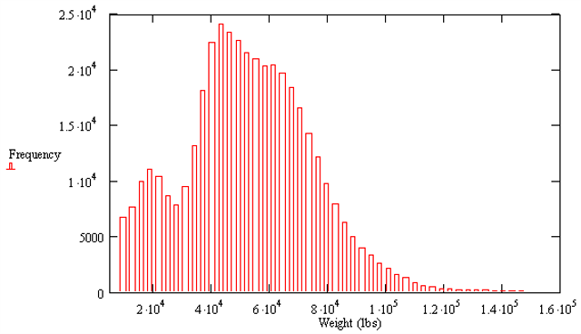
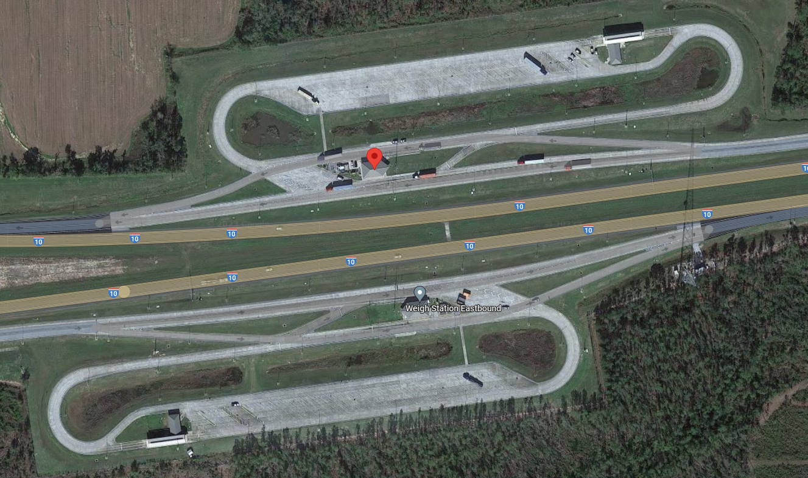

# Loading Characteristics

This chapter discusses issues related to the maximum weights that can be carried by tractor-trailer trucks and the associated enforcement mechanisms of those regulations.

## Unloaded Tractor-Trailer Weight Characteristics

The tractor-only weight is typically around 20,000 lbs. It will vary somewhat depending on the configuration (e.g., day versus sleeper cab, engine size). Specific weights are sometimes provided at tractor truck manufacturer web sites, within the specifications of the various models offered. Some weights can also be found on trucking web sites that provide reviews of tractor truck models (e.g., https://www.trucknews.com/transportation/test-driving-peterbilts-model-579/1003123738/#Spec%E2%80%99%20Sheet).

Unloaded trailer-only weights vary significantly by the type of trailer, but are in the range of 10,000 lb.

Thus, the combined unloaded tractor plus semi-trailer weight is in the range of 30,000 lb.


## Maximum Load without Permit

Per the Federal Highway Administration (https://ops.fhwa.dot.gov/freight/sw/overview/index.htm), the following weight limits are allowed without the requirement of a special permit.

On the interstate highway system:

* Single axle: 20,000 lbs
* Tandem axle: 34,000 lbs
* Gross vehicle weight: 80,000 lbs

Thus, with an unloaded weight of approximately 30,000 lb for a tractor-trailer combination, a maximum load of approximately 50,000 lb can be carried by the truck without the need for a permit.

On non-interstate highways, states may set their own commercial vehicle weight limits.

Additional information about federal weight limits can be found at the following sources:

* https://ops.fhwa.dot.gov/freight/policy/rpt_congress/truck_sw_laws/index.htm
* https://titanww.com/resources/axle-weight-limit/
* https://oversize.io/regulations/dot-truck-weight-limits


## Maximum Load with Permit

It is often necessary to transport loads that result in the maximum vehicle weight exceeding 80,000 lb. This is evidenced from the weight distribution shown in Figure \@ref(fig:TruckWeights). These data are from one highway measurement location in Florida for a full year. As can be seen in this figure, there is a significant percentage of trucks with weights greater than 80,000 lb (i.e., $8 \times 10^4$)

```{r TruckWeights, echo=FALSE, fig.cap='Truck Weight Distribution', out.width="60%", fig.align='center'}

```

Source: @TruckWeights

In these cases, a special permit must be obtained from the applicable state transportation agency(ies) (e.g., Florida DOT). It should be noted this process also applies to vehicles that exceed the base dimensional limits (e.g., a load carried on a flatbed that will be higher than bottom of most roadway overpasses).

If a permit is granted by the transportation agency, it will usually include certain restrictions. For example, the truck may be restricted to travel only during certain times of day (to minimize conflicts during heavier traffic periods) and/or may not travel on certain roadways. In the case of the latter, there may be routes with bridges that cannot handle the weight load. The truck may also have to avoid higher-speed roadways, such as an interstate, because the weight prevents the vehicle from attaining higher speeds. In some cases, it may be necessary for the DOT to map out a specific route from the origin and destination.

In some situations, one or more pilot vehicles (sometimes also referred to as escort vehicles) may also be required to travel with the tractor-trailer. See https://www.truckinfo.net/guide/what-is-a-pilot-car for more information on pilot vehicles.

Additional information about the permitting process for overweight and/or oversize trucks can be found at the following sources:

* https://www.flrules.org/gateway/ChapterHome.asp?Chapter=14-26
* https://www.fdot.gov/maintenance/OWODPermits.shtm
* https://www.flhsmv.gov/florida-highway-patrol/commercial-vehicle-enforcement/safety-enforcement/size-and-permit-enforcement/
* https://www.flhsmv.gov/florida-highway-patrol/commercial-vehicle-enforcement/safety-enforcement/weight-enforcement/


## Weigh Stations

Weigh stations are used by state transportation agencies to help enforce commercial truck weight regulations. This enforcement activity is essential to help project the roadway infrastructure (pavement, bridges, etc.) from costly damage.

Some weigh stations are situated next to a highway and require trucks to pull off the highway, get weighed, and then re-enter the highway, such as the one located along I-10 in Florida shown in Figure \@ref(fig:WeighStation). Some of these stations use static scales; that is, the trucks needs to stop temporarily to get weighed. Some the stations use weigh-in-motion (WIM) technology; that is, trucks can get weighed while they moving over the weight measurement device. See [Telemetered Traffic Monitoring and Weigh-in-Motion Systems: How it Works](https://www.youtube.com/watch?v=-SUPMheSIDo) to learn more about WIM technology (in particular, starting at 1:30 in the video). See https://www.fdot.gov/mcsaw/weighstationlisting.shtm for the locations of the roadside weigh stations in Florida.

```{r WeighStation, echo=FALSE, fig.cap='Truck Weigh Station (lat/long: 30.639846, -84.98288)', out.width="60%", fig.align='center'}

```
Source: Map data ©2023 Google

Florida and many other states also use numerous WIM stations along the highway (i.e., trucks do not have to pull off the highway). These station locations are generally not publicized and many truck drivers will not be aware of when they are traveling over such a station.


## Inspection Stations

Many states also have stations that may be used for a variety of inspection purposes, such as road worthiness of the vehicle, agricultural and horticultural products, and livestock. There is considerable variability from state to state in this regard.

Some states are implementing technology to ease the burden for truck drivers and trucking companies in dealing with these inspection stations. Florida, for example, provides an option to use bypass technology for agricultural inspection stations. See https://www.fdacs.gov/Agriculture-Industry/Agricultural-Inspection-Stations/Bypass-Services for more information on this topic.

