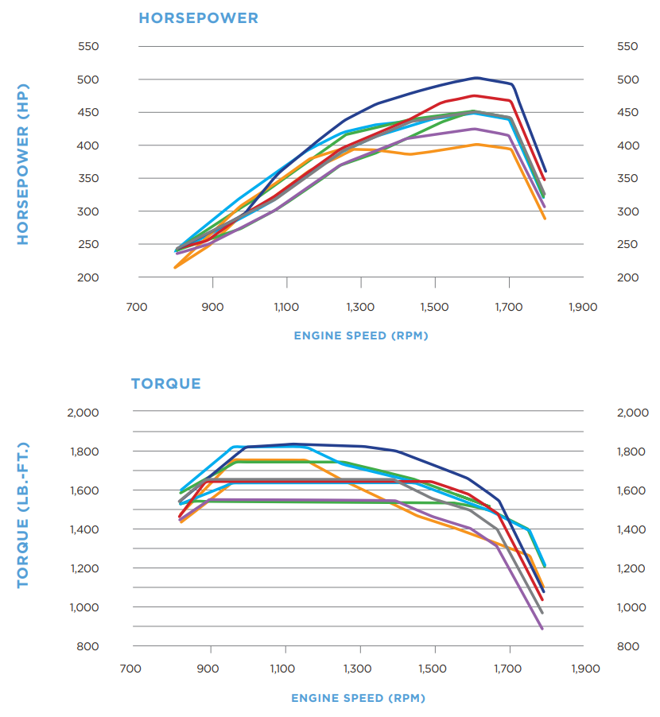
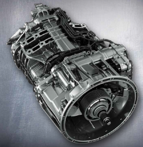
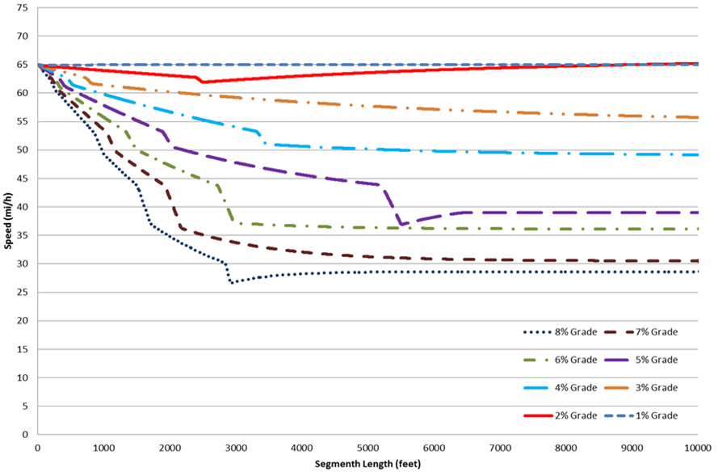
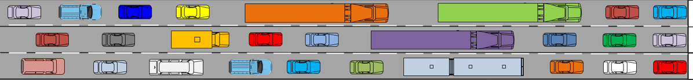
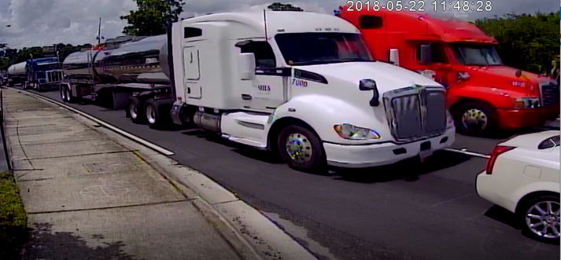
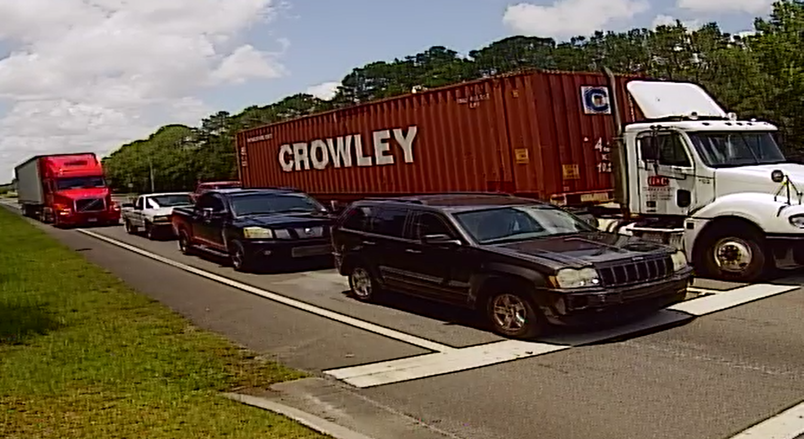
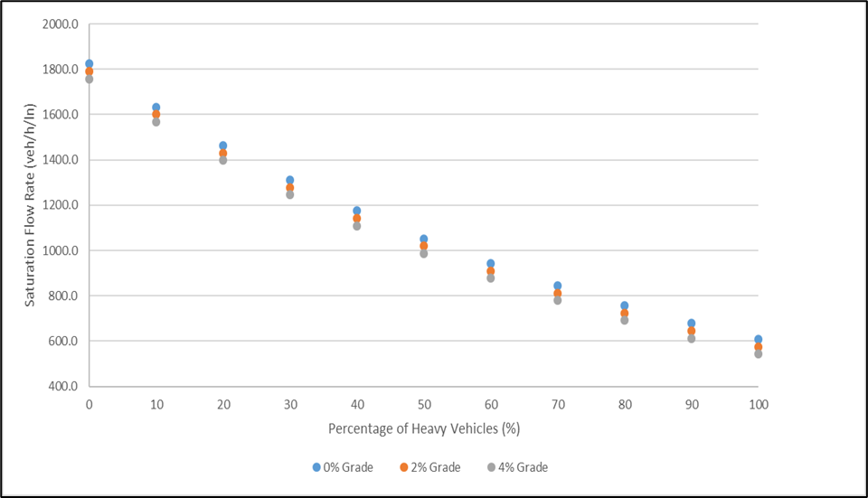

# Freight Vehicle Performance Characteristics {#VehPerformanceChars}

This chapter discusses topics that affect the performance (e.g., acceleration) of commercial trucks on the highway system. It also discusses how these performance characteristics should be considered in the context of traffic operations issues.


## Acceleration

Vehicle acceleration is a function of tractive effort (the force used to propel the vehicle forward) and resistance forces (the forces that resist/impede the forward motion of a vehicle). The available tractive effort is a function of the powertrain (engine and transmission). The total tractive effort that can be utilized is also limited by the forces between the tire-pavement interface; however, this aspect is rarely the limiting factor given the large weights of commercial vehicles. 


### Tractive Effort

**Engine**

Commercial truck tractors are typically powered by a high displacement internal combustion engine. The 'displacement' refers to the combined volume of the combustion chambers (i.e., piston cylinders). For example, the [PACCAR MX-13 engine](https://paccarpowertrain.com/products/mx-13/) has an internal displacement of 12.9 liters, in an inline-6 cylinder configuration. By comparison, a 2023 Honda Accord EX uses an internal combustion engine with 4 cylinders (inline) and a total displacement of 1.5 liters (source: https://www.automobile-catalog.com/car/2023/3170930/honda_accord_ex.html#gsc.tab=0).

```{r TractorEngine, echo=FALSE, fig.cap='PACCAR MX-13 Tractor Engine', out.width="40%", fig.align='center'}
knitr::include_graphics("./Images/VehPerformance/TruckEngine.png")
```

The tractor internal combustion engines run on diesel fuel and have large horsepower and very large torque output. This is illustrated in Figure \@ref(fig:TractorPowerCurves). The different colored lines correspond to variations of the base engine model configuration. Again, for comparison, the 2023 Honda Accord EX has maximum power (hp) of 192 and maximum torque (ft-lb) of 192. For the Honda Accord, the maximum horsepower and torque values are the same, but they are typically similar for passenger vehicle engines. Diesel commercial truck engines, however, are typically designed to have much higher torque values, which is needed to start accelerating from rest with a very heavy load.


```{r TractorPowerCurves, echo=FALSE, fig.cap='PACCAR MX-13 Engine Power and Torque Output', out.width="60%", fig.align='center'}

```


**Transmission**

Again, because of the very heavy loads, it is necessary to use a transmission with many gears to be able to obtain reasonable acceleration across a wide range of speeds--accelerating from a stop at an intersection to highway speeds of 70 mi/h. Commercial truck transmissions usually have 10-12 forward gears, as well as multiple reverse gears. The [Detroit DT12 transmission](https://www.demanddetroit.com/transmission/dt12-on-highway/), for example, consists of 12 forward gears and 4 reverse gears.
 

```{r TractorTransmission, echo=FALSE, fig.cap='Detroit DT12 Transmission', out.width="30%", fig.align='center'}

```

For more detail, including equations, about tractive effort see @mannering2019principles.

### Resistance Forces

The primary forces that resist tractive effort are:

* Aerodynamic  
* Grade  
* Rolling  


**Aerodynamic Resistance**

This force is a function of air density, frontal area, drag coefficient, and vehicle speed (squared).

Commercial trucks have larger frontal areas (approximated as the product of width and height of the front of the vehicle) and coefficients of drag. For example, the frontal area of a tractor truck is approximately 63.8 square ft (7.5 ft (width) $\times$ 8.5 ft (height)). Whereas, the frontal area of a common passenger vehicle, say a Honda Accord is only approximately 29.3 square ft (6.1 ft (width) $\times$ 4.8 ft (height)).

Drag coefficients for automobiles range from 0.25 - 0.55 (unitless). Sedan-style vehicles (e.g., Honda Accord) will have drag coefficients on the lower end of this range. SUVs and pick-up trucks will have drag coefficients on the higher end of this range. Drag coefficients for tractor-trailers range from 0.6-1.3. Tractors with roof and side fairings will generally have drag coefficients on the lower end of this range. (Source: Tables 2.2 and 2.3, @mannering2019principles)  

For level terrain and highway speeds, aerodynamic resistance is usually the most significant of the three forces for any vehicle. For tractor-trailers versus passenger vehicles, however, this force will be much greater due to the larger frontal area and drag coefficient, all else being equal.

**Rolling Resistance**

This force is a function of vehicle weight and a coefficient of rolling resistance value, which is a function of vehicle velocity. This force will also be much greater for a tractor-trailer relative to a passenger vehicle due to the much greater weight for the tractor-trailer.

**Grade Resistance**

This force is a function of vehicle weight and roadway incline. For any roadway upgrade, this force will also be much greater for a tractor-trailer relative to a passenger vehicle due to the much greater weight for the tractor-trailer.

For more detail, including equations, about these resistance forces see @mannering2019principles.


### Practical Acceleration Values

Despite the greater power and torque output of a tractor truck powertrain relative to most passenger vehicles, the much greater resistance forces for a tractor-trailer generally result in much poorer acceleration performance than for passenger vehicles. The maximum

For heavily loaded trucks, in the range of 60-80,000 lbs, maximum acceleration rates from rest (i.e., a stopped condition) and on level terrain are on the order of 3.5 ft/s/s. This maximum acceleration rate decreases, in a roughly linearly fashion, with increasing speed up to a maximum speed of approximately 75 mi/h. At maximum speed, the acceleration capability is zero, as the sum of the resistance forces equals the powertrain output force.

On upgrades, acceleration performance is typically very poor for heavily-loaded trucks. For steep upgrades, 5% and higher, trucks often can only maintain speeds of 30-40 mi/h, sometimes referred to as a 'crawl speed', as this is much less than the posted speed limit on major highways. Figure \@ref(fig:TruckUpgradeSpeeds) illustrates the impact of roadway upgrade on maximum speed for a heavily loaded tractor-trailer


```{r TruckUpgradeSpeeds, echo=FALSE, fig.cap='Truck acceleration/speed performance on upgrades', out.width="70%", fig.align='center'}

```
Source: @TruckSpeedCurves

In contrast, maximum acceleration rates for passenger vehicles, from rest and on level terrain, can easily exceed 10 ft/s/s for all but the most low performance vehicles. High performance passenger vehicles can realize acceleration rates as large as 20 ft/s/s. Maximum speeds for most passenger cars can also exceed 100 mi/h. Additionally, upgrades have much less impact on acceleration rates and maximum speed for passenger vehicles than for commercial trucks.

See @TruckSpeedCurves and @HeavyVehicleEffects for more information.


## Deceleration

Deceleration, or braking, is largely a function of braking technology (e.g., drum brakes versus disc brakes), weight distribution across the braking axles, and height of the vehicle's center of gravity. Generally, the braking performance for tractor-trailers is much poorer than that for passenger vehicles. This is because of the tractor-trailer's high center of gravity, the greater difficulty of achieving optimal weight distribution relative to the braking axles, and relatively poor braking mechanical efficiency. The latter issue is a result of the large and challenging axle configuration of tractor-trailers.


## Traffic Operations Considerations

The combination of large size and poor acceleration performance for tractor-trailers can result in significant traffic operations impacts. The saturation flow rate at signalized intersections is one example. Figures \@ref(fig:TruckQueuingSchematic), \@ref(fig:TruckQueuingStark), and \@ref(fig:TruckQueuingJax) illustrate the relative impact on the queue length (in distance) by tractor-trailers.

```{r TruckQueuingSchematic, echo=FALSE, fig.cap='Example of Queuing at a Signalized Intersection with Tractor-Trailers (1)', out.width="80%", fig.align='center'}

```
Source: @TruckSignalPCEs

```{r TruckQueuingStark, echo=FALSE, fig.cap='Example of Queuing at a Signalized Intersection with Tractor-Trailers (2)', out.width="60%", fig.align='center'}

```
Photo Source: Scott S. Washburn

```{r TruckQueuingJax, echo=FALSE, fig.cap='Example of Queuing at a Signalized Intersection with Tractor-Trailers (3)', out.width="60%", fig.align='center'}

```
Photo Source: Scott S. Washburn

The added queue distance combined with the relatively poor acceleration of tractor-trailers results in reduced saturation flow rates, and consequently capacity, at signalized intersections. Figure \@ref(fig:SatFlowRate) illustrates how an increasing percentage of tractor-trailers in the traffic stream reduces the saturation flow rate at a signalized intersection. A saturation flow rate of approximately 1800 veh/h/ln corresponds to a traffic stream of only passenger vehicles.

```{r SatFlowRate, echo=FALSE, fig.cap='Signalized Intersection Saturation Flow Rate vs Percentage of Tractor-Trailers', out.width="70%", fig.align='center'}

```
Source: @TruckArterialImpacts

On uninterrupted flow roadways, such as freeways, these same issues--relatively larger size and poorer acceleration compared with passenger vehicles--are accounted for on traffic stream performance through a passenger car equivalent (PCE) factor. The PCE value is used to calculate a heavy vehicle factor, which in turn is used to convert a traffic stream from units of veh/h to units of passenger cars per hour (pc/h). The latter value will always be higher if the percentage of tractor-trailers in the traffic stream is not zero.
