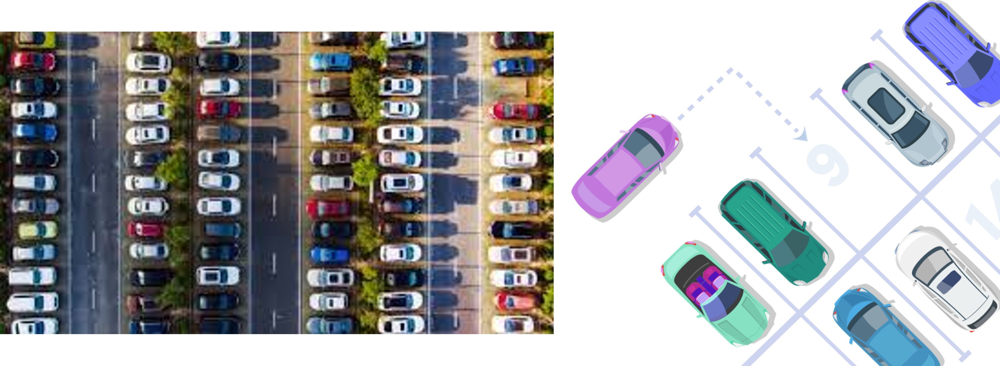
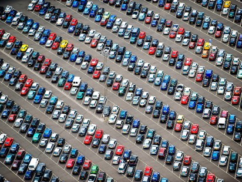
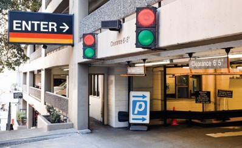
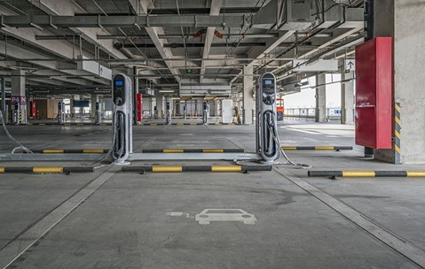
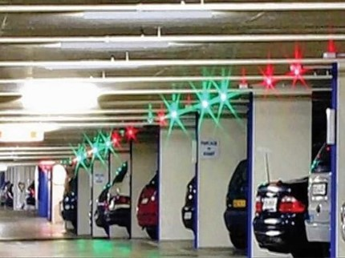
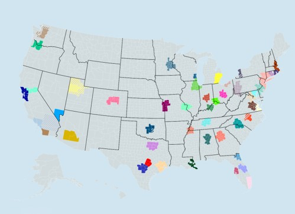
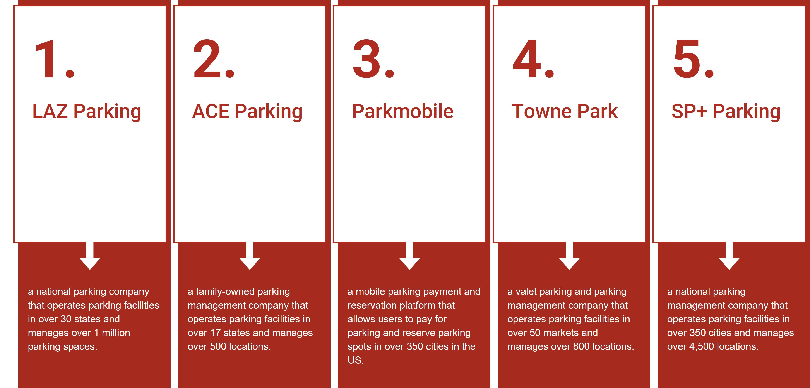
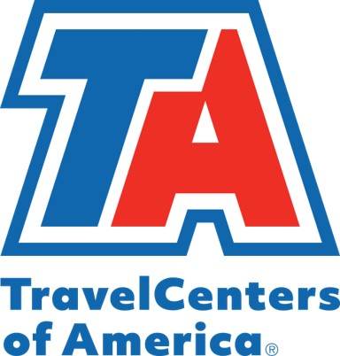

# Parking {#parking}

## private, such as Travel Centers of America/Petro {#parking-private parking}

## Introduction {#parking-intro}

Private parking advantages:

1.Important in urban areas where public parking is often limited.
Reduces congestion on road network.
2.Encourage the use of more sustainable forms of transportation, such as cycling and walking.
3.Provides convenient and reliable parking for users which improves users satisfaction and efficiency.

```{r Figure 6.1, echo=FALSE, fig.cap='Parking', fig.width=4, fig.align='center'}

```
4.Private parking can provide more accessibility and additional services but may come at a higher cost compared to alternative options which is typically more affordable but less available and may have fewer amenities.

## Benefits of Private Parking {#parking-benefits}

1. Increased availability:
Reducing competition
Reserved for specific individuals or businesses
Discouraging illegal parking
Can reduce congestion and improve traffic flow.
Encouraging carpooling:
Groups of people can park in one private spot, freeing up public parking spots for others.
Reducing circling time:
Provide a designated space for vehicles. This can reduce traffic congestion and carbon emissions.

```{r Figure 6.2, echo=FALSE, fig.cap='Private Parking', fig.width=4, fig.align='center'}

```

2. Convenience:
Private parking facilities are often located in convenient locations:
Shopping centers
Tourist attractions
Schools
Airports
Makes it easier for people to park their cars and access these areas  on time.


```{r Figure 6.3, echo=FALSE, fig.cap='Private Parking-Convenience', fig.width=4, fig.align='center'}
knitr::include_graphics("./Images/Mackenzie/Private Parking-Convenience.jpg")
```

3. Security:
Controlled access
Typically restricted to authorized personnel and/or customers.
Surveillance
Equipped with surveillance cameras or security guards.
Maintenance
Maintained more regularly, reducing the risk of injuries.
Lighting
Easier for drivers to see and navigate through the parking lot.

```{r Figure 6.4, echo=FALSE, fig.cap='Private Parking-Security', fig.width=4, fig.align='center'}

```

4. Cost-effectiveness:
Competitive pricing
Competitive pricing between facilities.
Long-term contracts
Provide discounts for customers who commit to a certain length of time.
Reduced fees
For frequent customers or for those who use their services during off-peak hours.
May have reduced or waived fees for certain groups, such as disabled individuals or electric vehicle owners.
Gives incentives towards users

```{r Figure 6.5, echo=FALSE, fig.cap='Private Parking-Cost Effectiveness', fig.width=4, fig.align='center'}

```
5. Technology:
Online booking
Saves time and ensure availability.
Automated payment systems
Such as pay-by-phone or contactless payment, making payment easier and more convenient for customers.
License plate recognition
Allows for automated entry and exit of vehicles.
Parking guidance systems
Help drivers locate available parking spots more easily.

```{r Figure 6.6, echo=FALSE, fig.cap='Private Parking-Technology', fig.width=4, fig.align='center'}

```
## Who Needs Private Parking {#parking-needs}
1. Residential
Residents are less likely to park on the streets
Reducing traffic congestion in the area

Provides a secure place for residents to park
Reducing the risk of theft, vandalism, and accidents

Can increase the value of residential properties as it is a desirable feature for many homebuyers

Designed to make the most efficient use of space
Optimize the parking area

2.Businesses:
Customers are more likely to visit businesses with accessible parking
Efficient and fast parking increases business’ foot traffic and sales

Provides an enhanced customer experience
Customers are more likely to return with convenient parking

Improved image and reputation
Helps businesses project a more professional and polished image
Seen as a perk or benefit for employees, improving morale and retention

3.Trucks/Freight
Provides a secure and safe place for trucks and freight during extended parking periods

Can be located close to major highways and/or transportation hubs
This can save time and reduce transportation costs

Facilities may offer maintenance services, such as fueling, weight stations, and repairs
Reduces downtime of vehicles

Facilities may offer electronic logging devices, weigh station bypasses, and compliance with Hours of Service regulations

4.Passenger Vehicles:
Provides a secure space for your vehicle, reducing the risk of theft and damage

Located in convenient locations. This can minimize cost, time and reduce carbon emissions

Private parking can protect transportation modes from environmental elements, such as sun, rain, snow, and hail, and natural disasters.

Provide maintenance services, such as car washes, oil changes, and tire rotations.


The private parking industry is active in many states, but some states have a more active industry than others.
States with large urban areas tend to have a higher demand for private parking, as public parking is often limited or expensive
Some examples of states with active private parking industries include:
California
New York
Illinois
Texas
Florida

```{r Figure 6.7, echo=FALSE, fig.cap='Private Parking location', fig.width=4, fig.align='center'}

```
## Private Parking Companies {#parking-companies}

```{r Figure 6.8, echo=FALSE, fig.cap='Private Parking Companies', fig.width=4, fig.align='center'}

```
## Key Example: TravelCenters of America {#parking-travel center}

TravelCenters of America (TA) is a chain of truck stops and travel centers primarily located in the U.S.

Served commercial drivers and highway travelers for over 50 years

Services offered:
Fuel stations, Restaurants, Convenience stores, Showers, Laundry facilities, Truck repair services.

Operates over 260 locations across the along major highways and interstates.

```{r Figure 6.9, echo=FALSE, fig.cap='Travel Centers of America', fig.width=4, fig.align='center'}

```
## Conclusion {#parking-conclusions}

Private parking can provide a range of benefits for drivers, businesses, and communities by providing:
A safer and efficient option for drivers
A cost-effective solution for individuals and/or businesses
Convenient, accommodating, and user-friendly technology
Applied mobile apps
Smart parking
Park guidance systems
Optimize time and provide efficiency in daily activities

## parking availability technology/information systems
