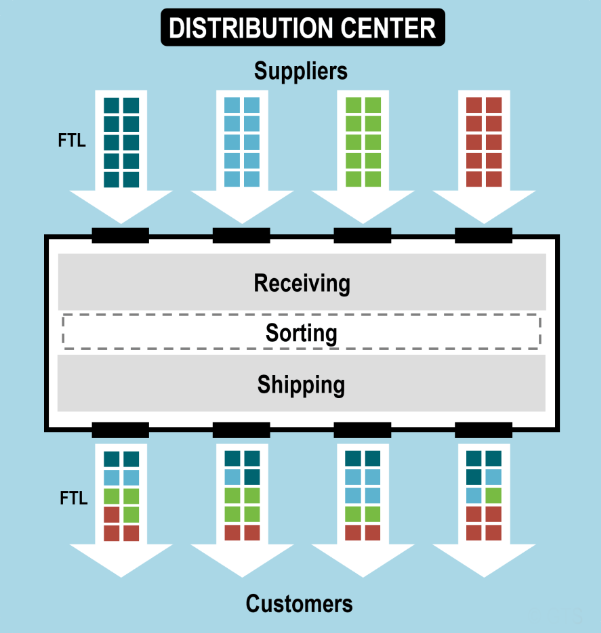

# Supply Chain {#SupplyChain}


## Sea Port {#SupplyChain-Seaport}

Ports can serve a range of vessels including recreational watercraft, barges, ferries, and ocean-going cargo and passenger ships. The United States has over 150 deep-draft ports, which serve ocean-going ships.

Seaports are maritime facilities that can comprise one or more wharves where ships can dock to load and discharge cargo and passengers.

## Supply Chain Management {#SupplyChain-Seaportmng}

Supply Chain Management (SCM) is the coordination and management of a complex network of activities delivering a finished product to end-users or customers. 

The process includes sourcing raw materials and parts, manufacturing and assembling products, storage, order entry and tracking, distribution through the various channels, and finally delivery to the customer.

Seaports are functioning as platforms within global supply chains and global production networks. 

These supply chains are highly dynamic as they react to changes in global trade patterns, consumer preferences, and advances in supply chain management and information technology.

```{r Figure 7.1, echo=FALSE, fig.cap='Ports and Supply Chain', fig.width=4, fig.align='center'}
knitr::include_graphics("./Images/SupplyChain/Ports and Supply Chain.jpg")
```
## The role of ports in the supply chain {#SupplyChain-Seaportrole}

1.Ports are a nexus in supply chains as they support the interaction between global supply chains and regional production and consumption markets. 

2.Global supply chains have become complex, pressuring the logistics industry to simultaneously improve their costs, performance, and resilience to disruptions.

3.Logistics services that still offer value may experience a debasement and become basic services, only generating a small margin. This is especially the case for physical added value.

4.The successful management of a supply chain is influenced by customer expectations, globalization, technological innovations, government regulation, competition, and sustainability concerns.

5.Within supply chains, corporations interact with external suppliers, internal departments, external distributors, and customers.
 

```{r Figure 7.2, echo=FALSE, fig.cap='The role of ports in the supply chain', fig.width=4, fig.align='center'}
knitr::include_graphics("./Images/SupplyChain/The role of ports in the supply chain.jpg")
```

## Ports and Their Impact on the Global Supply Chain {#SupplyChain-Seaport impact}

1. An efficient supply chain relies on optimized relationships, effective technology, excellent information sharing and streamlined infrastructure.
2. Port efficiency impacts organizations throughout the supply chain—suppliers, manufacturers, logistics service providers (LSPs), freight forwarders, cargo shipping lines and others.

```{r Figure 7.3, echo=FALSE, fig.cap='Ports and Their Impact on the Global Supply Chain', fig.width=4, fig.align='center'}
knitr::include_graphics("./Images/SupplyChain/Ports and Their Impact on the Global Supply Chain.jpg")
```

3. Some of the problems with the current port system and discuss possible solutions to help streamline port and downstream supply chain operations:

A Lack of Visibility into Container Status Impacts Forward Planning

A supply chain platform that integrates with port and terminal systems with a minimum of extra configuration
A centralized view of container status and information, so one can see where all your shipments are at a glance
Detailed container content information, so you can link specific supplies, parts and finished products back to loading, unloading and transportation schedules

4. An Increase in Demand on Ports Can Make Carriers Less Efficient

Deep analytics into exactly how ports are processing your shipments
Predictive forecasting and modeling so you can proactively make changes to your fleet operations
At-a-glance and in-depth reporting on the movement of goods so you can quickly identify and resolve potential issues

5. Infrastructure and Transportation Within and Around a Port Makes a Big Difference

Optimize routing and fleet transport through artificial intelligence, machine learning and predictive analytics
Accurate tracking of exactly where your containers, trucks, chassis and other assets are through GPS positioning
Take into account specialized handling needs for different types of sensitive goods


6. Environmental Factors Can Impact on Ports and the Supply Chain

The latest updates from air, ocean, rail and motor carriers
Communications from airport, marine and rail terminals
Data from electronic logging devices, automated information systems and GPS location services
Air traffic, weather alerts and maritime conditions


7. Specialized Port Arrangements Can Take Advantage of a Centralized Supply Chain Platform

## Rail Ports {#SupplyChain-Railport}
## Rail Transport{#SupplyChain-RailTransport}

1.Rail transport describes the usage of a train to transport passengers and freight along a designated route. Rail vehicles are directionally guided by the tracks on which they run and cannot deviate.

2.All across the globe, railroads are utilized to increase connectivity between regions and are major factors in developing countries.  

## Railroad Network {#SupplyChain-Railroadnetwork}

1.The United States freight rail network runs on almost 140,000 route miles.  It is generally considered the largest, safest and most cost-effective means of transporting freight. 

2.Unlike roadways, these freight railroads are owned and operated by private organizations such as CSX, BNSF and many others. 

3.This railroad network is a series of different railroad classes that all work together to create a smooth shipment process. 


```{r Figure 7.4, echo=FALSE, fig.cap='Railroad Network', fig.width=4, fig.align='center'}
knitr::include_graphics("./Images/SupplyChain/Railroad Network.jpg")
```


```{r Figure 7.5, echo=FALSE, fig.cap='Types of Railroads', fig.width=4, fig.align='center'}
knitr::include_graphics("./Images/SupplyChain/Types of Railroads.jpg")
```

## How can freight railroads be accessed? {#SupplyChain-Railroad}
1. Along the main rail network, there are what are known as railroad sidings. 

2. A railroad siding is a small stretch of track designed for minimal traffic and low speeds. These tracks are accompanied by warehouses to be used to store and transport goods from region to region. 

3. Railroad sidings make distribution simpler by increasing the proximity of the warehouse to the route and decreasing overall transportation costs but are not always available to smaller manufacturers.

## What is a Rail-port? {#SupplyChain-whatisRailport}

1.Rail-ports are gateway centers which provide a multitude of services in addition to rail / road transshipment, warehousing and pre- and on-carriage by truck tailored to each customer’s needs.  

2.Rail-ports are a great alternative for companies than cannot afford their own warehouse and rail sidings. Rail-ports are ideal for handling bulk goods of all kinds- packed/loose, solid/pourable, palleted or in containers.

3.The Rail-port concept combines the benefits of rail, truck and regional warehouses.

```{r Figure 7.6, echo=FALSE, fig.cap='Rail-port', fig.width=4, fig.align='center'}
knitr::include_graphics("./Images/SupplyChain/Rail-port.jpg")
```
## Types of Rail Terminals {#SupplyChain-Railporttypes}

1.Bulk
 linked with extractive industries such as agriculture, mining,wood products, ect.
 generally designed to be commodity specific.
2.Roll on/Roll off
Used to transport vehicles
require a large amount of parking space to store vehicles
3.Breakbulk
cargoes can be bagged, in drums, rolls or crates. 
Containerization has reduced the need for breakbulk terminals
4.Intermodal
loading and unloading unitized freight from railcars
5.Shunting
 assembly, sorting, and “breaking” of freight trains


```{r Figure 7.7, echo=FALSE, fig.cap='Types of Rail Terminals', fig.width=4, fig.align='center'}
knitr::include_graphics("./Images/SupplyChain/Types of Rail Terminals.jpg")
```
##The Global Supply Chain {#SupplyChain-Railportglobal}

Global freight supply chains are complex systems comprised of steamship lines, truckers, railroads, ports and a whole menagerie of other businesses and practices. 

Railroads and Rail-ports function as an essential platforms within global supply chains and production networks. 

These supply chains are ever evolving to keep up with changes in trade patterns, updated supply chain management and even new technologies.

##The Role of Rail in the Supply Chain {#SupplyChain-Railportsupplychain}
1. Railroads are considered the middleman of the supply chain.  They move about 40% of long-distance U.S. freight.

2. They are an important conduit for freight between port and last-mile truck service. As such, freight has three transportation options upon arrival at a sea port:
	
Off-dock: involves the movement of a container between the terminal and a railroad facility via truck over a distance
Near-dock: involves the movement of a container between the terminal adjacent but offsite railroad facility
On-dock: involves the direct loading of the container onto a train within the same terminal as the original vessel


```{r Figure 7.8, echo=FALSE, fig.cap='The Role of Rail in the Supply Chain', fig.width=4, fig.align='center'}
knitr::include_graphics("./Images/SupplyChain/The Role of Rail in the Supply Chain.jpg")
```
3. Rail intermodal is the transportation method of moving freight across the globe by both railroad and truck. 

4. As such, Intermodal provides both a competitively priced, and environmentally friendly alternative to excessive reliance on highways to transport freight. 

5. Intermodal is focused on the 53’ capacity freight market through the use of containers that move on the rail for the long haul segment of a shipment.There are two types of domestic intermodal shipping in container-on-flatcar (COFC) and trailer-on-flatcar.


```{r Figure 7.9, echo=FALSE, fig.cap='Role of Rail', fig.width=4, fig.align='center'}
knitr::include_graphics("./Images/SupplyChain/Role of Rail.jpg")
```

6.Per the Association of American Railroads:
Intermodal accounts for 25% of the revenue for major U.S. railroads- more than any other traffic category
Half of the intermodal traffic is due to imports and exports

7.Aside from intermodal, railroads move commodities such as crude oil, ethanol and coal to help meet energy needs.  It also moves essential chemicals such as fertilizers, plastic resins, caustic soda, and much more

## Rail Service During Supply Chain Disruptions {#SupplyChain-Railportservice}

1.In recent years the supply chain has been greatly impacted by the global pandemic by changes in on consumer purchasing trends, worker preferences, and rapidly changing global and national economies.  

2.As the middle link in the supply network, rail service is impacted by these not only directly in how the other supply chain members interact with it.  


```{r Figure 7.10, echo=FALSE, fig.cap='Rail Service During Supply Chain Disruptions', fig.width=4, fig.align='center'}
knitr::include_graphics("./Images/SupplyChain/Rail Service During Supply Chain Disruptions.jpg")
```

Rail networks have been combatting these disruptions by the following:

1.Expanding network capacity
Pulling equipment out of storage / activating their reserve fleets
Scheduling car movements to minimize congestion 
Reopening of previously  dormant terminals
2.Hiring, training, deploying and retaining train crews
Hiring bonuses, financial payments to refer-a-friend and other incentives to entice potential employees
Incentivizing through payments to move to high-demand regions of the network 
Quick response to bring idled locomotives back online
3.Closely collaborating with trucks
Railroads and their trucking partners work to move shipments from intermodal terminals as quickly as possible  
One railroad keeps a pool of truck chassis to help maximize truck hauling capacity while another railroad mounts intermodal containers on any chassis brought to it to help reduce truckers driving without any cargo

## The Economic Impact of Freight Railroads {#SupplyChain-Railportimpact}

1.Freight railroads serve nearly every industrial, wholesale, retail and resource-based sector of the American economy. 

2.The operations and capital investment of the freight rail industry has been estimated to support 1.1 percent of U.S. workers.  

3.Railroads account for around 1/3 of U.S. exports by volume without which we would not be competitive in the global market.

## Distribution centers {#SupplyChain-Distributioncenters}

1. Distribution Center: a facility that performs consolidation, warehousing, packaging, decomposition, and other functions linked with handling freight. Orders are received, processed, and filled. Their main purpose is to provide value-added services to freight, which is stored for relatively short time periods (days or weeks). Goods stored in a distribution center have usually been sold and are in transit to their destination. They can also perform light manufacturing activities such as assembly and labeling.

2. Functions of a Distribution Center
* Inventory Management:
  DCs store inventory to meet fluctuating demand.
  Centralized inventory allows for better control and optimization.
  
* Order Fulfillment:
  DCs process incoming orders, picking, packing, and shipping products.
  Enables timely delivery, enhancing customer satisfaction.
 
* Cost Reduction through Aggregation:
  Combining products from multiple sources for cost-effective transportation.
  Minimizes shipping expenses and maximizes economies of scale.

3. Strategic Management for Distribution Centers
* Network Optimization:
  Strategic placement of DCs for optimal geographic coverage.
  Reduces transportation costs, and enhances responsiveness.

* Technology Integration:
  Implementing advanced technologies like automation and robotics.
  Increases efficiency, accuracy, and order processing speed.

* Data-Driven Insights:
  Gathering and analyzing data on demand patterns, inventory turnover, and order processing times.
  Informed decision-making for inventory planning and customer service improvements.

* Flexibility and Adaptability:
  Designing DCs to accommodate changes in demand and product assortment.
  Supports quick adjustments to market trends and customer preferences.
  
```{r DCImage1, echo=FALSE, fig.cap='Distribution Center', fig.width=6, fig.align='center'}

``` 
Source: https://crashstats.nhtsa.dot.gov/Api/Public/ViewPublication/813375

## Logistics {#SupplyChain-Logistics}
What is Logistics?
The planning, execution, and management of the flow of goods, information, and resources within a supply chain.

* Forward Logistics
  Forward logistics deals with the forward movement of goods, from sourcing raw materials and manufacturing them into products, through their procurement, storage, and sales, to transportation and last-mile delivery to consumers.

* Reverse Logistics
  Reverse logistics is the process in delivery operations that controls the return movement of products from their final destination. The main goal is to capture value or properly dispose of failed deliveries.

```{r DCImage2, echo=FALSE, fig.cap='Logistic Process', fig.width=6, fig.align='center'}
knitr::include_graphics("./Images/SupplyChain/Forward-Reverse-Logistics.png")
``` 

## Routing {#SupplyChain-Routing}
What is Routing?
The process of planning and executing the most efficient and cost-effective delivery routes for transporting goods from a supplier to the end customer.

1. Benefits
* Reduce costs
* Improve delivery service and customer satisfaction
* Cut carbon emissions

```{r DCImage3, echo=FALSE, fig.cap='Route Optimization', fig.width=6, fig.align='center'}
knitr::include_graphics("./Images/SupplyChain/Routing.png")
```

2. Common routing Problems
* Vehicle Routing Problem(VRP): Finding the most efficient routes for a fleet of vehicles to deliver goods or services to a set of customers while minimizing costs and meeting certain constraints.
* Capacitated Vehicle Routing Problem(CVRP): The vehicles have a limited carrying capacity of the goods that must be delivered.
* Vehicle Routing Problem With Time Windows(VRPTW): The delivery locations have time windows within which the deliveries (or visits) must be made.
* Vehicle Routing Problem With Pickup and Delivery(VRPPD): Includes pickup and delivery tasks in addition to the standard customer visits. Vehicles are tasked with not only delivering goods to customers but also picking up items from other locations and delivering them to different destinations.

```{r DCImage4, echo=FALSE, fig.cap='Vechile Routing Problem', fig.width=6, fig.align='center'}
knitr::include_graphics("./Images/SupplyChain/VRP.png")
```


## First/ Last Mile {#SupplyChain-FirstandLastMile}

## What Is First/Last Mile? {#SupplyChain-whatismile}
What is First Mile?
Depending on the Industry it can mean many things:
A manufacturer may consider the First Mile when their completed goods are shipped from the factory to their distribution hub. 
A retailer may consider the First Mile when manufactured goods are shipped from the suppliers' distribution hub to the retailer's distribution center. 
E-commerce may consider the First Mile to be when the goods are transferred to the courier that will deliver the goods to the customer's home. 
But in short, First Mile is when the good travels through the first leg of the supply chain. 

 
```{r Figure 7.11, echo=FALSE, fig.cap='First and Last Mile', fig.width=4, fig.align='center'}
knitr::include_graphics("./Images/SupplyChain/First and Last Mile.jpg")
```

What is Last Mile?

Last Mile refers to the last phase of the supply chain process for the delivery of goods or people.

Last Mile can range anywhere from a couple of blocks to a couple 100 miles. The distance is determined by the network of the supply chain for the specific goods being transported. 

1. Last Mile for Transporting Goods
For transporting goods, the last 
mile may be the route taken by an Amazon driver to drop off packages.
The route taken by an 
autonomous robot to deliver food. 

2. Last Mile for Transporting People
The last mile may be the taxi used to go 
from the airport to arrive at a hotel.
The e-bike rental used to go from the 
train station to work (final destination).
 

```{r Figure 7.12, echo=FALSE, fig.cap='First and Last Mile Operation', fig.width=4, fig.align='center'}
knitr::include_graphics("./Images/SupplyChain/First and Last Mile Operation.jpg")
```

The concept of Last Mile was first introduced in the telecommunications industry. 
The industry’s Last Mile is the bandwidth that is delivered to the customer. 
The telecommunications network is like a “tree”. Bandwidth that travels in high capacity is known as “trunks”; the trunks branch out into “twigs” which serve as the Last Mile.

The Last Mile is a bandwidth bottleneck because there is a limit to how much   data can be transferred to the customer. 
The Last Mile is also the most expensive because of all the equipment needed   per customer and the number of customers that exist. 

```{r Figure 7.13, echo=FALSE, fig.cap='How Networks are Built', fig.width=4, fig.align='center'}
knitr::include_graphics("./Images/SupplyChain/How Networks are Built.jpg")
```
The concept of Last Mile first started with the telecommunications industry. But it has since branched out to other Industries. Most notably, the Transportation Industry  

The remainder of this lecture will discuss First/Last Mile, and how it relates to transportation.   


```{r Figure 7.14, echo=FALSE, fig.cap='Relation with Transportation', fig.width=4, fig.align='center'}
knitr::include_graphics("./Images/SupplyChain/Relation with Transportation.jpg")
```
## How does it relate to Transportation? {#SupplyChain-relation}

Whether ”First” or “Last Mile”, they both serve as connectors that either initiate or end a trip. 
In Transportation, there are two types or trips being done:
The Movement of Goods 
The Movement of People 
The First Mile isn’t as much of an issue when delivering goods compared to people… more on this later.  


```{r Figure 7.15, echo=FALSE, fig.cap='How does it relate to Transportation', fig.width=4, fig.align='center'}
knitr::include_graphics("./Images/SupplyChain/How does it relate to Transportation.jpg")
```
 
Movement of Goods

1.Last Mile regarding the movement of goods is the final step in the supply chain that moves goods from the distributor/facility to the customer. 
2.Last Mile usually involves parcel or small package carriers to deliver products
3.According to research done by straits, Last Mile Delivery market size is expected to reach $123 Billion USD by 2030 from the $40.5 Billion USD valuation given in 2021. 
4.This is due to an increase in e-commerce and then COVID-19 further fueled the trend of ordering online. 
5.The introduction of Omnichannel Supply Chains has also contributed to the market increase in Last Mile delivery.

6.In Supply Chain, traditionally the network is a Multichannel Supply Chain. This network would have departments grouped into stand alone silos with no interaction with one another. 
Example: A retail company would have a brick-and-mortar store and an online store. Each store would have its own supply channel such as warehouse management and transportation system. The infrastructure would only serve that one channel 
Since there is not overlap in the networks, overhead costs increase with less efficiency to move product. 
7.Omnichannel Supply Chains, changes by integrating all networks to minimize cost and increase efficacy. 
Example: The retail company, whether it's serving the brick-and-mortar store or the online store, the supply chain is designed to serve both channel simultaneously. 
If a customer can’t find an item in the brick-and-mortar store, they can order it online for the costumer. OR If the customer orders an Item online, they can choose to pick up the item at the brick-and-mortar store.

##Challenges? {#SupplyChain-challenge}
Movement of Goods
One more note on Omnichannel Supply Chains, 
1.With the implementation of algorithms and predictive analytics, companies hope to be more efficient in delivering goods... But there are consequences.  
2.In a lecture presentation given by Charles H.W. Edwards (Professor of the Practice, Department of City and Regional Planning UNC – Chapel Hill) to Florida Atlantic University's Fright Mobility Research Institute, Dr. Edwards presented on companies urge to anticipate orders for the purpose of faster shipping. 
3.E-commerce and online stores would look at trends generated by the number of clicks on their websites and then order products on the assumption that the consumer will eventually click the buy button.
4.The companies would order product before generating a sale and cause further unneeded stress for the First and Middle Mile, often… the consumer would never click the buy button, but the product would already be shipped from the manufacture to the distribution hub.  

5.Traffic Congestion and Parking are the main issues that affect Last Mile Deliveries. 
6.Distribution hubs are usually located far from the cities in more rural areas. 
Land is cheaper and available, more ample space for large trucks to move in and out of facilities.

7.But to move goods from the distribution hub to the final-destination (Last Mile), the challenge is traffic encountered in densely packed cities, accidents and other unforeseen events make delivery route optimization very difficult.  
8.Finding parking in order to deliver goods can sometimes be difficult. 

## Solutions? {#SupplyChain-Soln}

Movement of Goods
1.One way the industry can combat last mile challenges. Is by opening a secondary distribution hub outside the major city limits. Goods would go from the regional distribution center to this secondary distribution hub. Then the goods are closer to final-destination in the city.
2.Making the distance for the last mile smaller.
3.But the real solution comes from the type of vehicle used to distribute the the goods in the city 
4.Proposed Solutions: 
Delivery lockers, example: Amazon’s storefront pickup locations.
Drone and robots.
Route optimization software

FMRI Research: 
1.Sustainable Urban Freight Mobility Through Optimization of Logistics Facility Locations. FMRI Research Project.

This project considered to reevaluate freight providers traditional approach of positioning their distributions centers. 
This is because the traditional approach causes traffic congestion, increased emissions and higher delay. 
This project focused on a sustainable and cost-efficient approach by developing a a multi-objective framework for the facility location problem, NP-Hard optimization problem.
The model selects an optimal number of locations to create “mini hubs” inside the urban areas. 
The trucks would arrive at the “mini facilities and unload the goods.
The goods are then delivered (Last-Mile) via eco-friendly transportation modes (handcarts, bicycles, self-picked up) to the final destinations,
This project explores sustainable delivery solutions while simultaneously improving urban freight mobility.

2. Integrate Autonomous delivery Vehicle Into Sustainable Urban Logistics Planning and Optimization.
This project considered autonomous delivery vehicles as a novel approach to improve urban logistics and more specifically, improve the Last-Mile-Delivery. 
The reason this project was initiated is due to the current trend of sustainable urban distribution hubs which they are smaller logistic centers to be placed in the city.
Studies show that drone delivery services are better suited for rural and suburban locations. 
But autonomous delivery vehicles (ADVs) are best suited for urban city centers. 
Specifically, ADVs should be used as ground bases delivery                                            services to address the Last-Mile-Delivery. 
The reduce road traffic, no need for parking, 
The primary objective is to identify an urban logistic optimization                                      model while minimizing operations cost and carbon footprint. 


```{r Figure 7.16, echo=FALSE, fig.cap='Autonomous Delivery Robot', fig.width=4, fig.align='center'}
knitr::include_graphics("./Images/SupplyChain/Autonomous Delivery Robot.jpg")
```
## How does it relate to Transportation? {#SupplyChain-whatisrelation}

Movement of People
The First/Last Mile regarding the movement of people is the final step in the network to move people from the Main Mile to their destination.
Some of the modes that can be used for First/Last Mile:
Walking
Bikes 
Local Transit
Taxis 
Car Sharing 
Micro transit
Zoning such as Complete Streets. 

```{r Figure 7.17, echo=FALSE, fig.cap='Passenger transport', fig.width=4, fig.align='center'}
knitr::include_graphics("./Images/SupplyChain/Passenger transport.jpg")
```
## Challenges {#SupplyChain-whatisFirstchallenges}

Movement of People: 
The challenges with the Last Mile regarding public transit is transit agencies failure to plan out major transit stops with major destinations.
Major destinations maybe a tourist attraction, employer, or residential neighborhoods. 
The Census Bureau finds that 46% of public transit commuters prefer to take buses over other forms of transportation… however transit stops require commuters to walk the first or last leg of their trip. 
The problem with walking is if the transit stop is more then ¼ mile away, nor the First/Last Mile, commuters may opt to not use public infrastructure.


## Solutions {#SupplyChain-solution}

Movement of People:
Solutions include:
Updating or adding bike lanes
The City of Denton. Texas has produced a bike-sharing program that supports students from the University of Northern Texas campus and surrounding downtown area. The program is access via an app.   
On-demand ride sharing
King County has created a on-demand ridesharing app that connects pedestrians to transit stops, The service area is mostly for Seattle.  
On-demand micro transit
Complete Streets
Mobility Hubs (Broward County LRT concept)

## Long Haul, Short Haul {#SupplyChain-haul}

## What is Long Haul/Short Haul? {#SupplyChain-whatishaul}

In Transportation, a trip can be classified as a long or short haul.
Often, various modes (land, air, sea) of transportation are utilized for long and short haul. 
What determines a trip being a long or short haul is the type of good being transported and the location of the final destination.

```{r Figure 7.18, echo=FALSE, fig.cap='Long Haul and Short Haul', fig.width=4, fig.align='center'}
knitr::include_graphics("./Images/SupplyChain/Long Haul and Short Haul.jpg")
```
##Land Transportation {#SupplyChain-landtpt}

Long Haul: 
Consists of larger trucks that can haul larger loads of goods across long distances. 
Operate in a minimum radius of 250-miles, often between cities, states, or countries.
Typically found on interstates. 

```{r Figure 7.19, echo=FALSE, fig.cap='Long Haul', fig.width=4, fig.align='center'}
knitr::include_graphics("./Images/SupplyChain/Long Haul.jpg")
```
Short Haul:
Consists of small trucks that operate in a network within a 150-mile radius.
Usually operate within a city.
Examples: Delivery of materials to construction sites, Retail products from warehouses to brick-and-mortar stores. 
```{r Figure 7.20, echo=FALSE, fig.cap='Short Haul', fig.width=4, fig.align='center'}
knitr::include_graphics("./Images/SupplyChain/Short Haul.jpg")
```

## Air Transportation {#SupplyChain-airtpt}

Long Haul: 
Commercial flights are categorized as short, medium, or long hauls, depending on the distances needed to travel.
Long haul flights consist of larger planes that can move goods or passengers across long distances. 
Flight duration extends beyond but no less than 6 hours. 
It can be for both connecting or non-stop flights
Pilots spend more days away then home. 

```{r Figure 7.21, echo=FALSE, fig.cap='Air Transportation Long Haul', fig.width=4, fig.align='center'}
knitr::include_graphics("./Images/SupplyChain/Air Transportation Long Haul.jpg")
```
Ultra Long Haul: 
Ultra long Haul (ULH) is an operational model that arose due to the Covid-19 virus.
ULH is proposed as a point-to-point service that, with a strong domestic “feeder system” would:
Require minimal adjustments to cope with Covid-19 or any future outbakes. 
Produce higher seat-load factors and yields.
Produce more network flexibility.
Allow the ability to bypass densely populated hub airports.  

```{r Figure 7.22, echo=FALSE, fig.cap='Ultra Long Haul', fig.width=4, fig.align='center'}
knitr::include_graphics("./Images/SupplyChain/Ultra Long Haul.jpg")
```

Short Haul: 
Commercial flights categorized as short hauls, consist of smaller planes that are used in short but more frequent flights.
Flight duration lasts between 30 minutes to 3 hours. 
Pilots make several trips a day and come back the same day.


```{r Figure 7.23, echo=FALSE, fig.cap='Air Transportation Short Haul', fig.width=4, fig.align='center'}
knitr::include_graphics("./Images/SupplyChain/Air Transportation Short Haul.jpg")
```
