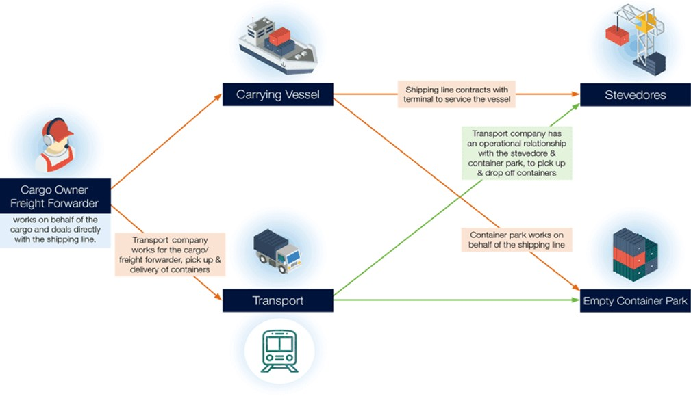
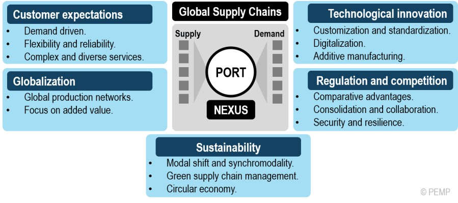
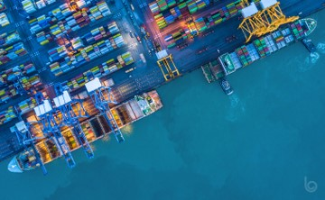
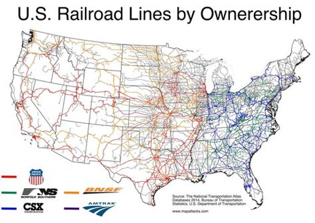
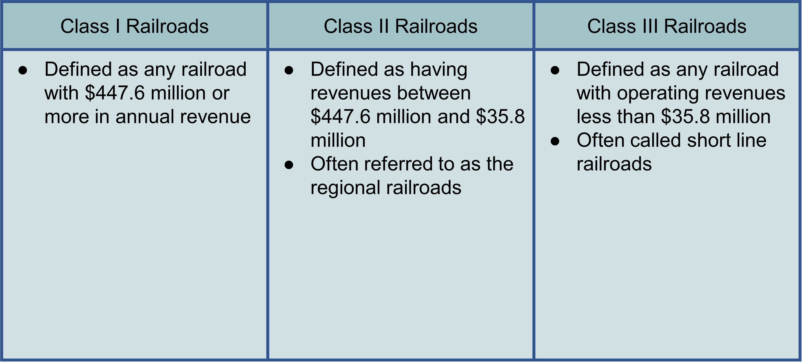
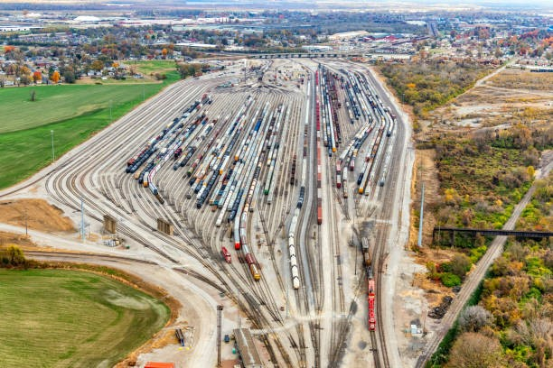
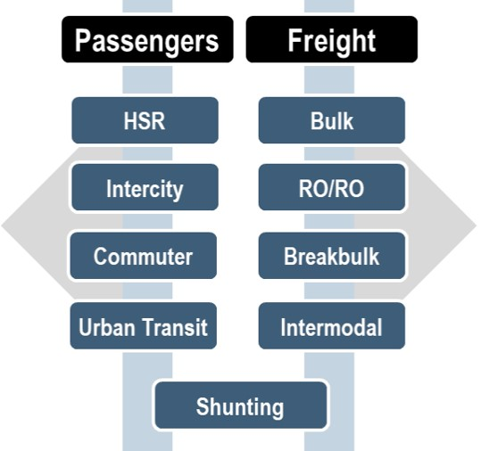
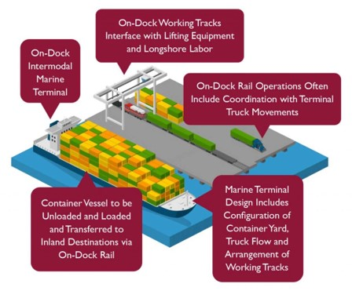
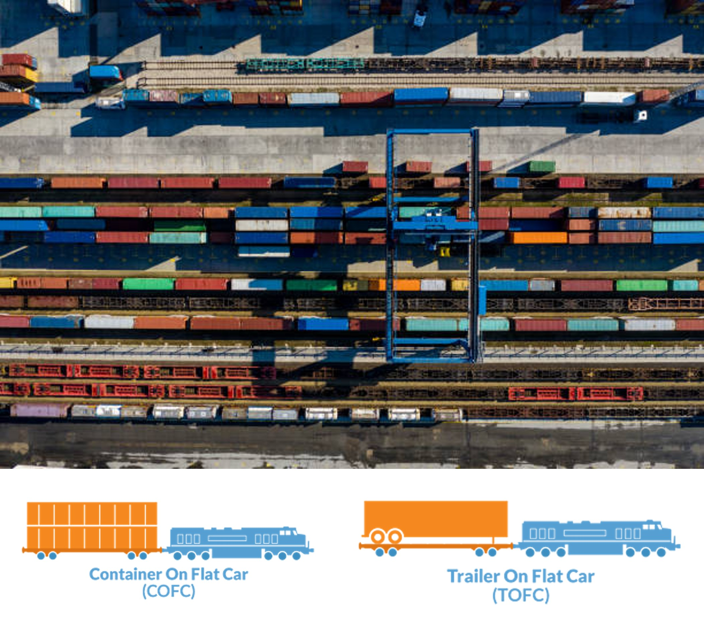
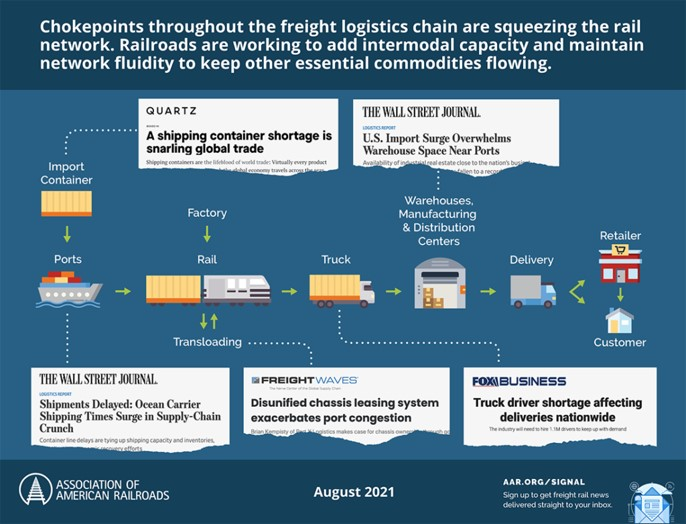

# Supply Chain


## Sea Port

Ports can serve a range of vessels including recreational watercraft, barges, ferries, and ocean-going cargo and passenger ships. The United States has over 150 deep-draft ports, which serve ocean-going ships.

Seaports are maritime facilities that can comprise one or more wharves where ships can dock to load and discharge cargo and passengers.

## Supply Chain Management

Supply Chain Management (SCM) is the coordination and management of a complex network of activities delivering a finished product to end-users or customers. 

The process includes sourcing raw materials and parts, manufacturing and assembling products, storage, order entry and tracking, distribution through the various channels, and finally delivery to the customer.

Seaports are functioning as platforms within global supply chains and global production networks. 

These supply chains are highly dynamic as they react to changes in global trade patterns, consumer preferences, and advances in supply chain management and information technology.

```{r Figure 7.1, echo=FALSE, fig.cap='Ports and Supply Chain', fig.width=4, fig.align='center'}

```
## The role of ports in the supply chain

1.Ports are a nexus in supply chains as they support the interaction between global supply chains and regional production and consumption markets. 

2.Global supply chains have become complex, pressuring the logistics industry to simultaneously improve their costs, performance, and resilience to disruptions.

3.Logistics services that still offer value may experience a debasement and become basic services, only generating a small margin. This is especially the case for physical added value.

4.The successful management of a supply chain is influenced by customer expectations, globalization, technological innovations, government regulation, competition, and sustainability concerns.

5.Within supply chains, corporations interact with external suppliers, internal departments, external distributors, and customers.
 

```{r Figure 7.2, echo=FALSE, fig.cap='The role of ports in the supply chain', fig.width=4, fig.align='center'}

```

## Ports and Their Impact on the Global Supply Chain

1. An efficient supply chain relies on optimized relationships, effective technology, excellent information sharing and streamlined infrastructure.
2. Port efficiency impacts organizations throughout the supply chain—suppliers, manufacturers, logistics service providers (LSPs), freight forwarders, cargo shipping lines and others.

```{r Figure 7.3, echo=FALSE, fig.cap='Ports and Their Impact on the Global Supply Chain', fig.width=4, fig.align='center'}

```

3. Some of the problems with the current port system and discuss possible solutions to help streamline port and downstream supply chain operations:

A Lack of Visibility into Container Status Impacts Forward Planning

A supply chain platform that integrates with port and terminal systems with a minimum of extra configuration
A centralized view of container status and information, so one can see where all your shipments are at a glance
Detailed container content information, so you can link specific supplies, parts and finished products back to loading, unloading and transportation schedules

4. An Increase in Demand on Ports Can Make Carriers Less Efficient

Deep analytics into exactly how ports are processing your shipments
Predictive forecasting and modeling so you can proactively make changes to your fleet operations
At-a-glance and in-depth reporting on the movement of goods so you can quickly identify and resolve potential issues

5. Infrastructure and Transportation Within and Around a Port Makes a Big Difference

Optimize routing and fleet transport through artificial intelligence, machine learning and predictive analytics
Accurate tracking of exactly where your containers, trucks, chassis and other assets are through GPS positioning
Take into account specialized handling needs for different types of sensitive goods


6. Environmental Factors Can Impact on Ports and the Supply Chain

The latest updates from air, ocean, rail and motor carriers
Communications from airport, marine and rail terminals
Data from electronic logging devices, automated information systems and GPS location services
Air traffic, weather alerts and maritime conditions


7. Specialized Port Arrangements Can Take Advantage of a Centralized Supply Chain Platform

## Rail Ports
## Rail Transport

1.Rail transport describes the usage of a train to transport passengers and freight along a designated route. Rail vehicles are directionally guided by the tracks on which they run and cannot deviate.

2.All across the globe, railroads are utilized to increase connectivity between regions and are major factors in developing countries.  

## Railroad Network

1.The United States freight rail network runs on almost 140,000 route miles.  It is generally considered the largest, safest and most cost-effective means of transporting freight. 

2.Unlike roadways, these freight railroads are owned and operated by private organizations such as CSX, BNSF and many others. 

3.This railroad network is a series of different railroad classes that all work together to create a smooth shipment process. 


```{r Figure 7.4, echo=FALSE, fig.cap='Railroad Network', fig.width=4, fig.align='center'}

```


```{r Figure 7.5, echo=FALSE, fig.cap='Types of Railroads', fig.width=4, fig.align='center'}

```

## How can freight railroads be accessed?
1. Along the main rail network, there are what are known as railroad sidings. 

2. A railroad siding is a small stretch of track designed for minimal traffic and low speeds. These tracks are accompanied by warehouses to be used to store and transport goods from region to region. 

3. Railroad sidings make distribution simpler by increasing the proximity of the warehouse to the route and decreasing overall transportation costs but are not always available to smaller manufacturers.

## What is a Rail-port?

1.Rail-ports are gateway centers which provide a multitude of services in addition to rail / road transshipment, warehousing and pre- and on-carriage by truck tailored to each customer’s needs.  

2.Rail-ports are a great alternative for companies than cannot afford their own warehouse and rail sidings. Rail-ports are ideal for handling bulk goods of all kinds- packed/loose, solid/pourable, palleted or in containers.

3.The Rail-port concept combines the benefits of rail, truck and regional warehouses.

```{r Figure 7.6, echo=FALSE, fig.cap='Rail-port', fig.width=4, fig.align='center'}

```
## Types of Rail Terminals

1.Bulk
 linked with extractive industries such as agriculture, mining,wood products, ect.
 generally designed to be commodity specific.
2.Roll on/Roll off
Used to transport vehicles
require a large amount of parking space to store vehicles
3.Breakbulk
cargoes can be bagged, in drums, rolls or crates. 
Containerization has reduced the need for breakbulk terminals
4.Intermodal
loading and unloading unitized freight from railcars
5.Shunting
 assembly, sorting, and “breaking” of freight trains


```{r Figure 7.7, echo=FALSE, fig.cap='Types of Rail Terminals', fig.width=4, fig.align='center'}

```
##The Global Supply Chain

Global freight supply chains are complex systems comprised of steamship lines, truckers, railroads, ports and a whole menagerie of other businesses and practices. 

Railroads and Rail-ports function as an essential platforms within global supply chains and production networks. 

These supply chains are ever evolving to keep up with changes in trade patterns, updated supply chain management and even new technologies.

##The Role of Rail in the Supply Chain
1. Railroads are considered the middleman of the supply chain.  They move about 40% of long-distance U.S. freight.

2. They are an important conduit for freight between port and last-mile truck service. As such, freight has three transportation options upon arrival at a sea port:
	
Off-dock: involves the movement of a container between the terminal and a railroad facility via truck over a distance
Near-dock: involves the movement of a container between the terminal adjacent but offsite railroad facility
On-dock: involves the direct loading of the container onto a train within the same terminal as the original vessel


```{r Figure 7.8, echo=FALSE, fig.cap='The Role of Rail in the Supply Chain', fig.width=4, fig.align='center'}

```
3. Rail intermodal is the transportation method of moving freight across the globe by both railroad and truck. 

4. As such, Intermodal provides both a competitively priced, and environmentally friendly alternative to excessive reliance on highways to transport freight. 

5. Intermodal is focused on the 53’ capacity freight market through the use of containers that move on the rail for the long haul segment of a shipment.There are two types of domestic intermodal shipping in container-on-flatcar (COFC) and trailer-on-flatcar.


```{r Figure 7.9, echo=FALSE, fig.cap='Role of Rail', fig.width=4, fig.align='center'}

```

6.Per the Association of American Railroads:
Intermodal accounts for 25% of the revenue for major U.S. railroads- more than any other traffic category
Half of the intermodal traffic is due to imports and exports

7.Aside from intermodal, railroads move commodities such as crude oil, ethanol and coal to help meet energy needs.  It also moves essential chemicals such as fertilizers, plastic resins, caustic soda, and much more

## Rail Service During Supply Chain Disruptions

1.In recent years the supply chain has been greatly impacted by the global pandemic by changes in on consumer purchasing trends, worker preferences, and rapidly changing global and national economies.  

2.As the middle link in the supply network, rail service is impacted by these not only directly in how the other supply chain members interact with it.  


```{r Figure 7.10, echo=FALSE, fig.cap='Rail Service During Supply Chain Disruptions', fig.width=4, fig.align='center'}

```

Rail networks have been combatting these disruptions by the following:

1.Expanding network capacity
Pulling equipment out of storage / activating their reserve fleets
Scheduling car movements to minimize congestion 
Reopening of previously  dormant terminals
2.Hiring, training, deploying and retaining train crews
Hiring bonuses, financial payments to refer-a-friend and other incentives to entice potential employees
Incentivizing through payments to move to high-demand regions of the network 
Quick response to bring idled locomotives back online
3.Closely collaborating with trucks
Railroads and their trucking partners work to move shipments from intermodal terminals as quickly as possible  
One railroad keeps a pool of truck chassis to help maximize truck hauling capacity while another railroad mounts intermodal containers on any chassis brought to it to help reduce truckers driving without any cargo

## The Economic Impact of Freight Railroads

1.Freight railroads serve nearly every industrial, wholesale, retail and resource-based sector of the American economy. 

2.The operations and capital investment of the freight rail industry has been estimated to support 1.1 percent of U.S. workers.  

3.Railroads account for around 1/3 of U.S. exports by volume without which we would not be competitive in the global market. 


