# Seaport Operations {#seaport}

```{r PortImage, echo=FALSE, fig.cap='Port of Miami Partial Schematic', out.width='90%', fig.asp=.75, fig.align='center'}
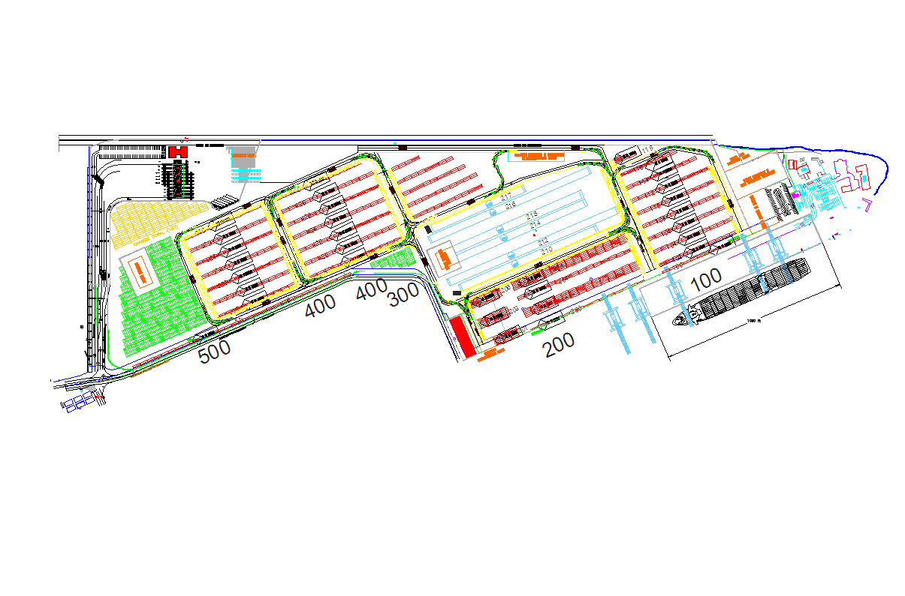
```

## Cargo container movement

Photos courtesy of Scott S. Washburn

This section describes the process of moving cargo containers from a container ship to tractor+semi-trailers and vice versa.

Port crane lifts container off of cargo ship

```{r FigurePortCranesYokohama, echo=FALSE, fig.cap='Cranes at Port of Yokohama (Japan)', out.width="75%", fig.align='center'}
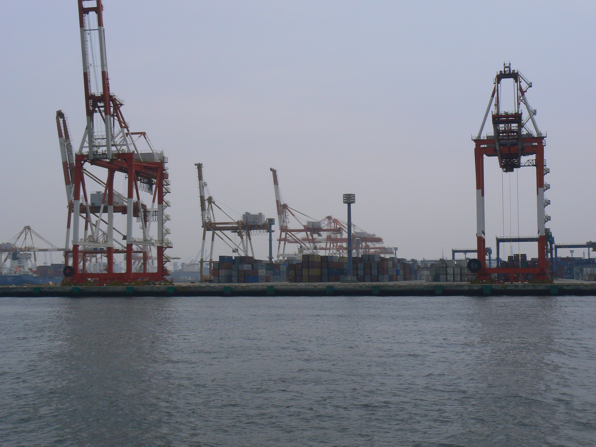
```


```{r FigurePortCranesMiami, echo=FALSE, fig.cap='Cranes at Port of Miami', out.width="75%", fig.align='center'}
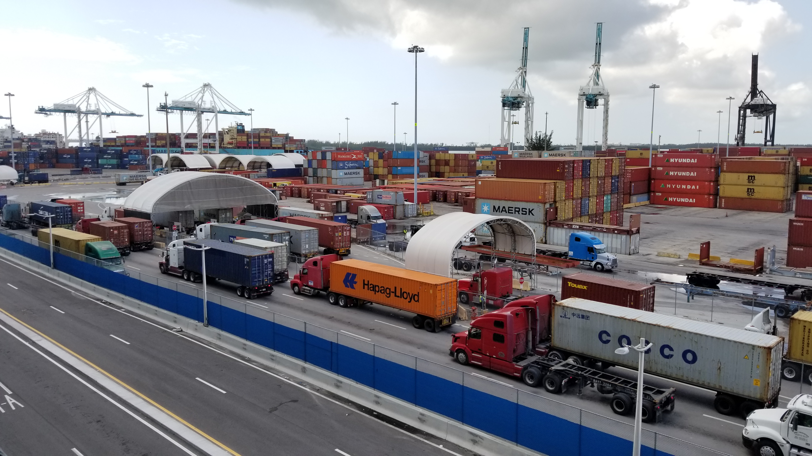
```

```{r FigureContainerShip1, echo=FALSE, fig.cap='Cargo Container Ship at Port of Yokohama (Japan)', out.width="75%", fig.align='center'}
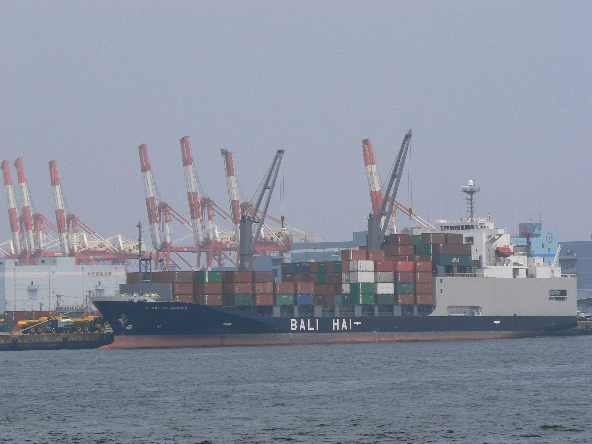
```

```{r FigureContainerShip2, echo=FALSE, fig.cap='Cargo Container Ship at Port of Yokohama (Japan)', out.width="75%", fig.align='center'}
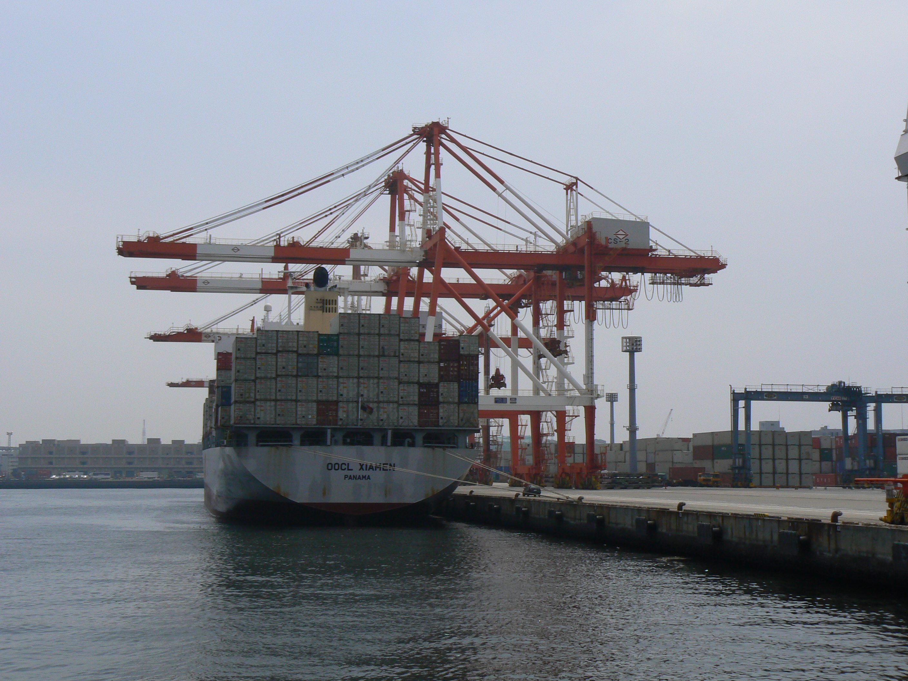
```

```{r FigureContainerShip3, echo=FALSE, fig.cap='Cargo Container Ship at Port of Yokohama (Japan)', out.width="75%", fig.align='center'}
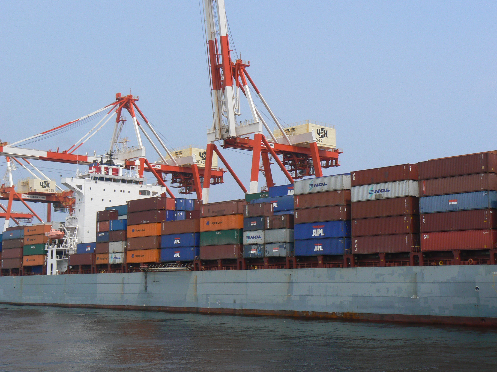
```


https://en.wikipedia.org/wiki/Container_ship

Port crane lowers container onto a "Mule".

```{r FigureMuleUnloaded, echo=FALSE, fig.cap='An Unloaded Mule Vehicle', out.width="75%", fig.align='center'}
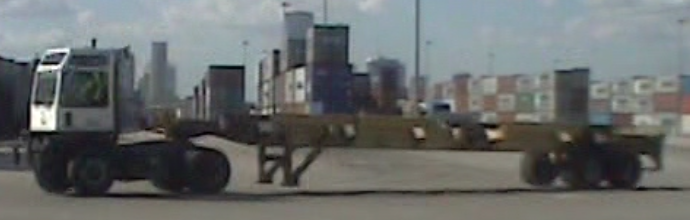
```

```{r FigureMuleLoading, echo=FALSE, fig.cap='Mule Vehicle being Loaded with Container from Port Crane', out.width="75%", fig.align='center'}
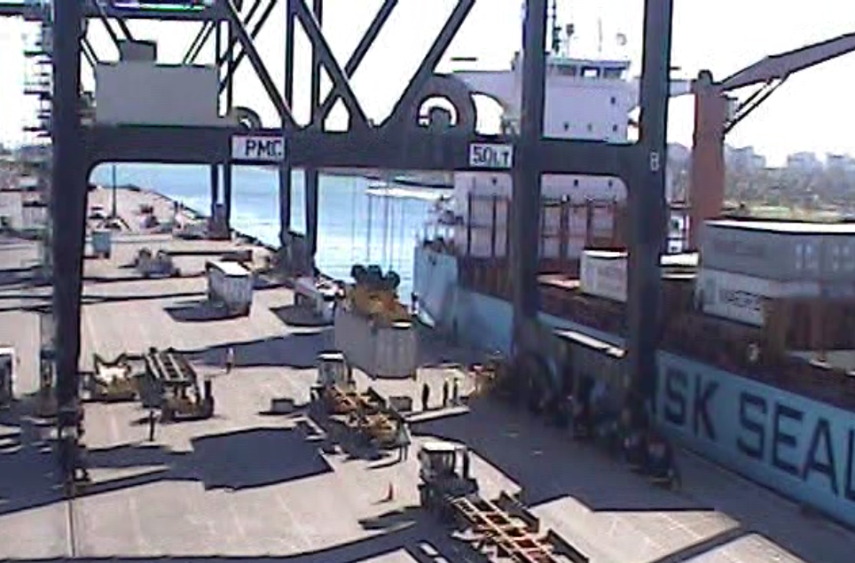
```

```{r FigureMuleLoaded, echo=FALSE, fig.cap='Mule Vehicle', out.width="75%", fig.align='center'}
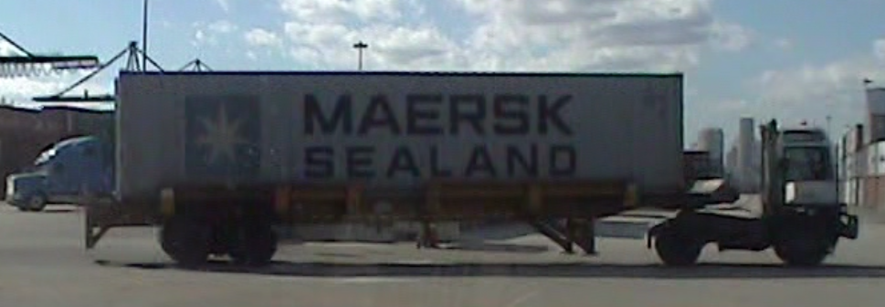
```

```{r FigureMuleTwoContainers, echo=FALSE, fig.cap='Mule Vehicle', out.width="75%", fig.align='center'}
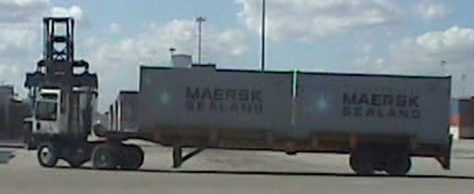
```

"Top Loader" moves container from Mule to "Yard" or directly to semi-trailer.

```{r FigureTopLoader1, echo=FALSE, fig.cap='Top Loader Carrying a Container', out.width="75%", fig.align='center'}
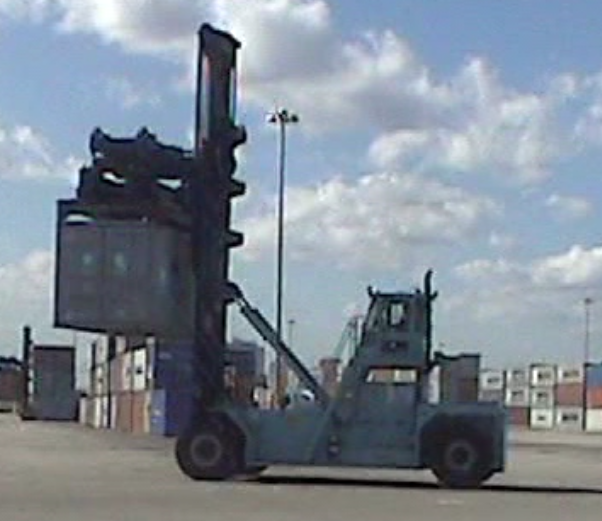
```

Top Loader placing a container on a container stack in the "Yard".

```{r FigureTopLoader2, echo=FALSE, fig.cap='Top Loader Placing a Container on a Stack', out.width="75%", fig.align='center'}
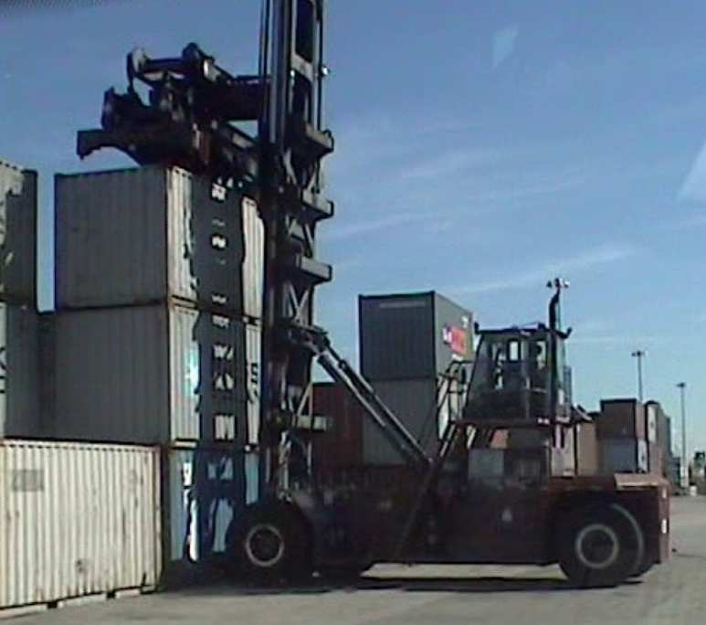
```

Top Loader placing a container on a container on a semi-trailer.

```{r FigureTopLoader3, echo=FALSE, fig.cap='Top Loader Placing a Container on a Semi-trailer', out.width="75%", fig.align='center'}
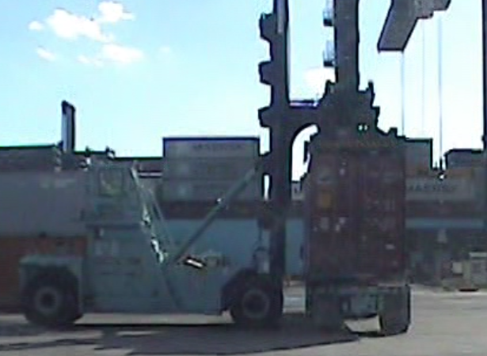
```

## Reefer Units {#seaport-reefer}

The term “Reefer” refers to a refrigerated container used to transport perishable goods.
 
While these units are used throughout most supply chains, they are especially important within marine settings as food often travels hundreds of miles before reaching consumers.


```{r Figure 8.1, echo=FALSE, fig.cap='Reefer Unit', out.width="75%", fig.align='center'}
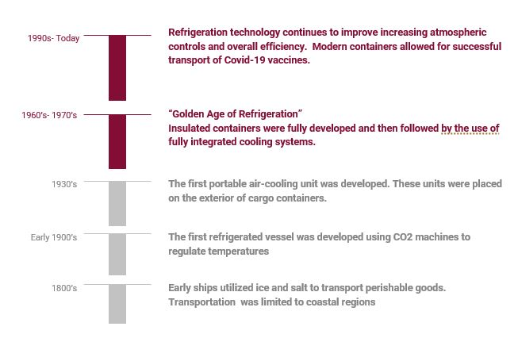
```

## Types of Reefer Containers {#seaport-containers}

There are three typical types of Reefer Containers.  Each have their own benefits and drawbacks.


```{r Figure 8.2, echo=FALSE, fig.cap='Types of Reefer Containers', out.width="75%", fig.align='center'}
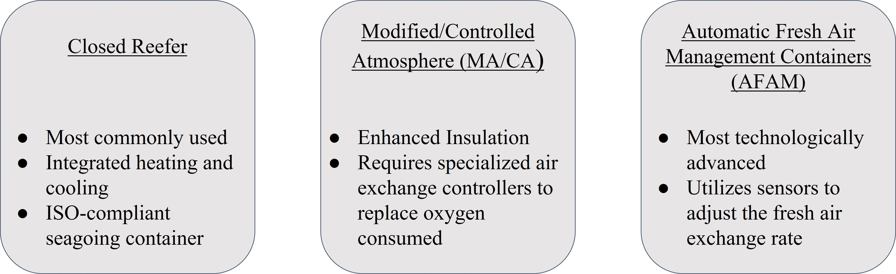
```
## How does a Reefer Container work? {#seaport-work}

Reefer containers maintain the desired temperatures by channeling air under and around the cargo through T-shaped decking.

Reefer control units allow for the setting and adjustment of other parameters such as humidity, ventilation and atmosphere which varies between cargos.  

Power supply is sustained  through either portable generators or the vessel’s power outlet.


```{r Figure 8.3, echo=FALSE, fig.cap='Reefer Container ', out.width="75%", fig.align='center'}
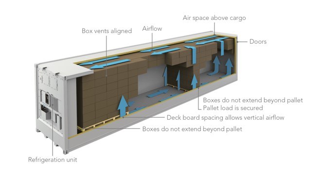
```

## Why are they necessary? {#seaport-necessary}
The usage of reefer units has greatly influenced how we manage supply chains and what can be shipped. 

Benefits of reefer units include: 
Longer product shelf life
Diversification of shippable cargo
Durable enough to remain operational in harsh marine environments
Manufactured in multiple standard dimensions and can be partitioned to diversify cargo within individual containers
Cargo does not require immediate cold storage upon arrival to destination

## Industry Regulations {#seaport-regulation}

To prevent practices during transportation that create food safety risks, the FDA creates various rules and regulations. The Sanitary Transportation of Human and Animal Food Rule aims to address the failure to properly refrigerate food, inadequate cleaning of vehicles between loads, and failure to properly protect food. 

Additionally, global organizations uphold and promote a higher standard for product quality and safety in conjunction with the rules set forth by the FDA. 


```{r Figure 8.4, echo=FALSE, fig.cap='Industry Regulation', out.width="75%", fig.align='center'}

```

## 20ft and 40ft Containers {#seaport-20ft40ft}

## The Modern Freight Container {#seaport-freight}
The term “freight transportation” conjures images of boats or trains filled to the brim with modern day shipping containers, but the movement of merchandise has not always been this simple. 

Prior to the 18th century, freight was handled manually as break bulk cargo. In other words each item was individually accounted for and transferred between carriers- a rather inefficient method. 

Malcolm McLean patented the first standardized shipping container in 1956.  These steel containers were designed to be robust and reliable. 

## Impact of Modern Containers on Seaport Operations {#seaport-modern}
Containerization, the process unitization of cargoes in exports, greatly impacted shipping operations. 

The advent of the modern container brought a decline of inland ports as they were no longer able to support massive container ships.  Seaports built along deep waterways became the predominant terminal for shipping.

With the use of containers, products were safely sealed reducing pilfering and overall damages.

Containers also reduced the labor requirements within ports as cranes took the place of large longshoremen crews.

Overall, there was a rise in efficiency and speed of export accompanied by a decrease in shipping costs.

```{r Figure 8.5, echo=FALSE, fig.cap='Containers', out.width="75%", fig.align='center'}
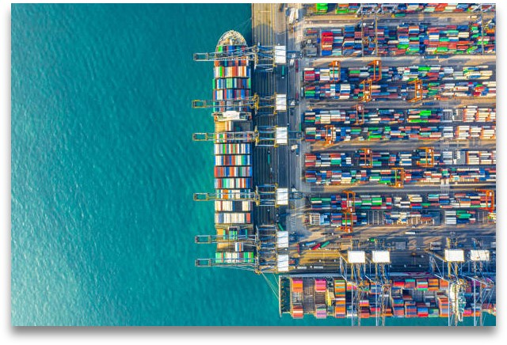
```

## ISO Standard: Container Sizes {#seaport-size}
The International Organization for Standardization (ISO) sets the standard for shipping container sizes in addition to other practices.  These standards can all be found on the ISO website.

Typically, containers are either 20’ or 40’ for general purposes but occasionally other sizes may be used such as the one outlined in red above.  ISO 668:2020 outlines the classification, dimensions and ratings for series 1 freight containers.

```{r Figure 8.6, echo=FALSE, fig.cap='Container Size', out.width="75%", fig.align='center'}
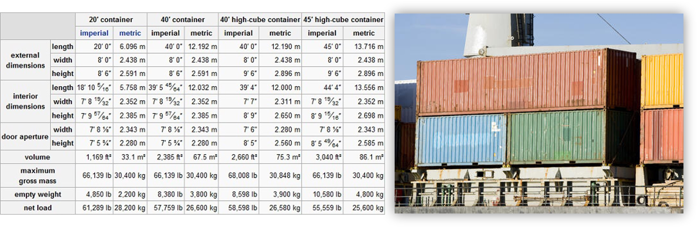
```

## ISO Standard: Container Markings {#seaport-markings}

All markings on the exterior of a shipping container are done in accordance with ISO Standard 6346:2022.  

The bulk of the information can be found on the door side of the shipping container. 

```{r Figure 8.7, echo=FALSE, fig.cap='Container Markings', out.width='75%', fig.align='center'}
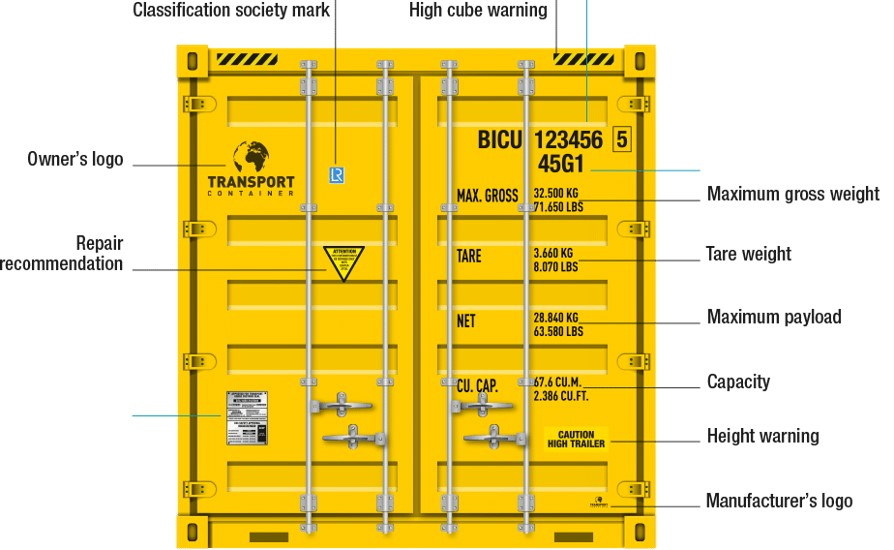
```

The container numbers consists of owner codes, equipment categories, serial numbers and check digits.  The container numbers must be displayed on all sides of the container.

The size and type code is usually below the container numbers. The first character of the code indicates the length of the container, the second represents the width/height, and the third and fourth character indicates the container type. 

Prior to shipment, containers must have a safety approval per the international convention for safe containers (CSC). This approval is indicated by the CSC Plate located on the outer left door of the container.  Typically the CSC Plate is now combined with the customs plate and any other plates required for international trade- collectively known as the Combined Data Plate. 

```{r Figure 8.8, echo=FALSE, fig.cap='ISO Standard Container Markings', out.width='75%', fig.align='center'}
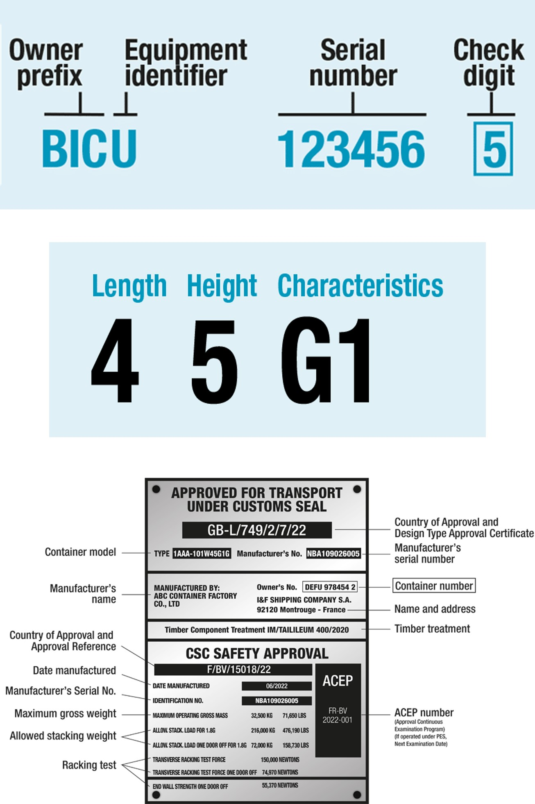
```
## Types of Containers {#seaport-types}

1. Dry Storage Containers:

These containers are some of the most common in the industry.  They are  designed to transport dry goods. These containers do not allow for temperature controls, so they are not suited for moving food or chemicals that require refrigeration.

2. Flat Rack Containers:

Flat rack containers are ideal for shipping boats, cars and other heavy machinery.  These containers do not have a top and two of their sides may be optional.  Often times, the sides of the containers are either collapsible or detachable. 


```{r Figure 8.9, echo=FALSE, fig.cap='Types of Containers', out.width='75%', fig.align='center'}
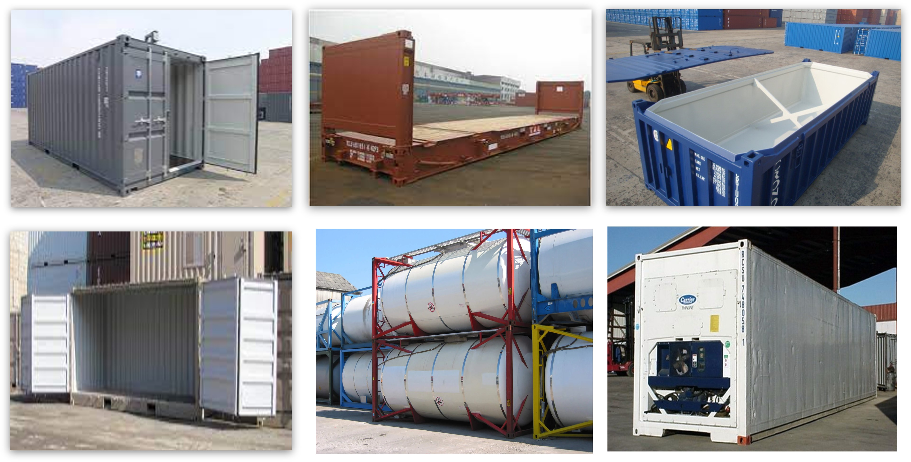
```
3. Open Top Containers:

These containers have an open top to allow for ease of bulk cargo loading.  During shipping a roof structure may be secured to the container via ropes to protect against precipitation. 

4. Open Side Containers:

Open side containers are used for cargo that would otherwise not fit through the standard door openings of a dry storage container. The side swings open as if it was made of two large doors, but it can still be secured to protect the merchandise inside.

5. Tanks:

Tanks are designed to retain liquids, especially fuels. They are typically constructed out of anti-corrosive materials because of the harsh chemicals they carry. 

6. Refrigerated Containers:

Refrigerated containers have temperature controls so goods can be kept at a specific temperature during transport. They are well insulated to ensure that the climate remains consistent.  These containers allowed for a wider range of shippable cargo. 

## How are containers packed? {#seaport-packed}


```{r Figure 8.10, echo=FALSE, fig.cap='Container Packing', out.width='75%', fig.align='center'}
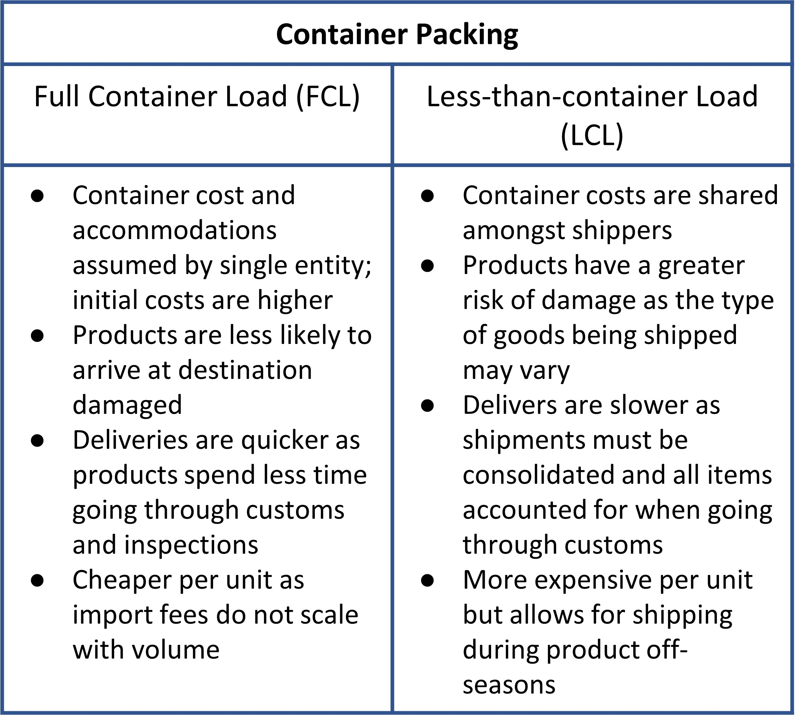
```

## Bill of lading {#seaport-lading}

The Bill of Lading and the Freight Bill are two of the most important forms when shipping containers. 

The Bill of Lading is essentially a shipping contract which describes the origin and destination of the merchandise, the quantity, the description of goods and the cost of shipment. This document is legal proof of the shipment and can be used during legal proceedings. 

The Freight Bill is the invoice for the shipping from origin to destination.  This document includes all the details of shipment and is signed by both the shipper and carrier. Unlike the bill of lading, this document  cannot be used during legal disputes as proof of shipment. 

```{r Figure 8.11, echo=FALSE, fig.cap='Bill of Lading', out.width='75%', fig.align='center'}
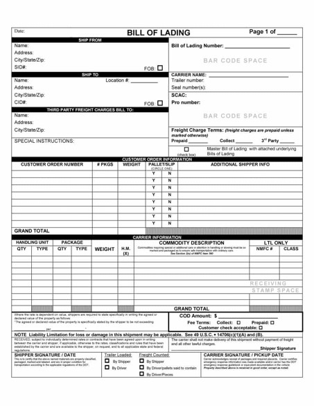
```

