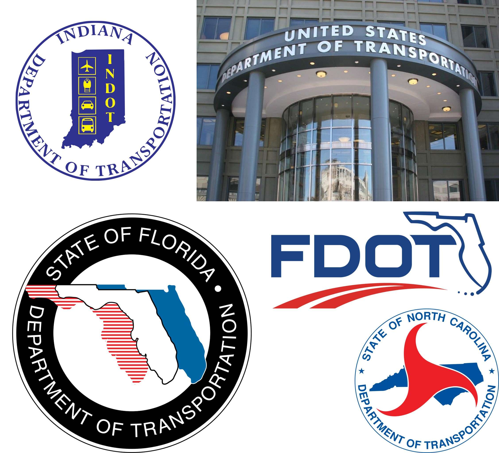
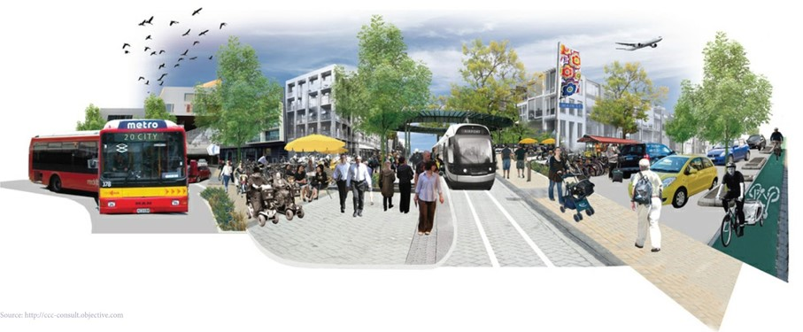
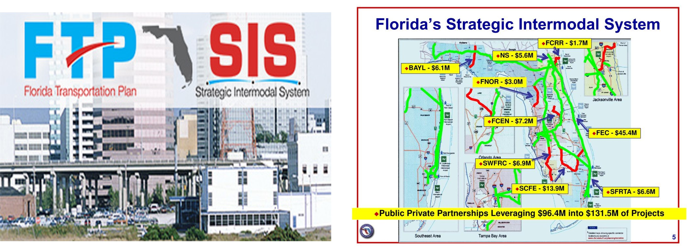
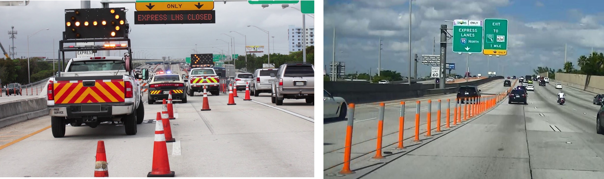
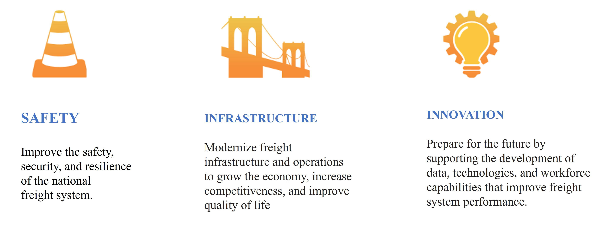

# Planning, Design, Operations Management Organizations {#planning}

::: {#Note .ThreshValue .message style="color: orange;"}
This chapter still needs work. It has Evangelos' and Lili's names in the topic assignment spreadsheet.
:::

## State DOTs {#planning-DOT}

Introduction
1.Each state has its own department of transportation, that is responsible for transportation planning, design, management and operations that act in accordance with regulations and guidelines.
2.These regulations and guidelines establish consistency across the nation, allowing for each state to navigate through their own environmental, geographical, and geological challenges

```{r Figure 9.1, echo=FALSE, fig.cap='State DOTs', fig.width=4, fig.align='center'}

```

## Planning {#planning-plan}

1.Each state has its own transportation planning office, and it is usually divided into subcategories
2.For example, the Florida Department of Transportation, has a central planning office, that has four subcategories: policy planning, forecasting and trends, system implementation, and performance. 

```{r Figure 9.2, echo=FALSE, fig.cap='planning', fig.width=4, fig.align='center'}

```

## FDOT Planning Processes {#planning-process}

Florida Transportation Plan (FTP)
Strategic Intermodal System (SIS)
Planning Studies 
Access Management
Interchange Access Request (IAR)
Highway Capacity/Level of Service (LOS)
Project Traffic Forecasting
Site Impact Analysis
Shared Use Non-motorized (SUN) Trail network
Statistics, Measures, and Trends
Performance Measures

Strategic Intermodal System (SIS):

This network establishes a competitive market for the states economy,and improves the functionality of the transportation system considering heavy congested areas that surround highways, trails, waterways, ports, and airports.

Florida Transportation Plan (FTP):

This plan has three subcategories: the FTP vision element, the FTP policy element, and the FTP implementation element. Each aspect of this plan is purposed to outline the future of the Florida transportation system, develop technology based consumer application, and further implement performance measures for state, regional, and local agencies.

```{r Figure 9.3, echo=FALSE, fig.cap='planning process', fig.width=4, fig.align='center'}

```

## Design {#planning-design}

Each state has its own transportation design team located in the state department of transportation.
The office of design’s purpose is to innovatively supply transportation solutions to problems faced by the community. 
The Florida Department of Transportation has a design team that consistent of three subcategories: Production Support, Roadway Design, and Structures Design.
This team establishes policies, regulations, and standards for structures, highways, and bridges. 

## Operation Management {#planning-operation}
 
FDOT Operations:

ITS Communications
Managed Lanes
Management and Deployment 
Software and Architecture
Statewide Arterial Management Program (STAMP)
Traffic, Incident Management (TIM)/Commercial Vehicle Operations (CVO)
Traffic Systems

```{r Figure 9.4, echo=FALSE, fig.cap='operation management', fig.width=4, fig.align='center'}

```
Traffic, Incident Management (TIM):

This program establishes new methods to quickly and efficiently identify and respond to crashes. This program trains first responders, and Rapid Incident Scene Clearance (RISC) on clearing the incident or crash to prevent further hazardous consequences.

Managed Lanes:

This program establishes express lanes, and additional supplemental lane mobility that allows for the driver to have an efficient driving experience, while also supplying accurate data that can further shape the future of the transportation system

## Freight Plan {#planning-freight}

As the nation has grown, so has the freight transportation industry. Freight transportation is essential to development, supporting population expansion and economic activity, enabling dramatic growth, and incorporating multiple components that employ millions.

1.A freight plan is a blueprint for action that identifies the implementation steps that will solve freight needs and issues. 

2.In order to create an actionable plan, a client must first determine how the plan will be implemented when it’s finished. Then, working backwards, the plan will include the pieces needed to become a reality.

3.The U.S. federal government requires state departments of transportation and metropolitan planning organizations to develop freight plans, and if done right, those plans can have great benefit for a community or state. 

4.A well thought out freight plan supports economic development, addresses private sector demands, matches funding and financing options for projects, and provides justification and transparency for investment decisions.

## How Can A Client Get The Most Out Of Freight Planning? {#planning-freightplanning}

Freight plans are customized to fit the needs of each client. 
Freight plans generally focus on these topics:

Mobility (efficient and reliable movement)
Economic development
Infrastructure: maintaining existing assets and developing new capacity
Safety
Environmental protection
Equity and community

## Purpose of the Guidance on State Freight Plans {#planning-guidance}

Provide States with information on the required elements.
Provide a template that reflects those statutory requirements.
Recommend approaches and information (optional elements) States may include.
Provide suggestions and encourage States to establish
State Freight Advisory Committees to benefit State freight planning. 

## National Freight Strategic Plan {#planning-strategicplan}

1. Safe, reliable, and efficient freight transportation boosts exports, enhances commerce, and powerseconomic growth. Our robust national multimodal freight system supports our economy by lowering costs to businesses and consumers and boosting the competitiveness of American goods abroad. The safe and efficient movement of goods through our freight system is a top priority for the U.S Department of Transportation (U.S. DOT).

2. This National Freight Strategic Plan defines the U.S. DOT’s vision and goals for the national multimodal freight system, assesses the conditions and performance of the freight system and barriers to freight system performance, and defines strategies to achieve its vision and goals. The Plan was developed through a multiagency effort involving extensive consultation with freight stakeholders in both the public and private sectors.

3. The Department will use this Plan to guide national freight policy, programs, initiatives, and investments; inform State freight plans; identify freight data and research needs; and provide a framework for increased cross-sector, multijurisdictional, and multimodal coordination and partnerships. 

## Vision {#planning-vision}

The freight transportation system of the United States will strengthen our economic competitiveness with safe and reliable supply chains that efficiently and seamlessly connect producers, shippers, and consumers in domestic and foreign markets.

```{r Figure 9.5, echo=FALSE, fig.cap='vision', fig.width=4, fig.align='center'}

```

## National Freight Policy Strategic Goals {#planning-policy}


```{r Figure 9.6, echo=FALSE, fig.cap='Strategic Goals', fig.width=4, fig.align='center'}

```

