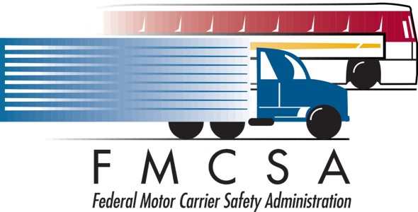
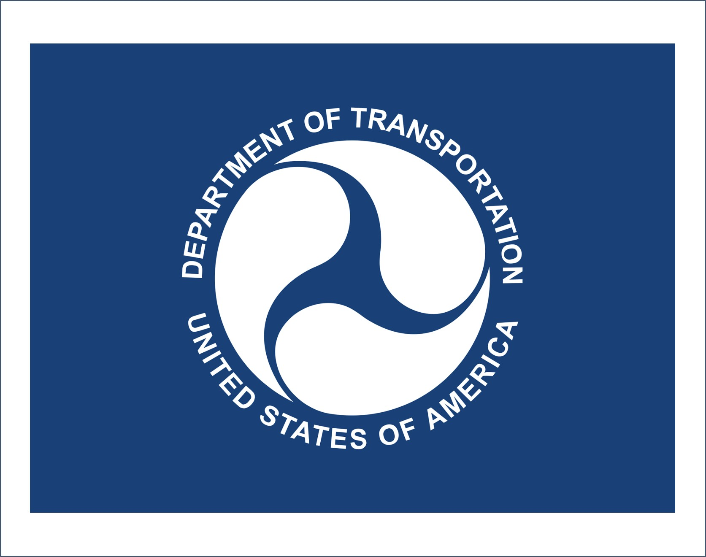
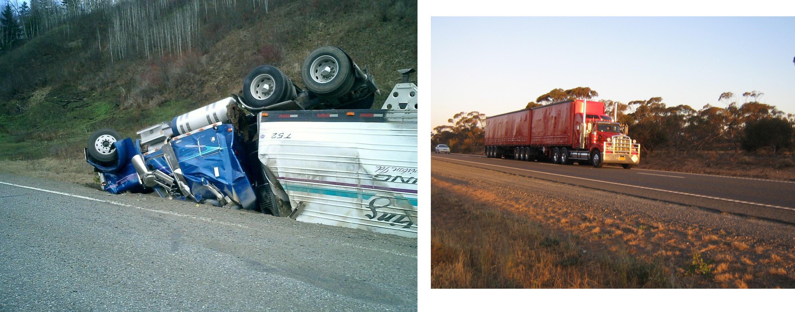
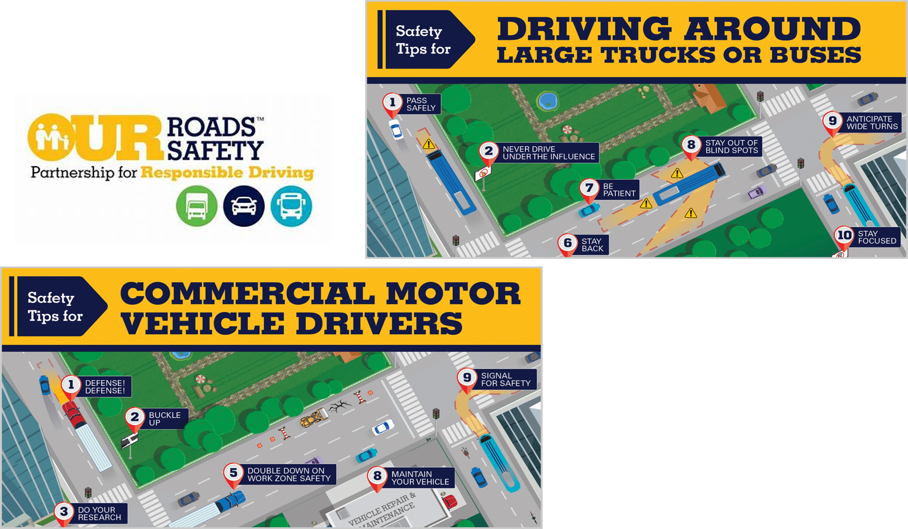
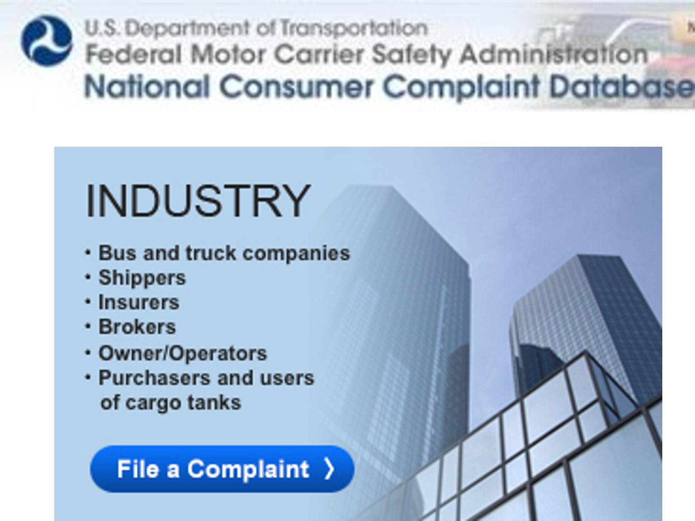
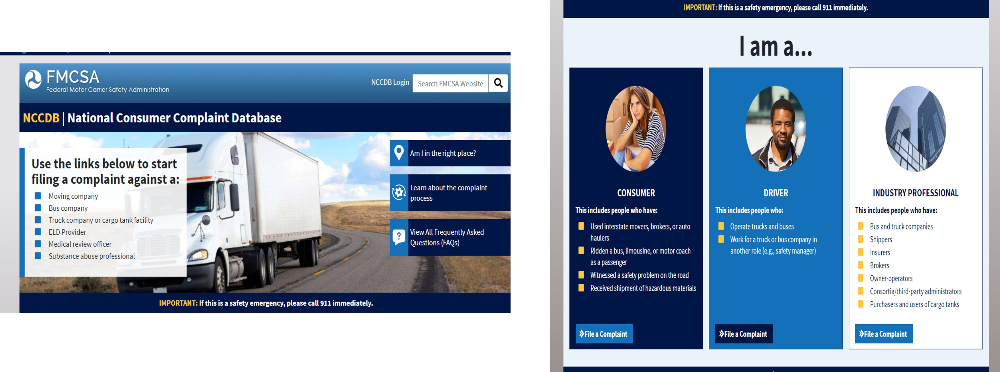

#Enforcement and Safety Organizations {#safety}

## Federal Motor Carrier Safety Administration {#safety-federal}

Introduction

What is the Federal Motor Carrier Safety Administration? 

1.The Federal Motor Carrier Safety Administration (FMCSA) is a governmental agency that is responsible for supervising and regulating motor carriers.
2.The FMCSA has established its headquarters in Washington D.C, while it oversees commercial driver licensing, bus companies and commercial trucking.

```{r Figure 10.1, echo=FALSE, fig.cap='Federal Motor Carrier Safety Administration', fig.width=4, fig.align='center'}

```
## Evolution {#safety-evolution}

The FMCSA was established through the Motor Carrier Safety Improvement Act of 1999 on January 1, 2000 by the United States Department of Transportation
The FMCSA now has over 1,000 employees stationed across the country
One of the most recent additions of regulations includes the FMCSA Clearinghouse, which provides the ability to prohibit drivers to operate vehicles based on alcohol and drug testing and violations. 

```{r Figure 10.2, echo=FALSE, fig.cap='DOT', fig.width=4, fig.align='center'}

```

## Purpose {#safety-Purpose}
What is the purpose of the Federal Motor Carrier Safety Administration? 

The purpose of this administration is enforce, regulate, and adjust the standard operating procedures for motor carrier vehicles to prevent and reduce crashes.


```{r Figure 10.3, echo=FALSE, fig.cap='Purpose', fig.width=4, fig.align='center'}

```

## Programs {#safety-Programs}
What does the Federal Motor Carrier Safety Administration do?
1.creates safety systems that are designed to focus on high risk situations while enforcing regulations
2.brings educational awareness on fatal crashes that can result from opposition to safety regulations to companies, and the public
3.works with stakeholders from various motor vehicle companies to enable efforts to reduce fatal crashes

Safety Systems: 

Safety Measurement System (SMS)

The regulated data can be found and analyzed within the Safety Measurement System. This system gets updated with data from motor carrier inspections, violations, and investigations.

Pre-Employment Screening Program (PSP)

This system allows for motor carriers, such as trucking or transit companies to make educated decisions when hiring employees.
It allows for access to the Motor Carrier Management Information System, (MCMIS), which provides the employer with data regarding the drivers inspection and crash history.

Educational Awareness:

Our Roads, Our Safety

1.This program was created to encourage awareness regarding public safety when sharing the road with transit and trucking operations.
2.Our Roads, Our Safety focuses on outreach to pedestrians, vehicle drivers, truck drivers, bicyclists, and the general driving public on possible hazards, and the individual responsibility to operate a vehicle safely when driving.


```{r Figure 10.4, echo=FALSE, fig.cap='Educational Awareness', fig.width=4, fig.align='center'}

```

```{r Figure 10.5, echo=FALSE, fig.cap='Programs', fig.width=4, fig.align='center'}

```

National Consumer Complaint Database (NCCDB):

The NCCDB is a database created to allow the general public to input complaints, observations, and comments considering unsafe actions committed by motor carrier’s employees and companies.

Look Before You Book:

This program allows for the general public to research the licensing, insurance, and history of transit companies. 
This allows consumers to make an informed decision when booking bus trips.


```{r Figure 10.6, echo=FALSE, fig.cap='Educational Awareness-USDOT', fig.width=4, fig.align='center'}

```

```{r Figure 10.7, echo=FALSE, fig.cap='National Consumer Complaint Database (NCCDB)', fig.width=4, fig.align='center'}

```

Stakeholders and Special Interest Lobby Groups:

The FMCSA enables a collective review system for truck drivers, trucking companies, and special interest groups to analyze and decide on rulings.
The process is called the Notice of proposed Rulemaking, while they go to Congress and undergo approval.
The rules that are reviewed, and approved, then get rendered into code.

## Grants {#safety-grants}

Motor Carrier Safety Assistance Program Grant
(MCSAP)

This grant program was created to provide aid to the states, by distributing funding for the purpose of enacting safety programs. 
An example of how this grant is being used is displayed by the support the FMCSA gives state law enforcement agencies, to encourage them to enforce and monitor safety measurements. 

High Priority (HP) Grant

This grant program is designated to enforce commercial vehicle safety plan activities.
This program has an increasingly more important role as it regulates the standard for new innovative technology and connected motor vehicle safety.

## Conclusion {#safety-Conclusion}

The overall benefits that the FMCSA contributes to the transportation field, and industry, is the standard that it continues to establish for the safety of our road systems.
The FMCSA allows for labor groups, transit and trucking partners to come together and discuss regulations, while modifying previous codes.
This agency contributes to maintaining the transportation system, and its relationship with innovative technology. 

