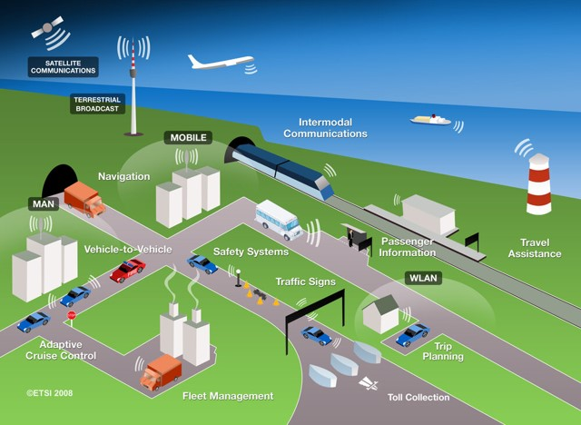
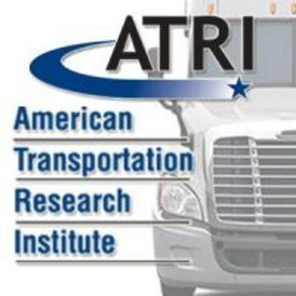
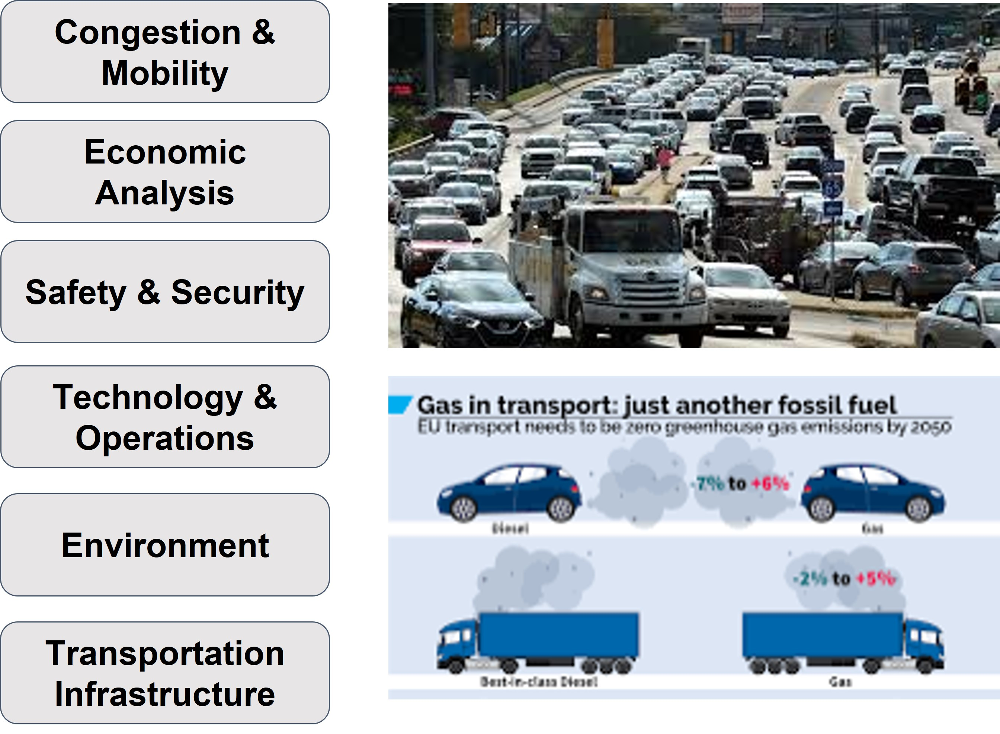
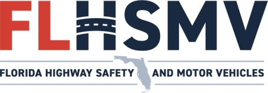
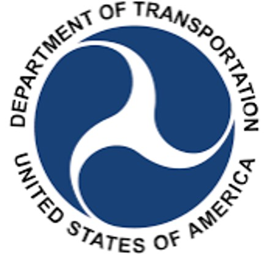
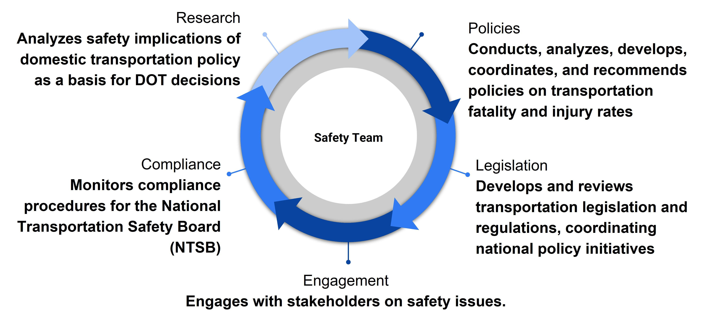
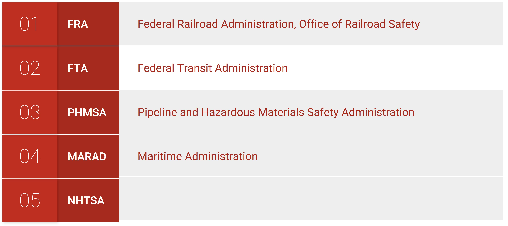
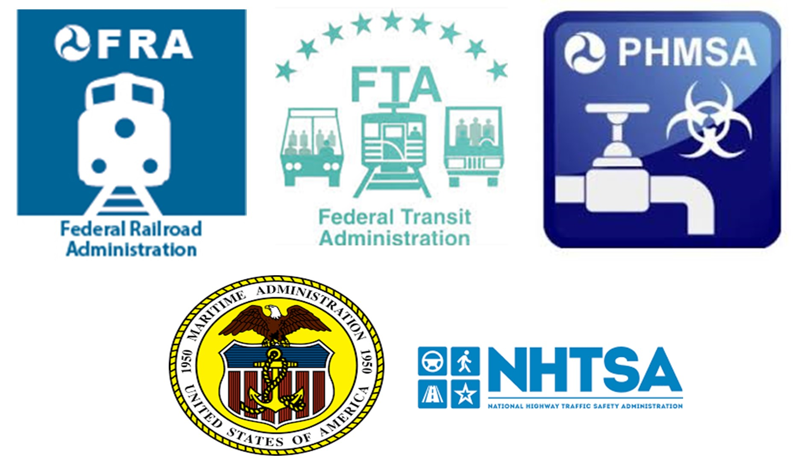

# Research organizations {#organization}
## American Transportation Research Institute (ATRI) {#organization-ATRI}
Introduction

Safety is the protection from risk, danger, or injury
Assessed through crash data

Preparedness is needed to prevent conflicts and increase safety

To reduce fatalities in injuries:
behavior analysis
infrastructure 
road design

## Importance of Enforcement and Safety Organizations {#organization-imp}
Enforcement and safety organizations aid in preparation and reduction of safety issues
They do this through roadway design, traffic law enforcement, road user behavior, and emergency response time (FDOT, 2020)
Improvements in safety are done through collaboration between different transportation disciplines.
Freight, passenger vehicles, hazardous materials, railroad, aviation, maritime, etc.

```{r Figure 12.1, echo=FALSE, fig.cap='Importance of Enforcement', fig.width=4, fig.align='center'}

```
## American Transportation Research Institute {#organization-ATRIOrganization}
Since 1954, ATRI has engaged in transportation studies and operational tests.

Conducts research on transportation with an emphasis on trucking.

Aims to provide a safe, efficient, and viable transportation system.

```{r Figure 12.2, echo=FALSE, fig.cap='ATRI', fig.width=4, fig.align='center'}

```

## ATRI Focus Areas {#organization-focus area}


```{r Figure 12.3, echo=FALSE, fig.cap='Focus Areas', fig.width=4, fig.align='center'}

```

ATRI Research:

Autonomous Vehicle Technology
Bottlenecks, Congestion, Funding
Compliance, Safety, Accountability (CSA)
Driver Health and Wellness
Driver Shortage/ Driver Retention
Economic Analysis
Environment
Hours-of-Service
Operational Costs of Trucking
Safety
Technology
Traffic Incident Management
Truck Parking

## Florida Department of Highway Safety and Motor Vehicles {#organization-highwaysafety}

FLHSMV was established in 1969

Provides highway safety and security through excellence in service, education and enforcement.

Priority focus is the issuance of drivers licenses, vehicle tags & titles, and Florida Highway Patrol operations.

```{r Figure 12.4, echo=FALSE, fig.cap='FLHSMV', fig.width=4, fig.align='center'}

```

## United States Department of Transportation {#organization-usdot}

USDOT was established in 1966. 

Aims to deliver a leading transportation system, serving the American people and economy through safe, efficient, sustainable, and equitable movements of goods, people and services.

Priority focus of DOT is safety.

```{r Figure 12.5, echo=FALSE, fig.cap='USDOT', fig.width=4, fig.align='center'}

```

## USDOT Safety Team Responsibilities {#organization-usdotsafety}

```{r Figure 12.6, echo=FALSE, fig.cap='Team Responsibilities', fig.width=4, fig.align='center'}

```

## USDOT Safety Overview {#organization-overview}

```{r Figure 12.7, echo=FALSE, fig.cap='Overview', fig.width=4, fig.align='center'}

```

Federal Railroad Administration:

Office of Railroad Safety
Executes regulatory and inspection responsibilities of grade crossings, hazardous materials, motive power equipment, operating practices, signal and train control, track.

Federal Transit Administration:

Office of Transit Safety and Oversight
Increases transit safety through policy development, hazard investigation, data collection, risk analysis, oversight programs, information sharing.

Pipeline and Hazardous Materials Safety Administration:

Office of Pipeline Safety, Office of Hazardous Materials Safety.
Developing, proposing and implementing regulatory policy initiatives and regulations governing the safe operation of the nations hazardous liquid and natural gas pipeline transportation system.

Maritime Administration:
Office of Safety
Develop national and international standards designed to enhance the efficiency and safety of the maritime industry. 
Development and application of technologies in maritime safety.

National Highway Traffic Safety Administration:

Mission is to save lives prevent injuries and reduce economic costs due to road traffic crashes through education, research, safety standards, and enforcement.


```{r Figure 12.8, echo=FALSE, fig.cap='USDOT Safety Overview', fig.width=4, fig.align='center'}

```


