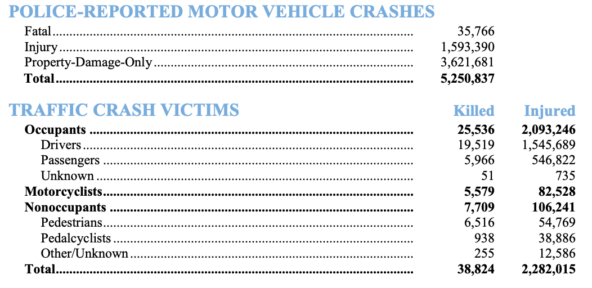
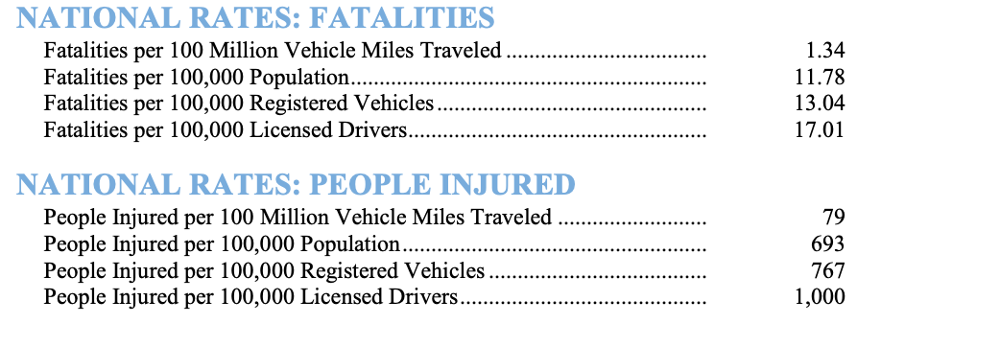
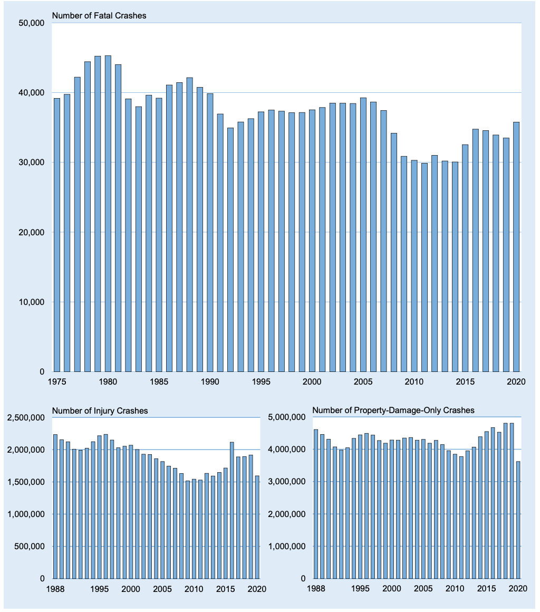
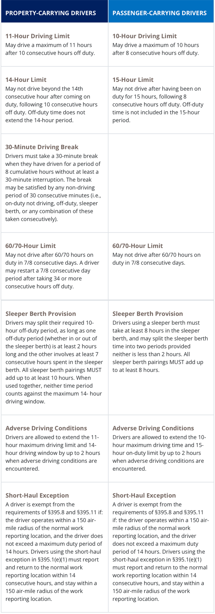

# Safety {#Safety}

The objective measure reflected in the prevalence of crashes and their harm.

## Crash Frequency {#Safety-CrashFrequency}

1) Crash: an event that produces injury and/or property damage, involves a motor vehicle in transport, and occurs on a trafficway or while the vehicle is still in motion after running off the trafficway.

2) Crash frequency: refers to the counts the number of crashes that have occurred at a given location (along a roadway section or at an intersection) over a specified time period, typically three to five years.

## Crash Severity {#Safety-CrashSeverity}

1) Crash severity: refers to the level of seriousness or extent of harm caused by a traffic collision or accident. It is often measured based on the most severe injury sustained by a person involved in the crash.

2) Severity levels-Highway Safety Manual

* F (Fatal crash): a police-reported crash involving a motor vehicle in transport on a trafficway in which at least one person dies within 30 days of the crash.
* I (Injury crash): a police-reported crash that involves a motor vehicle in transport on a trafficway in which no one died but at least one person was reported to have: (i) an incapacitating injury; (ii) a visible but not incapacitating injury; (iii) a possible, not visible injury; or (iv) an injury of unknown severity.
* PDO (Property damage only): a police- reported crash involving a motor vehicle in transport on a trafficway in which no one involved in the crash suffered any injuries.

3) Other severity levels-KABCO

* K: Killed (fatal)
* A: Disabling injury (serious)
* B: Evident injury (moderate)
* C: Possible injury (minor)
* O: No evident injury (none)

4) Statistics

**2020 national crash statistics**

```{r crashstatImage, echo=FALSE, fig.cap='2020 national crash statistics', fig.width=6, fig.align='center'}

```

```{r crashratestatImage, echo=FALSE, fig.cap='2020 national crash rates statistics', fig.width=6, fig.align='center'}

```

**Crash trend, by severity, 1975-2020**

```{r crashtrendImage, echo=FALSE, fig.cap='Crash trend, by severity, 1975-2020', fig.width=6, fig.align='center'}

```

Source: https://crashstats.nhtsa.dot.gov/Api/Public/ViewPublication/813375

## Driver Fatigue  {#Safety-DriverFatigue}

Fatigue can result when you do not get enough sleep or do not get quality sleep. It can impair your driving, similar to alcohol impairment.

1) What causes fatigue?

* Being awake for many consecutive hours.
* Not getting enough sleep over multiple days.
* Time of day: Your body has a sleep/wake cycle that tells you when to be alert and when it’s time to sleep. The urge to sleep is the most intense in the early morning hours.
* Monotonous tasks or long periods of inactivity.
* Health factors such as sleep disorders or medications that cause drowsiness.

2) What are the effects of driver fatigue?

* Nodding off.
* Reacting more slowly to changing road conditions, other drivers, or pedestrians.
* Making poor decisions.
* Drifting from your lane.
* Experiencing “tunnel vision” (when you lose sense of what’s going on in the periphery)
* Experiencing “microsleeps” (brief sleep episodes lasting from a fraction of a second up to 30 seconds).
* Forgetting the last few miles you drove.

3) How to avoid driver fatigue?

* Getting adequate sleep on a daily basis is the only true way to protect yourself against the risks of driving when you’re drowsy. Experts urge consumers to make it a priority to get seven to eight hours of sleep per night. 
* Before the start of a long family car trip, get a good night’s sleep, or you could put your entire family and others at risk.
* Many teens do not get enough sleep at a stage in life when their biological need for sleep increases, which makes them vulnerable to the risk of drowsy-driving crashes, especially on longer trips. Advise your teens to delay driving until they’re well-rested.
* Avoid drinking any alcohol before driving. Consumption of alcohol interacts with sleepiness to increase drowsiness and impairment.
* Always check your prescription and over-the-counter medication labels to see if drowsiness could result from their use.
* If you take medications that could cause drowsiness as a side effect, use public transportation when possible.
* If you drive, avoid driving during the peak sleepiness periods (midnight – 6 a.m. and late afternoon). If you must drive during the peak sleepiness periods, stay vigilant for signs of drowsiness, such as crossing over roadway lines or hitting a rumble strip, especially if you’re driving alone.

4) Related regulations

While regulations set maximum numbers of driving and work hours for jobs such as driving a large truck, this approach doesn’t account for individual differences in sleep needs and health. Workers in most other jobs aren’t covered by regulations intended to reduce driver fatigue.

**Summary of Hours of Service Regulations**

```{r crashtrendImage2, echo=FALSE, fig.cap='Hours-of-service regulations', fig.width=6, fig.align='center'}

```

5) Related statistics

* NHTSA’s census of fatal crashes and estimate of traffic-related crashes and injuries rely on police and hospital reports to determine the incidence of drowsy-driving crashes. NHTSA estimates that in 2017, 91,000 police-reported crashes involved drowsy drivers. These crashes led to an estimated 50,000 people injured and nearly 800 deaths. But there is broad agreement across the traffic safety, sleep science, and public health communities that this is an underestimate of the impact of drowsy driving. 
* Sleepiness can result in crashes any time of the day or night, but three factors are most commonly associated with drowsy-driving crashes. (a) Occur most frequently between midnight and 6 a.m., or in the late afternoon; (b) Often involve only a single driver (and no passengers) running off the road at a high rate of speed with no evidence of braking; (c) Frequently occur on rural roads and highways.

Source: 
https://www.cdc.gov/niosh/newsroom/feature/driverfatigue.html
https://www.cdc.gov/niosh/motorvehicle/topics/driverfatigue/default.html
https://www.fmcsa.dot.gov/regulations/hours-service/summary-hours-service-regulations
https://www.nhtsa.gov/risky-driving/drowsy-driving

## Driver Competency {#Safety-DriverCompetency}

Driver competency refers to a driver's ability to safely and effectively operate a motor vehicle while adhering to traffic laws, regulations, and best practices. It encompasses a range of skills, knowledge, and behaviors necessary for safe driving. Here are some key aspects of driver competency:

* Technical skills: This involves proficiency in handling the vehicle's controls, such as steering, braking, accelerating, and using turn signals. 
* Knowledge of traffic laws: Competent drivers should have a good understanding of traffic laws and regulations, including speed limits, right-of-way rules, and traffic signs and signals. 
* Defensive driving: Competent drivers are skilled in defensive driving techniques, which involve anticipating and responding to potential hazards on the road. This includes maintaining a safe following distance, being aware of blind spots, and avoiding distractions.
* Situational awareness: Drivers need to be aware of their surroundings and the behavior of other road users. This includes monitoring the actions of pedestrians, cyclists, and other drivers to anticipate and react to unexpected events.
* Judgment and Decision-Making: Competent drivers make sound decisions while driving. They assess situations quickly, prioritize safety, and choose appropriate actions to avoid accidents or dangerous situations.
* Emotional control: Competency also includes the ability to stay calm and composed while driving, even in stressful or challenging situations. 
* Adaptability: Drivers should be able to adapt to changing road and weather conditions. This includes adjusting their speed and driving style in response to rain, snow, fog, or other adverse conditions.
* Vehicle maintenance: Competent drivers understand the importance of regular vehicle maintenance and conduct routine checks to ensure their vehicle is safe to drive.
* Responsible behavior: This involves refraining from behaviors that can impair driving, such as driving under the influence of alcohol or drugs, texting while driving, or engaging in other distractions.


