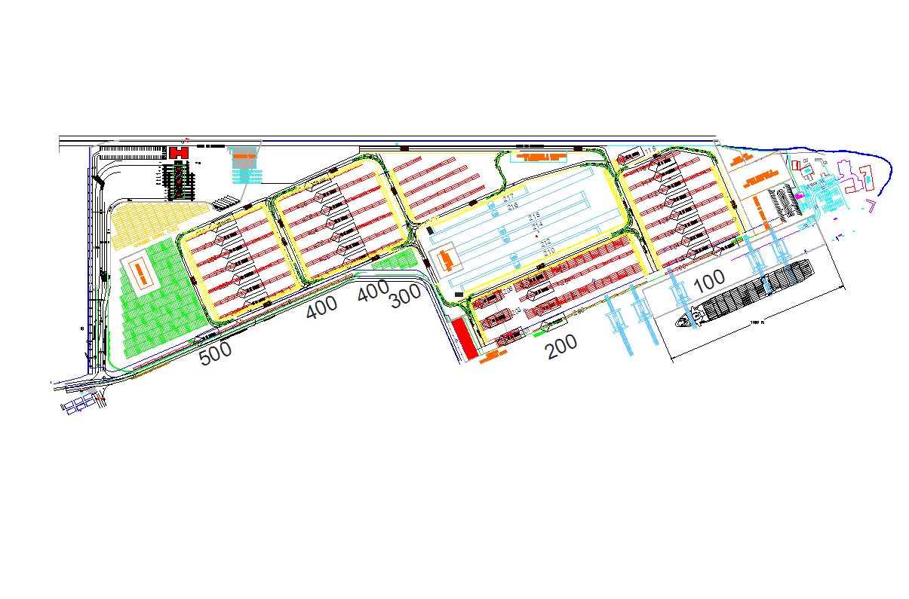

--- 
title: "Introduction to Freight Transportation"
author:
  - "Scott S. Washburn, University of Florida, https://swash.essie.ufl.edu"
  - "Evangelos Kaiser, Florida Atlantic University, http://www.eng.fau.edu/directory/faculty/kaisar/"
  - "Lili Du, University of Florida, https://www.essie.ufl.edu/people/name/lili-du/"
date: "`r Sys.Date()`"
site: bookdown::bookdown_site
output: bookdown::gitbook
documentclass: book
bibliography: [references.bib]
biblio-style: apalike
link-citations: yes
github-repo: swash17/FreightCurriculum
description: "Material designed for an introduction to freight transportation course. Initial development of this material was sponsored by the Freight Mobility Research Institute (http://eng.fau.edu/research/fmri/)"
---


# Preface {-}

This material is intended for an introduction to freight transportation course.Initial development of this material was sponsored by the Freight Mobility Research Institute (http://eng.fau.edu/research/fmri/).

An example figure is shown in Figure \@ref(fig:PortImage)


```{r eval=FALSE, echo=FALSE}
install.packages("bookdown")
# or the development version
# devtools::install_github("rstudio/bookdown")
```

```{r PortImage, echo=FALSE, fig.cap='Port of Miami Partial Schematic', out.width='90%', fig.asp=.75, fig.align='center'}

```


```{r include=FALSE}
# automatically create a bib database for R packages
knitr::write_bib(c(
  .packages(), 'bookdown', 'knitr', 'rmarkdown'
), 'packages.bib')
```
